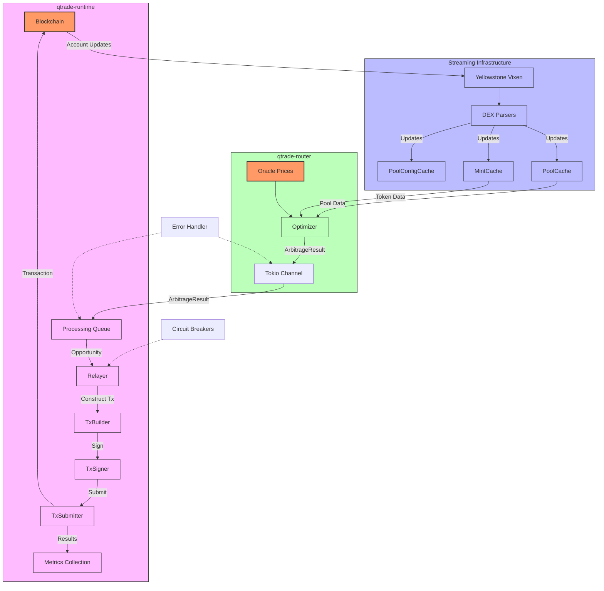
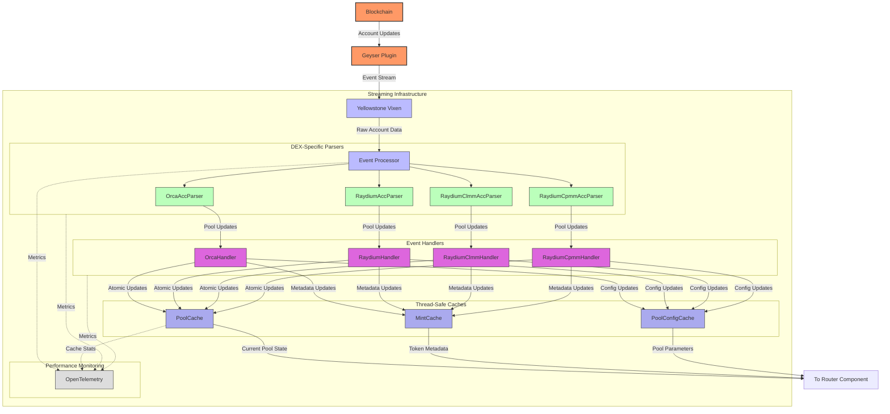

# Arbitrage System Architecture

This document describes the architecture and data flow of the arbitrage system in qtrade.

## System Components

The system consists of two main components:

1. **qtrade-router**: Processes market data and identifies arbitrage opportunities
   - Uses convex optimization to find profitable trading paths
   - Sends results to qtrade-runtime via a channel

2. **qtrade-runtime**: Executes arbitrage opportunities and manages blockchain interactions
   - Receives arbitrage results from qtrade-router
   - Processes and executes the identified opportunities
   - Records metrics for performance tracking

## Architecture Diagram



## Streaming Infrastructure Detail

Below is a more detailed view of the streaming infrastructure component, showing how Yellowstone Vixen processes and distributes data from the Solana blockchain:



The streaming infrastructure is the foundation of the entire arbitrage system, providing real-time updates from the Solana blockchain to the router component. It leverages Yellowstone Vixen's direct connection to the Geyser plugin to receive account updates with minimal latency.

### Key Components

1. **Event Processor**: Receives raw account data from Yellowstone Vixen and routes it to appropriate parsers based on program IDs and account types.

2. **DEX-Specific Parsers**: Specialized parsers for different DEX protocols that understand the unique data structures of each platform:
   - `OrcaAccParser`: Decodes Orca Whirlpool AMM account data
   - `RaydiumAccParser`: Handles standard Raydium AMM accounts
   - `RaydiumClmmAccParser`: Processes Raydium Concentrated Liquidity accounts
   - `RaydiumCpmmAccParser`: Parses Raydium Constant Product Market Maker accounts

3. **Event Handlers**: Convert parsed account data into structured pool state models and coordinate atomic updates to the shared caches.

4. **Thread-Safe Caches**: Provide concurrent, low-latency access to current market state:
   - `PoolCache`: Maintains current reserves and liquidity data for all tracked pools
   - `MintCache`: Stores token metadata including decimals and symbols
   - `PoolConfigCache`: Houses configuration parameters for pools

5. **Telemetry**: OpenTelemetry integration captures performance metrics throughout the pipeline to monitor health and efficiency.

The entire system utilizes atomic reference counting and thread-safe data structures to enable concurrent processing while ensuring data consistency. This architecture allows the arbitrage router to work with an always-current view of the market state.

## Data Flow

1. **Market Data Collection**
   - Pool reserves are collected and stored in the `PoolCache`
   - Oracle prices are retrieved for market value comparisons

2. **Arbitrage Detection**
   - The router periodically runs optimization to identify arbitrage opportunities
   - Results are packaged as `ArbitrageResult` objects

3. **Communication Channel**
   - Results are sent from router to runtime via a Tokio channel
   - A lazy_static pattern ensures the channel is initialized only once

4. **Processing Queue**
   - The relayer component maintains a FIFO queue for arbitrage results
   - This ensures orderly processing even with high volumes of opportunities

5. **Execution**
   - The relayer processes each opportunity in order
   - Transactions are constructed, signed, and submitted to the blockchain
   - Results are tracked through metrics

## Data Structures

### ArbitrageResult

The core data structure passed between router and runtime:

```rust
pub struct ArbitrageResult {
    /// Delta values (tender amounts) for each pool
    pub deltas: Vec<Vec<f64>>,
    /// Lambda values (receive amounts) for each pool
    pub lambdas: Vec<Vec<f64>>,
    /// A-matrix that maps global to local indices
    pub a_matrices: Vec<Vec<Vec<f64>>>,
    /// Status of the optimization problem
    pub status: String,
}
```

## Metrics

The system tracks performance metrics such as:

- Number of arbitrage opportunities detected
- Number of successful executions
- Profit amounts
- Execution times
- Success/failure rates

## Error Handling

The communication channel is designed to be resilient:
- Channel disconnections are detected and logged
- Queue overflow protection prevents memory issues
- Thread-safe access is ensured via Mutex locks

## Future Improvements

1. **Priority Queue**: Replace the FIFO queue with a priority queue based on profit potential
2. **Execution Pipeline**: Implement parallel transaction building and signing
3. **Risk Management**: Add pre-flight simulation of transactions
4. **Adaptive Timing**: Adjust execution timing based on historical success rates
5. **Circuit Breakers**: Implement emergency stops if market conditions change rapidly
