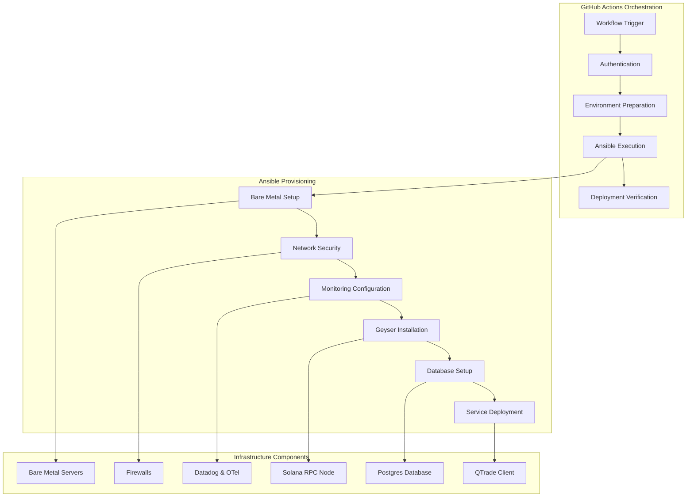

# Hybrid Deployment Infrastructure

QTrade leverages a sophisticated hybrid deployment architecture combining GitHub Actions and Ansible to create a robust, consistent, and scalable deployment pipeline for the entire arbitrage system. This infrastructure enables reliable deployments across various environments while maintaining strong security practices and version control.

## Deployment Architecture Overview



## GitHub Actions Orchestration

QTrade's deployment pipeline is driven by a series of GitHub Actions workflows that follow a sequentially numbered deployment process. Each workflow handles a specific aspect of the infrastructure, allowing for granular control and targeted deployments when changes are required.

### Workflow Structure

The deployment pipeline is organized into seven sequential workflows:

1. **Bare Metal Provisioning** (`1-bare-metal.yml`)
   - Sets up base server configurations
   - Configures core system packages and users
   - Prepares Docker environments

2. **Network Security** (`2-ufw-solana.yml`)
   - Implements firewall rules specific to Solana nodes
   - Secures RPC endpoints
   - Configures network access controls

3. **Monitoring Setup** (`3-datadog.yml`)
   - Installs Datadog agents
   - Configures OpenTelemetry collectors
   - Sets up monitoring dashboards and alerts

4. **Geyser Plugin Deployment** (`4-geyser.yml`)
   - Installs the Yellowstone Geyser plugin
   - Configures Rust toolchain with specified version
   - Sets up data streaming infrastructure

5. **Database Configuration** (`5-postgres.yml`)
   - Deploys PostgreSQL with specified version
   - Configures database schemas and users
   - Sets up necessary indexes for high-performance queries

6. **Agave Deployment** (`6-agave.yml`)
   - Configures middleware services
   - Sets up communication interfaces

7. **QTrade Client Deployment** (`7-qtrade-client.yml`)
   - Deploys the QTrade arbitrage client
   - Configures client-specific parameters
   - Sets up service management

### Key GitHub Actions Features

```yaml
# Example from QTrade's GitHub Actions workflow
name: 3. datadog

on:
  workflow_dispatch:
    inputs:
      host:
        description: 'The IP address of the host to deploy to'
        required: true
        type: string
        default: '160.202.128.177'
      version:
        description: 'What version of the otel-collector?'
        required: true
        type: string
        default: '0.121.0'
```

The workflows incorporate several important features:

1. **Parameterized Deployments**
   - Customizable host targets allow deployment to any environment
   - Version parameters enable precise control over component versions
   - Feature toggles allow for conditional deployment steps

2. **Secure Authentication**
   - SSH key management for secure server access
   - Ansible vault integration for secrets management
   - Secure credential handling through GitHub secrets

3. **Environment Validation**
   - SSH connection validation before deployment attempts
   - Host key verification to prevent man-in-the-middle attacks
   - Pre-deployment environment checks

## Ansible Automation

Ansible serves as the infrastructure-as-code tool responsible for the actual provisioning and configuration of services on the target machines. QTrade's Ansible implementation follows a role-based architecture for modularity and reusability.

### Ansible Playbook Structure

```yaml
# Example from QTrade's Ansible playbook
- name: Provision datadog
  hosts: all
  remote_user: "{{ remote_user }}"
  become: true
  become_method: ansible.builtin.sudo
  become_flags: "su -c"
  gather_facts: true
  tasks:
    - name: Import datadog role
      ansible.builtin.import_role:
        name: datadog
```

The Ansible implementation includes:

1. **Role-Based Organization**
   - Each component has a dedicated role (bare-metal, ufw-solana, datadog, geyser, postgres, agave, qtrade-client)
   - Roles ensure consistent application of configurations
   - Modular approach allows for component-specific updates

2. **Idempotent Operations**
   - All playbooks are designed to be safely re-runnable
   - State checking prevents unnecessary changes
   - Consistent end-state regardless of starting conditions

3. **Environment Abstraction**
   - Variables control environment-specific configurations
   - Host inventory separation allows for environment isolation
   - Role parametrization enables environment-specific tuning

### Key Ansible Features

1. **Host Key Management**
   - Automatic SSH host key registration
   - Secure key acceptance and verification
   - Connection testing before deployment

2. **Privilege Escalation Control**
   - Granular sudo permissions
   - User-specific privilege management
   - Secure command execution patterns

3. **Python Interpreter Specification**
   - Explicit Python interpreter selection
   - Version compatibility management
   - Environment isolation

## Deployment Security

QTrade's deployment infrastructure incorporates several security practices:

1. **Secure Secret Management**
   - Ansible vault for sensitive data encryption
   - GitHub secrets for workflow credentials
   - Isolated credential access

2. **SSH Hardening**
   - Private key authentication only
   - Strict host key checking
   - Limited connection attempts

3. **Firewall Configuration**
   - Custom UFW rules for Solana nodes
   - Port-specific access controls
   - Default-deny stance with explicit allows

## Deployment Workflow

The typical deployment flow follows these steps:

1. **Initiate Deployment**
   - Trigger relevant GitHub Actions workflow with required parameters
   - System validates inputs and prepares environment

2. **Authentication Preparation**
   - SSH keys are configured
   - Vault passwords are set up
   - Host keys are verified

3. **Ansible Execution**
   - GitHub Actions calls appropriate Ansible playbook
   - Playbook applies role configurations
   - Changes are applied with proper privilege escalation

4. **Validation**
   - Service status verification
   - Health checks
   - Monitoring confirmation

## Environment Management

The hybrid deployment system supports multiple environments:

1. **Development Environment**
   - Feature testing
   - Integration validation
   - Performance benchmarking

2. **Staging Environment**
   - Production-like configuration
   - Pre-release validation
   - Load testing

3. **Production Environment**
   - High-availability configuration
   - Optimized performance settings
   - Enhanced monitoring

## Versioning and Rollbacks

QTrade's deployment infrastructure supports version management:

1. **Explicit Versioning**
   - Each component deployment specifies exact versions
   - Version tracking through GitHub Actions parameters
   - Consistent version application across environments

2. **Rollback Capability**
   - Previous version re-deployment
   - State preservation during rollbacks
   - Configuration version consistency

## Future Enhancements

Planned enhancements for QTrade's deployment infrastructure include:

1. **Canary Deployments**
   - Progressive rollout capabilities
   - Automated health monitoring during deployment
   - Automatic rollback on failure detection

2. **Enhanced Testing Integration**
   - Automated pre-deployment testing
   - Integration test execution in staging
   - Performance benchmark automation

3. **Configuration Drift Detection**
   - Automated configuration validation
   - Drift notification and remediation
   - State consistency enforcement

## Conclusion

QTrade's hybrid deployment architecture leverages the orchestration capabilities of GitHub Actions with the powerful configuration management of Ansible to create a robust, secure, and scalable deployment pipeline. This approach enables consistent deployments across environments, version-controlled infrastructure changes, and reduced manual intervention during the deployment process.
