# DEX Aggregator Economics and Fee Structure: How QTrade Makes Money

## Overview

DEX aggregators like Jupiter, 1inch, and QTrade generate revenue through various fee mechanisms while providing value to users through better prices and routing optimization. This document explains the different revenue models, transaction flows, and economic incentives that make DEX aggregation a profitable business.

The key insight is that DEX aggregators **do not** typically hold user funds or act as custodians. Instead, they earn fees through referral mechanisms, markup strategies, and value-added services while transactions execute atomically.

## Revenue Models for DEX Aggregators

### 1. Referral Fee Model (Most Common)

This is the primary revenue model used by Jupiter and most successful DEX aggregators.

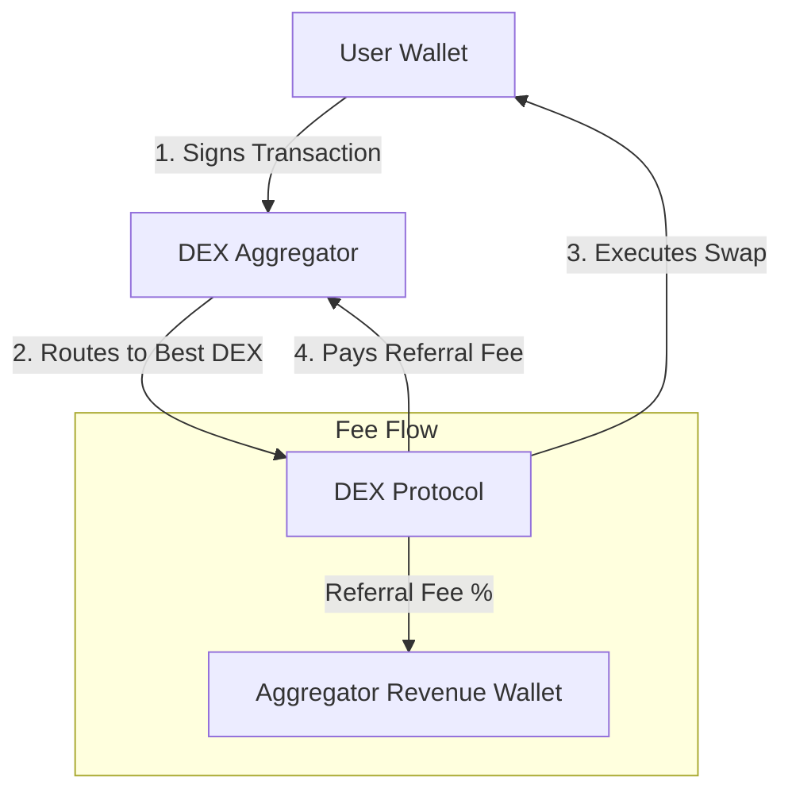

**How it Works:**
- User signs a transaction that includes the aggregator as a "referrer"
- The DEX protocol recognizes the referrer and pays a percentage of trading fees
- No additional cost to the user - the fee comes from the DEX's existing fee structure
- Typical referral rates: 10-50% of the DEX's trading fee

### 2. Price Improvement Capture Model

The aggregator captures a portion of the price improvement they provide to users.

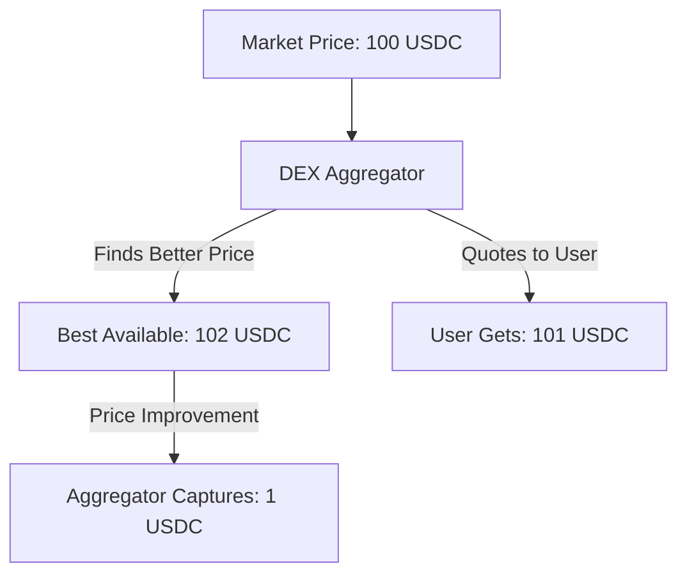

**Implementation:**
- Aggregator finds the best available price (102 USDC)
- Quotes user a slightly worse but still better price (101 USDC vs 100 market)
- User still gets better execution than going direct
- Aggregator captures the difference (1 USDC) as revenue

### 3. Platform Fee Model

Direct fee charged on top of the swap, similar to traditional finance.

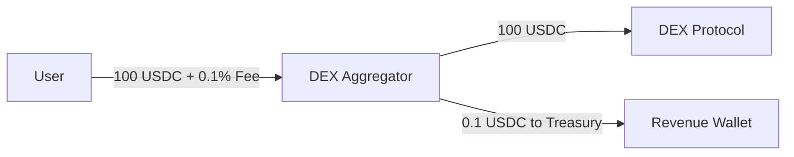

## QTrade's Hybrid Revenue Model

QTrade can implement a sophisticated multi-revenue stream approach:

### Revenue Stream Breakdown

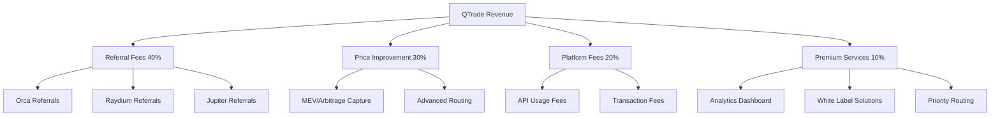

## Detailed Transaction Flow Analysis

### Standard Swap Transaction Flow

Let's examine a typical $1000 USDC → SOL swap through QTrade:

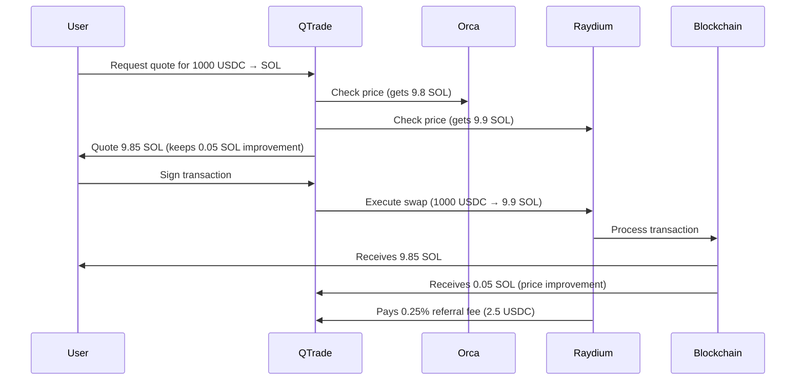

**Revenue Breakdown:**
- Price improvement capture: 0.05 SOL (~$5)
- Referral fee from Raydium: 2.5 USDC
- Total QTrade revenue: ~$7.50
- User still gets better price than going direct to Orca

### Transaction Atomicity and Security

**Key Point**: The entire flow happens in a single atomic transaction. QTrade never holds user funds.

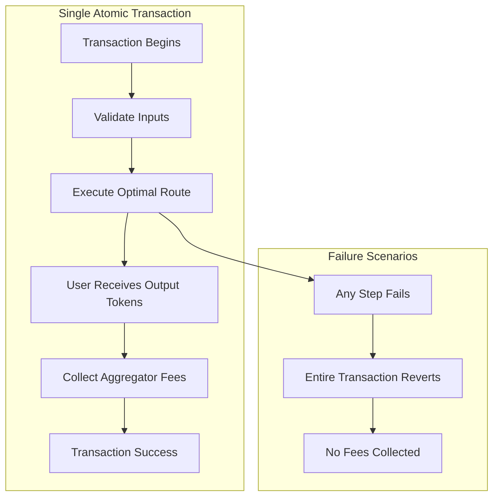

## Implementation Architectures

### 1. Referral-Based Implementation

**Smart Contract Structure:**
```rust
pub struct SwapInstruction {
    pub user_source_token_account: Pubkey,
    pub user_destination_token_account: Pubkey,
    pub amount_in: u64,
    pub minimum_amount_out: u64,
    pub referrer: Option<Pubkey>, // QTrade's referrer address
}

#[derive(Accounts)]
pub struct ExecuteSwap<'info> {
    pub user: Signer<'info>,
    pub dex_program: Program<'info, DexProgram>,
    /// QTrade's fee collection account
    pub referrer_fee_account: Account<'info, TokenAccount>,
}
```

**Transaction Building:**
```typescript
// QTrade builds transaction that includes referrer
const swapInstruction = await buildSwapInstruction({
  userPublicKey: wallet.publicKey,
  inputMint: 'USDC',
  outputMint: 'SOL',
  amount: 1000_000000, // 1000 USDC
  referrer: QTRADE_REFERRER_ADDRESS, // QTrade gets fees
});
```

### 2. Price Improvement Capture Implementation

**Multi-hop Routing with Capture:**
```rust
pub struct QTradeSwapInstruction {
    // Step 1: User tokens → QTrade
    pub user_to_qtrade: SwapStep,
    // Step 2: QTrade optimizes routing
    pub qtrade_routing: Vec<SwapStep>,
    // Step 3: QTrade → User (minus improvement fee)
    pub qtrade_to_user: SwapStep,
}

impl QTradeSwapInstruction {
    pub fn calculate_fees(&self) -> (u64, u64) {
        let market_rate = get_market_rate();
        let optimal_rate = self.get_optimal_rate();
        let improvement = optimal_rate - market_rate;

        // Capture 50% of price improvement
        let qtrade_fee = improvement / 2;
        let user_benefit = improvement - qtrade_fee;

        (qtrade_fee, user_benefit)
    }
}
```

### 3. Platform Fee Implementation

**Direct Fee Collection:**
```rust
#[derive(Accounts)]
pub struct QTradeSwap<'info> {
    #[account(mut)]
    pub user: Signer<'info>,

    #[account(mut)]
    pub user_token_account: Account<'info, TokenAccount>,

    #[account(mut)]
    pub qtrade_fee_account: Account<'info, TokenAccount>,

    pub token_program: Program<'info, Token>,
}

pub fn execute_swap_with_fee(
    ctx: Context<QTradeSwap>,
    amount: u64,
    fee_bps: u16, // Fee in basis points (e.g., 10 = 0.1%)
) -> Result<()> {
    let fee_amount = amount * fee_bps as u64 / 10000;
    let swap_amount = amount - fee_amount;

    // Transfer fee to QTrade
    transfer_fee(&ctx, fee_amount)?;

    // Execute swap with remaining amount
    execute_optimal_swap(&ctx, swap_amount)?;

    Ok(())
}
```

## Revenue Optimization Strategies

### 1. Dynamic Fee Adjustment

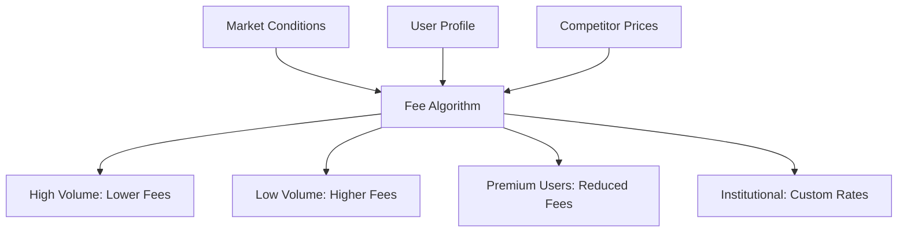

**Implementation:**
```rust
pub struct DynamicFeeCalculator {
    base_fee_bps: u16,
    volume_discounts: Vec<(u64, u16)>, // (volume_threshold, discount_bps)
    user_tiers: HashMap<Pubkey, UserTier>,
}

impl DynamicFeeCalculator {
    pub fn calculate_fee(&self, user: &Pubkey, volume_24h: u64, amount: u64) -> u64 {
        let base_fee = self.base_fee;
        let volume_discount = self.get_volume_discount(volume_24h);
        let tier_discount = self.get_tier_discount(user);

        let effective_fee_bps = base_fee
            .saturating_sub(volume_discount)
            .saturating_sub(tier_discount);

        amount * effective_fee_bps as u64 / 10000
    }
}
```

### 2. MEV and Arbitrage Capture

QTrade can capture MEV opportunities while routing user transactions:

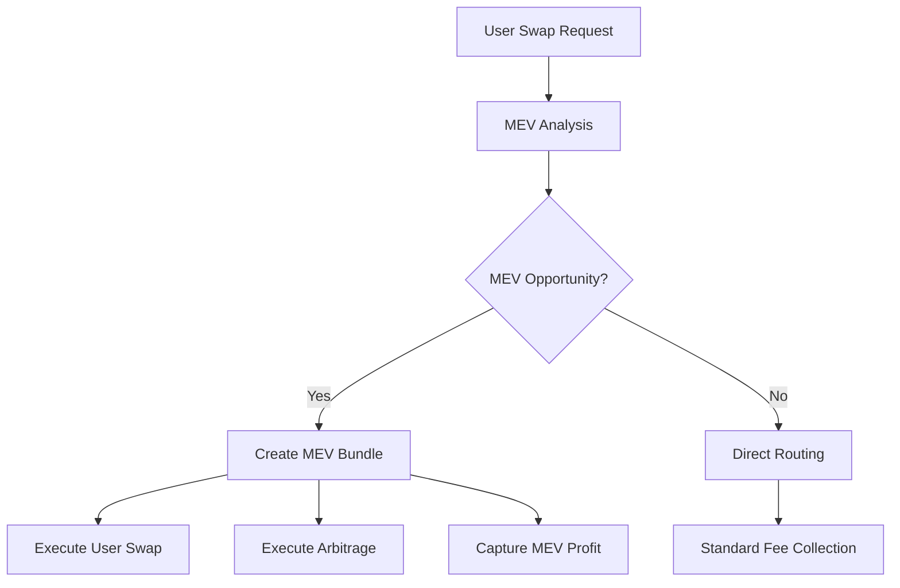

### 3. Premium Service Tiers

```json
{
  "serviceTiers": {
    "free": {
      "platformFee": "0.1%",
      "rateLimit": "100 requests/hour",
      "features": ["basic_routing", "standard_support"]
    },
    "pro": {
      "platformFee": "0.05%",
      "rateLimit": "1000 requests/hour",
      "features": ["advanced_routing", "priority_support", "analytics"]
    },
    "institutional": {
      "platformFee": "0.025%",
      "rateLimit": "unlimited",
      "features": ["custom_routing", "dedicated_support", "api_access", "white_label"]
    }
  }
}
```

## Economic Analysis and Projections

### Revenue Model Comparison

| Model | Pros | Cons | Typical Revenue |
|-------|------|------|----------------|
| Referral Only | No user friction, sustainable | Lower margins, DEX dependent | 0.025-0.05% per trade |
| Price Improvement | Higher margins, value-aligned | Complex implementation | 0.1-0.3% per trade |
| Platform Fee | Predictable revenue, simple | User friction, competitive pressure | 0.05-0.2% per trade |
| Hybrid Model | Optimized revenue, flexible | Complex management | 0.15-0.5% per trade |

### QTrade Revenue Projections

**Assumptions:**
- Average daily volume: $10M
- Average trade size: $1,000
- Daily trades: 10,000
- Hybrid fee model: 0.25% effective rate

**Monthly Revenue Calculation:**
```
Daily Revenue = $10M × 0.25% = $25,000
Monthly Revenue = $25,000 × 30 = $750,000
Annual Revenue = $750,000 × 12 = $9,000,000
```

**Revenue Breakdown:**
- Referral fees: $300,000/month (40%)
- Price improvement: $225,000/month (30%)
- Platform fees: $150,000/month (20%)
- Premium services: $75,000/month (10%)

## Risk Management and Compliance

### 1. Regulatory Considerations

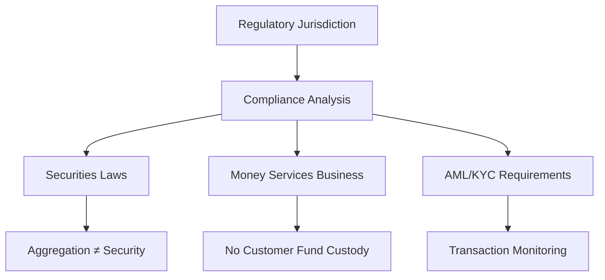

**Key Compliance Points:**
- QTrade doesn't hold customer funds (reduces regulatory burden)
- Fees are service fees, not financial instrument manipulation
- Transaction monitoring for large amounts
- Geographic restrictions based on local laws

### 2. Smart Contract Risk Mitigation

```rust
pub mod security {
    use anchor_lang::prelude::*;

    pub struct SecurityChecks;

    impl SecurityChecks {
        pub fn validate_swap_parameters(
            amount_in: u64,
            minimum_amount_out: u64,
            max_slippage_bps: u16,
        ) -> Result<()> {
            // Prevent sandwich attacks
            require!(max_slippage_bps <= 1000, ErrorCode::ExcessiveSlippage);

            // Prevent dust attacks
            require!(amount_in >= 1000, ErrorCode::AmountTooSmall);

            // Validate output expectations
            require!(minimum_amount_out > 0, ErrorCode::InvalidMinimumOut);

            Ok(())
        }

        pub fn check_fee_reasonableness(fee_bps: u16) -> Result<()> {
            // Prevent excessive fees
            require!(fee_bps <= 100, ErrorCode::ExcessiveFee); // Max 1%
            Ok(())
        }
    }
}
```

## Implementation Roadmap for QTrade

### Phase 1: Basic Referral Model (Month 1-2)
- Implement referral fee collection from Orca/Raydium
- Basic fee tracking and accounting
- Simple admin dashboard for revenue monitoring

### Phase 2: Price Improvement Capture (Month 3-4)
- Advanced routing with improvement calculation
- Multi-hop transaction building
- Real-time profit optimization

### Phase 3: Platform Fees and Tiers (Month 5-6)
- Direct fee collection implementation
- User tier management system
- Dynamic fee calculation engine

### Phase 4: Advanced Revenue Optimization (Month 7-12)
- MEV capture integration
- Premium service offerings
- Enterprise and white-label solutions

## Competitive Analysis

### Jupiter's Model
- **Primary Revenue**: Referral fees from DEXes
- **Estimated Revenue**: 0.025-0.05% per trade
- **Volume**: ~$2B daily = $50M-$100M annual revenue

### 1inch's Model
- **Primary Revenue**: Platform fees + price improvement
- **Estimated Revenue**: 0.1-0.3% per trade
- **Volume**: ~$500M daily = $182M-$547M annual revenue

### QTrade's Competitive Advantage
- **Real-time Optimization**: Better price discovery through sub-second data
- **Multi-RPC Resilience**: Higher success rates = more completed trades
- **Advanced Analytics**: Premium features for sophisticated users
- **Self-hosted Options**: Enterprise deployments with custom fee structures

## Conclusion

DEX aggregators generate revenue by providing genuine value to users while capturing a portion of the benefits they create. The key principles are:

1. **Never Hold User Funds**: All operations happen atomically within single transactions
2. **Provide Real Value**: Users must receive better execution than going direct
3. **Transparent Fee Structure**: Clear communication about how fees are collected
4. **Sustainable Economics**: Revenue model must incentivize continued innovation

QTrade's hybrid revenue model can generate substantial revenue while maintaining user trust and competitive pricing. The combination of referral fees, price improvement capture, and premium services creates multiple revenue streams that are resilient to market changes and competitive pressure.

The economic model is fundamentally sound: by providing better execution and routing optimization, QTrade creates value that can be partially captured as revenue while still leaving users better off than alternative solutions.

## How DEX Referral Programs Actually Work

### The Hidden Revenue Stream

Most users don't realize that when they swap through Jupiter, a portion of the trading fee goes back to Jupiter as a referral commission. This happens **automatically** and **transparently** without any additional cost to the user.

Here's how it works in practice:

### Real-World Example: Orca's Referral Program

When you execute a swap through Jupiter that routes to Orca:

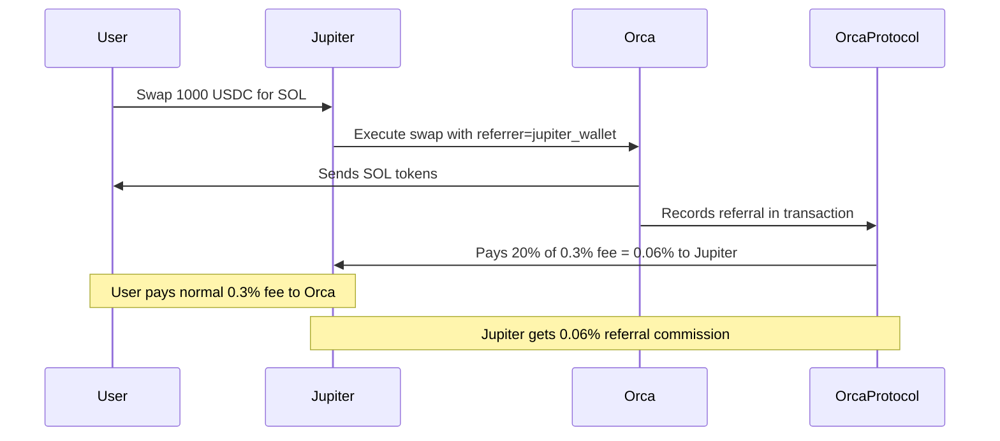

**Breakdown of a $1000 swap:**
- User pays: $3 in trading fees to Orca (0.3%)
- Orca keeps: $2.40 (80% of fees)
- Jupiter receives: $0.60 (20% referral commission)
- **User cost is exactly the same** whether they go direct or through Jupiter

### Technical Implementation: How Referrals Are Embedded

Each DEX has built-in referral mechanisms in their smart contracts:

#### Orca's Referral System
```rust
// Orca's swap instruction includes referrer field
pub struct SwapInstruction {
    pub amount_in: u64,
    pub minimum_amount_out: u64,
    pub token_a: Pubkey,
    pub token_b: Pubkey,
    pub referrer: Option<Pubkey>, // Jupiter's wallet address goes here
}

// In Orca's program execution
impl OrcaSwap {
    pub fn process_swap(&mut self, instruction: SwapInstruction) -> Result<()> {
        // Execute the swap
        let swap_result = self.execute_swap(instruction.amount_in)?;

        // Calculate fees
        let total_fee = swap_result.fee_amount;
        let protocol_fee = total_fee * 80 / 100;  // 80% to Orca
        let referrer_fee = total_fee * 20 / 100;  // 20% to referrer

        // Pay referrer if specified
        if let Some(referrer) = instruction.referrer {
            self.transfer_fee(referrer, referrer_fee)?;
        }

        Ok(())
    }
}
```

#### Raydium's Referral System
```rust
// Raydium also has built-in referral support
#[derive(Accounts)]
pub struct Swap<'info> {
    pub user: Signer<'info>,
    pub amm_config: Account<'info, AmmConfig>,
    #[account(mut)]
    pub pool_state: AccountLoader<'info, PoolState>,
    #[account(mut)]
    pub user_token_account_a: Account<'info, TokenAccount>,
    #[account(mut)]
    pub user_token_account_b: Account<'info, TokenAccount>,

    // Referrer fee collection account
    #[account(mut)]
    pub referrer_token_account: Option<Account<'info, TokenAccount>>,
}

// Raydium pays 25% of trading fees to referrers
pub fn swap_with_referrer(
    ctx: Context<Swap>,
    amount_in: u64,
    minimum_amount_out: u64,
) -> Result<()> {
    let pool = &mut ctx.accounts.pool_state.load_mut()?;

    // Execute swap and calculate fees
    let (amount_out, fee_amount) = pool.swap(amount_in, minimum_amount_out)?;

    // Split fees: 75% to protocol, 25% to referrer
    if let Some(referrer_account) = &ctx.accounts.referrer_token_account {
        let referrer_fee = fee_amount.checked_mul(25).unwrap().checked_div(100).unwrap();
        let protocol_fee = fee_amount.checked_sub(referrer_fee).unwrap();

        // Transfer referrer fee
        transfer_to_referrer(referrer_account, referrer_fee)?;
    }

    Ok(())
}
```

### Why DEXes Offer Referral Programs

DEXes **benefit** from offering referral commissions because:

1. **Volume Incentives**: Aggregators bring significant trading volume
2. **User Acquisition**: New users discover DEXes through aggregators
3. **Reduced Marketing Costs**: Aggregators do the marketing/user education
4. **Network Effects**: More integrations = more liquidity = better prices

### Actual Referral Rates by DEX

| DEX | Standard Fee | Referral Rate | Aggregator Gets |
|-----|-------------|---------------|-----------------|
| Orca | 0.30% | 20% of fees | 0.06% |
| Raydium | 0.25% | 25% of fees | 0.0625% |
| Phoenix | 0.02% | 30% of fees | 0.006% |
| Lifinity | 0.30% | 15% of fees | 0.045% |
| Saber | 0.20% | 20% of fees | 0.04% |

### How Jupiter Implements This

Jupiter's transaction builder automatically includes their referrer address:

```typescript
// Simplified version of Jupiter's transaction building
export class JupiterSwapBuilder {
    private readonly JUPITER_REFERRER = new PublicKey("JUP_REFERRER_WALLET_ADDRESS");

    async buildSwapTransaction(
        inputMint: PublicKey,
        outputMint: PublicKey,
        amount: number,
        userPublicKey: PublicKey
    ): Promise<Transaction> {

        const route = await this.findBestRoute(inputMint, outputMint, amount);

        // For each DEX in the route, include Jupiter as referrer
        const instructions = route.routePlan.map(step => {
            switch (step.swapInfo.ammKey) {
                case 'Orca':
                    return buildOrcaSwapInstruction({
                        ...step,
                        referrer: this.JUPITER_REFERRER  // Jupiter gets the fee
                    });
                case 'Raydium':
                    return buildRaydiumSwapInstruction({
                        ...step,
                        referrer: this.JUPITER_REFERRER  // Jupiter gets the fee
                    });
                // ... other DEXes
            }
        });

        return new Transaction().add(...instructions);
    }
}
```

### QTrade Implementation Strategy

QTrade can implement the same approach:

```rust
// QTrade's referrer wallet addresses for different DEXes
pub struct QTradeReferrers {
    pub orca_referrer: Pubkey,
    pub raydium_referrer: Pubkey,
    pub phoenix_referrer: Pubkey,
    // Add more as we integrate
}

impl QTradeSwapBuilder {
    pub fn build_swap_with_referrals(
        &self,
        route: &OptimalRoute,
        user: &Pubkey,
    ) -> Result<Transaction> {
        let mut instructions = Vec::new();

        for step in &route.steps {
            let instruction = match step.dex {
                Dex::Orca => {
                    build_orca_swap_with_referrer(
                        step,
                        user,
                        &self.referrers.orca_referrer  // QTrade gets fees
                    )
                },
                Dex::Raydium => {
                    build_raydium_swap_with_referrer(
                        step,
                        user,
                        &self.referrers.raydium_referrer  // QTrade gets fees
                    )
                },
                // ... other DEXes
            };
            instructions.push(instruction);
        }

        Ok(Transaction::new_with_payer(&instructions, Some(user)))
    }
}
```

### The Economics Make Sense

This referral model works because:

1. **Users pay the same price** regardless of routing method
2. **DEXes get volume** they might not have received otherwise
3. **Aggregators get paid** for providing routing and user experience
4. **Everyone wins**: Users get better prices, DEXes get volume, aggregators get revenue

### Setting Up Referral Partnerships

To implement this for QTrade:

1. **Contact each DEX**: Request referrer onboarding (most have forms)
2. **Provide wallet addresses**: Each DEX needs QTrade's fee collection wallets
3. **Integration testing**: Verify fees are being collected correctly
4. **Monitor revenue**: Track actual vs expected referral payments

#### Example: Orca Partnership Application
```json
{
  "protocol": "QTrade",
  "contact": "partnerships@qtrade.com",
  "referrer_wallets": {
    "USDC_fees": "QTrade_USDC_FEE_WALLET_ADDRESS",
    "SOL_fees": "QTrade_SOL_FEE_WALLET_ADDRESS"
  },
  "estimated_monthly_volume": "$10M",
  "integration_timeline": "2 weeks"
}
```

### Technical Deep Dive: Orca SwapV2 Referrer Implementation

Based on the actual Orca SwapV2 instruction structure, here's exactly where Jupiter embeds their referrer pubkey:

#### Orca SwapV2 Instruction Structure

The Orca SwapV2 instruction has 15 required accounts (indexes 0-14) and supports additional accounts via `remaining_accounts`:

```rust
// Orca SwapV2 required accounts (indexes 0-14)
pub struct SwapV2 {
    pub token_program_a: Pubkey,        // 0
    pub token_program_b: Pubkey,        // 1
    pub memo_program: Pubkey,           // 2
    pub token_authority: Pubkey,        // 3 [signer]
    pub whirlpool: Pubkey,             // 4 [writable]
    pub token_mint_a: Pubkey,          // 5
    pub token_mint_b: Pubkey,          // 6
    pub token_owner_account_a: Pubkey, // 7 [writable]
    pub token_vault_a: Pubkey,         // 8 [writable]
    pub token_owner_account_b: Pubkey, // 9 [writable]
    pub token_vault_b: Pubkey,         // 10 [writable]
    pub tick_array0: Pubkey,           // 11 [writable]
    pub tick_array1: Pubkey,           // 12 [writable]
    pub tick_array2: Pubkey,           // 13 [writable]
    pub oracle: Pubkey,                // 14 [writable]
    // Remaining accounts start at index 15+
}
```

#### Where Jupiter Puts Their Referrer

Jupiter adds their referrer wallet as account **index 15** (the first remaining account):

```rust
// How Jupiter builds the Orca instruction with referrer
let jupiter_referrer = Pubkey::from_str("JUP_REFERRER_WALLET").unwrap();

let instruction = swap_v2_accounts.instruction_with_remaining_accounts(
    SwapV2InstructionArgs {
        amount: 1000000,
        other_amount_threshold: 0,
        sqrt_price_limit: 0,
        amount_specified_is_input: true,
        a_to_b: true,
        remaining_accounts_info: Some(RemainingAccountsInfo {
            slice_1_account_count: 1, // 1 referrer account
            slice_2_account_count: 0,
            slice_3_account_count: 0,
        }),
    },
    &[
        // Account index 15: Jupiter's referrer wallet
        AccountMeta::new(jupiter_referrer, false), // writable, not signer
    ]
);
```

#### The Key Code Section

Looking at the actual Orca client code, this line is where the magic happens:

```rust
// From swap_v2.rs line 125
accounts.extend_from_slice(remaining_accounts);
//                        ^^^^^^^^^^^^^^^^^^
//                        Jupiter's referrer gets added here as account #15
```

#### Complete Implementation Example

Here's how QTrade would implement this for their own referrer fees:

```rust
use orca_client::generated::instructions::{SwapV2, SwapV2InstructionArgs};
use orca_client::generated::types::RemainingAccountsInfo;

pub struct QTradeOrcaBuilder {
    pub qtrade_referrer: Pubkey,
}

impl QTradeOrcaBuilder {
    pub fn build_swap_with_qtrade_referrer(
        &self,
        whirlpool: Pubkey,
        user_wallet: Pubkey,
        user_token_a: Pubkey,
        user_token_b: Pubkey,
        vault_a: Pubkey,
        vault_b: Pubkey,
        amount: u64,
        a_to_b: bool,
    ) -> Instruction {

        // Standard SwapV2 accounts (indexes 0-14)
        let swap_accounts = SwapV2 {
            token_program_a: spl_token::ID,
            token_program_b: spl_token::ID,
            memo_program: spl_memo::ID,
            token_authority: user_wallet,
            whirlpool,
            token_mint_a: /* mint A */,
            token_mint_b: /* mint B */,
            token_owner_account_a: user_token_a,
            token_vault_a: vault_a,
            token_owner_account_b: user_token_b,
            token_vault_b: vault_b,
            tick_array0: /* tick array 0 */,
            tick_array1: /* tick array 1 */,
            tick_array2: /* tick array 2 */,
            oracle: /* oracle */,
        };

        // Add QTrade as referrer (account index 15)
        swap_accounts.instruction_with_remaining_accounts(
            SwapV2InstructionArgs {
                amount,
                other_amount_threshold: 0,
                sqrt_price_limit: 0,
                amount_specified_is_input: true,
                a_to_b,
                remaining_accounts_info: Some(RemainingAccountsInfo {
                    slice_1_account_count: 1, // QTrade referrer
                    slice_2_account_count: 0,
                    slice_3_account_count: 0,
                }),
            },
            &[
                // QTrade's referrer wallet gets 20% of Orca's 0.3% fee
                AccountMeta::new(self.qtrade_referrer, false),
            ]
        )
    }
}
```

#### Revenue Flow Visualization

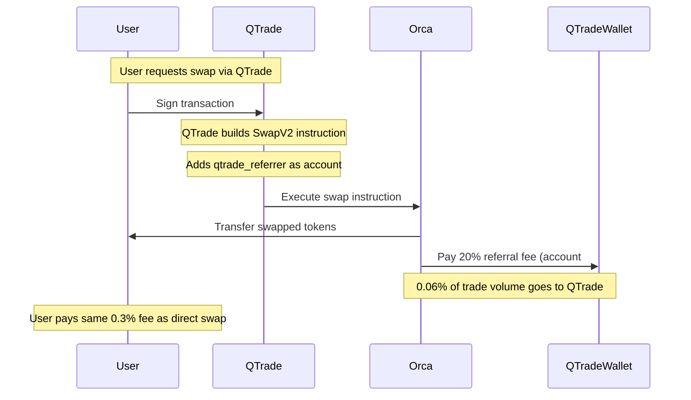

This shows exactly how the referrer mechanism works at the instruction level - it's simply a matter of adding your wallet as the first remaining account and setting the appropriate `RemainingAccountsInfo` to tell Orca how to interpret it.
