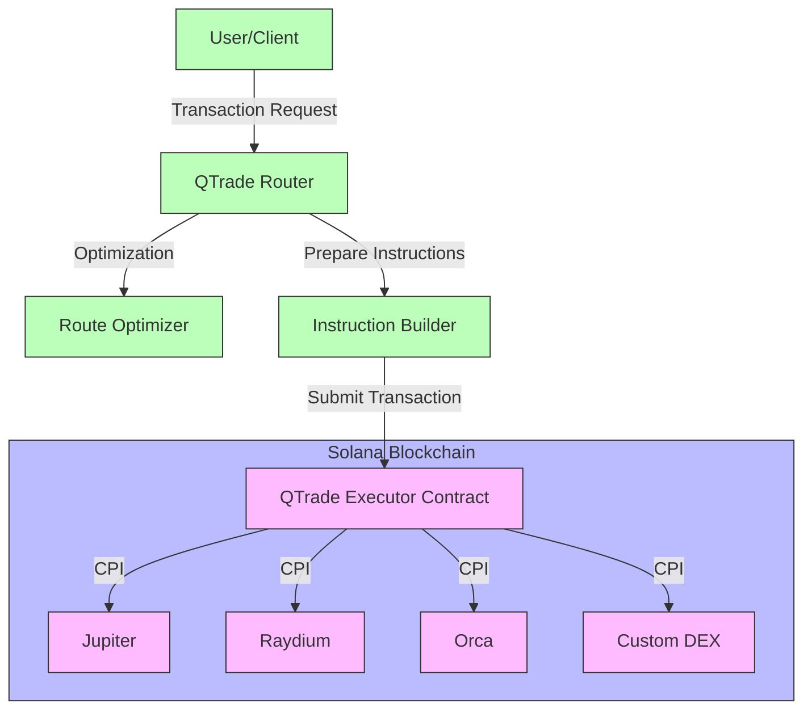
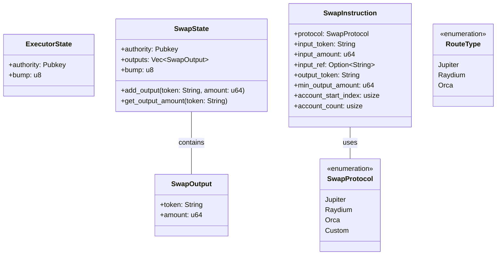
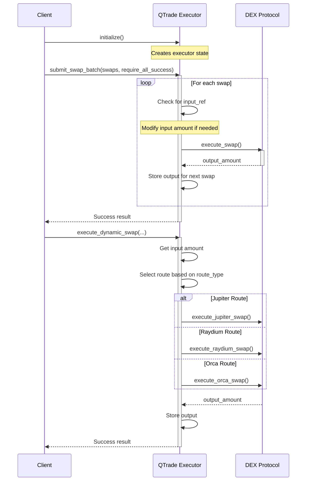

# QTrade Executor Architecture

This document describes the architecture and implementation of the on-chain executor component in the qtrade hybrid architecture.

## Overview

The QTrade Executor is a Solana smart contract built with Anchor that enables efficient on-chain execution of swap operations. It represents a hybrid approach to DEX aggregation, where complex routing logic happens off-chain, but execution can be performed on-chain for maximum efficiency and composability.

## System Components

The system consists of the following key components:

1. **QTrade Executor Smart Contract**: An Anchor-based Solana program that executes swaps on various DEXes.
   - Supports batched swap execution
   - Provides dynamic swap routing based on previous swap outputs
   - Interfaces with multiple DEX protocols (Jupiter, Raydium, Orca)

2. **Off-chain Router**: The existing qtrade-router component that identifies optimal swap routes
   - Calculates the most efficient paths across multiple DEXes
   - Prepares transaction instructions for on-chain execution

## Architecture Diagram

## Smart Contract Design

The QTrade Executor smart contract follows a modular design:

## On-chain Flow

The flow of executing swaps through the QTrade Executor happens in the following steps:

## Key Features

### Batch Swap Execution

The `submit_swap_batch` function allows executing multiple swaps in a single transaction. This approach offers several advantages:

1. **Gas Efficiency**: Executing multiple swaps in one transaction reduces overall gas costs
2. **Atomic Execution**: All swaps either succeed together or fail together (when `require_all_success` is true)
3. **Output Reuse**: The output from one swap can be used as the input for a subsequent swap

### Dynamic Swap Routing

The `execute_dynamic_swap` function provides a flexible approach to swap execution:

1. **Input Flexibility**: Can use a specific input amount or reference a previous swap's output
2. **Protocol Selection**: Routes to different DEX protocols based on the route type
3. **State Persistence**: Maintains swap state for subsequent operations

### Protocol Integration

The executor integrates with multiple DEX protocols:

1. **Jupiter**: General-purpose DEX aggregator with wide market coverage
2. **Raydium**: AMM and CLMM pools with concentrated liquidity
3. **Orca**: Whirlpool concentrated liquidity pools
4. **Custom**: Extensible design allows for future protocol integrations

## Implementation Details

### Account Structure

The program uses several Anchor accounts to manage state:

1. **ExecutorState**: Stores the authority and bump for the PDA
   - Initialized once per user
   - Used to validate authority for all operations

2. **SwapState**: Maintains the outputs from previous swaps
   - Created on-demand during dynamic swap execution
   - Stores token addresses and output amounts

### Instruction Processing

The executor processes instructions in the following manner:

1. **Initialization**: Creates the executor state account
2. **Batch Swaps**: Processes multiple swaps, tracking outputs between them
3. **Dynamic Swaps**: Executes single swaps with dynamic input sourcing

### Cross-Program Invocation (CPI)

The executor uses CPI to interact with DEX protocols:

1. **Account Preparation**: Organizes required accounts based on the protocol
2. **Instruction Building**: Creates the appropriate instruction for the target protocol
3. **Invocation**: Calls the target protocol with the necessary accounts and data

## Security Considerations

1. **Slippage Protection**: Min output amount checks prevent excessive slippage
2. **Authority Validation**: All operations require proper authority signatures
3. **Input Validation**: Proper validation of inputs prevents unexpected behavior
4. **Account Validation**: Careful checking of all accounts passed to the program

## Integration with QTrade Ecosystem

The QTrade Executor integrates with the existing QTrade ecosystem:

1. **Router Integration**: The qtrade-router can prepare instructions for the executor
2. **Client Support**: The qtrade-client can be extended to interface with the executor
3. **Metrics Collection**: Execution results can feed into the existing metrics infrastructure

## Future Improvements

1. **Flash Loan Support**: Add native flash loan capabilities for more complex strategies
2. **Position Management**: Support for managing LP positions on various protocols
3. **Concentrated Liquidity**: Specialized handling for concentrated liquidity pools
4. **Partial Success Mode**: Allow partial success for batch operations with maximum outputs

## Conclusion

The QTrade Executor represents a significant advancement in the QTrade architecture, bringing execution capabilities on-chain while leveraging the existing off-chain intelligence of the router component. This hybrid approach combines the best of both worlds: the computational power of off-chain systems with the composability and efficiency of on-chain execution.
