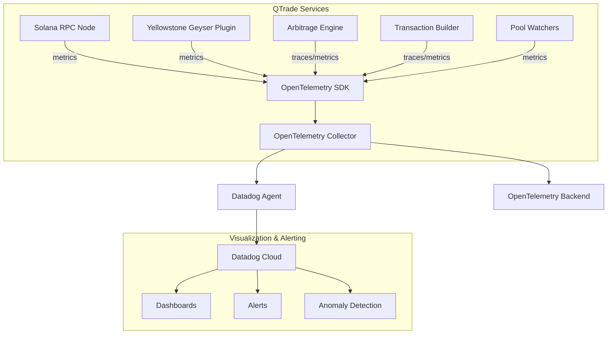

# Monitoring Infrastructure with Datadog and OpenTelemetry

The QTrade platform employs a sophisticated monitoring infrastructure using Datadog and OpenTelemetry to ensure system reliability, performance optimization, and timely alerts across the entire arbitrage pipeline. This document provides a technical deep-dive into the monitoring architecture and implementation.

## Monitoring Architecture Overview



## OpenTelemetry Implementation

QTrade uses OpenTelemetry as its primary instrumentation framework, providing a vendor-agnostic way to collect telemetry data (traces, metrics, and logs) across its various components. The implementation follows a three-layer approach:

1. **Instrumentation Layer**: Native code instrumentation using the OpenTelemetry SDK
2. **Collection Layer**: OpenTelemetry Collector for data aggregation and processing
3. **Backend Layer**: Datadog for visualization, alerting, and long-term storage

### Core Components Integration

Each component in the QTrade system is fully instrumented:

#### 1. Solana RPC Node Monitoring

```rust
// Example metric collection for RPC node health
let counter = meter
    .u64_counter("qtrade.rpc.requests_total")
    .with_description("Total number of RPC requests processed")
    .build();
counter.add(1, &[KeyValue::new("endpoint", "getAccountInfo")]);
```

The system tracks key RPC node metrics including:
- Request latency distributions
- Error rates by endpoint type
- Transaction submission success rates
- Block processing times
- Connection pool utilization

#### 2. Yellowstone Geyser Plugin Metrics

The Yellowstone Geyser plugin is monitored for both throughput and data completeness:

```rust
// Example metric for Geyser plugin monitoring
static ref GEYSER_EVENTS_PROCESSED: Counter<u64> = {
    QTRADE_RUNTIME_METER
        .u64_counter("qtrade.geyser.events_processed")
        .with_description("Number of events processed by Yellowstone Geyser plugin")
        .build()
};
```

Key metrics include:
- Event processing latency
- Event throughput rates
- Plugin backpressure indicators
- Account data completeness verification
- Plugin restart counts

#### 3. DEX Pool Monitoring

The monitoring system tracks the health and state of DEX pools to ensure accurate arbitrage calculations:

```rust
// Pool monitoring example
let histogram = meter
    .f64_histogram("qtrade.dex.pool_reserves_update_time")
    .with_description("Time taken to update pool reserves")
    .build();
histogram.record(update_duration_ms, &[
    KeyValue::new("dex", "raydium"),
    KeyValue::new("pool_address", pool_address)
]);
```

Metrics tracked include:
- Pool reserve update frequency
- Reserve data freshness
- Reserve size changes
- Liquidity depth indicators
- Price deviation measurements

#### 4. Transaction Processing Pipeline

The transaction processing pipeline is comprehensively monitored with distributed tracing:

```rust
// Transaction tracing example
tracer.in_span("transaction_execution", |cx| {
    let span = cx.span();
    span.set_attribute(KeyValue::new("tx_signature", signature));
    span.set_attribute(KeyValue::new("provider", "jito"));

    // Execution logic

    // Record result
    span.set_attribute(KeyValue::new("status", "confirmed"));
});
```

This approach enables:
- End-to-end transaction visibility
- Per-provider success rates
- Execution time distributions
- RPC provider reliability comparisons
- Transaction fee analytics

## Datadog Integration

Datadog serves as the primary visualization and alerting platform, with the OpenTelemetry Collector exporting data via OTLP to Datadog:

```yaml
# OpenTelemetry Collector configuration excerpt
receivers:
  otlp:
    protocols:
      grpc:
        endpoint: 0.0.0.0:4317
      http:
        endpoint: 0.0.0.0:4318

exporters:
  datadog:
    api:
      key: ${DATADOG_API_KEY}
    metrics:
      endpoint: https://api.datadoghq.com
    traces:
      endpoint: https://trace.agent.datadoghq.com

service:
  pipelines:
    metrics:
      receivers: [otlp]
      processors: [batch, resourcedetection]
      exporters: [datadog]
    traces:
      receivers: [otlp]
      processors: [batch, resourcedetection]
      exporters: [datadog]
```

### Custom Metrics and Checks

QTrade implements custom Datadog checks (`qtrade-custom-checks`) to perform specialized monitoring:

1. **Arbitrage Profitability Analytics**:
   - Tracking profit distributions
   - Opportunity frequency patterns
   - Chain conditions correlation

2. **Cross-System Health Verification**:
   - RPC provider state consistency checks
   - Pool data validation across providers
   - Transaction status reconciliation

### Infrastructure Monitoring

In addition to application-level monitoring, QTrade employs comprehensive infrastructure monitoring:

1. **System Resource Tracking**:
   - CPU, memory, and disk utilization
   - Network bandwidth and latency
   - Container performance metrics

2. **Cloud Resource Optimization**:
   - Service scaling efficiency
   - Resource cost allocation
   - Provisioning lead indicators

## Alerting and Incident Response

The monitoring system is configured with multi-tiered alerting:

1. **Operational Alerts**:
   - Service availability issues
   - Performance degradation indicators
   - Data freshness concerns

2. **Business Alerts**:
   - Arbitrage opportunity pattern changes
   - Profit margin deviations
   - Market condition shifts

3. **Security Alerts**:
   - Unusual transaction patterns
   - Authorization anomalies
   - Network access outliers

## Dashboard Examples

The monitoring infrastructure drives several key dashboards:

1. **Executive Dashboard**: Overall system health, profit metrics, and key performance indicators
2. **Operations Dashboard**: Detailed component health, latency distributions, and error rates
3. **DEX Analytics Dashboard**: Pool-specific metrics, liquidity depths, and price impact analytics
4. **Transaction Dashboard**: Provider reliability, confirmation rates, and fee optimization metrics

## Future Enhancements

QTrade's monitoring infrastructure roadmap includes:

1. **Advanced Anomaly Detection**:
   - Machine learning-based pattern recognition
   - Predictive failure analytics
   - Auto-remediation capabilities

2. **Extended Metrics Collection**:
   - Market microstructure indicators
   - Competitive arbitrage analytics
   - Cross-chain comparison metrics

3. **Enhanced Visualization**:
   - Real-time 3D transaction flow visualization
   - Interactive profit attribution models
   - Geographical performance distribution maps

## Conclusion

QTrade's monitoring infrastructure combines the flexibility of OpenTelemetry with the powerful visualization and alerting capabilities of Datadog. This hybrid approach enables comprehensive visibility across the entire arbitrage pipeline, from blockchain data ingestion to transaction execution, ensuring optimal system performance and reliability.
