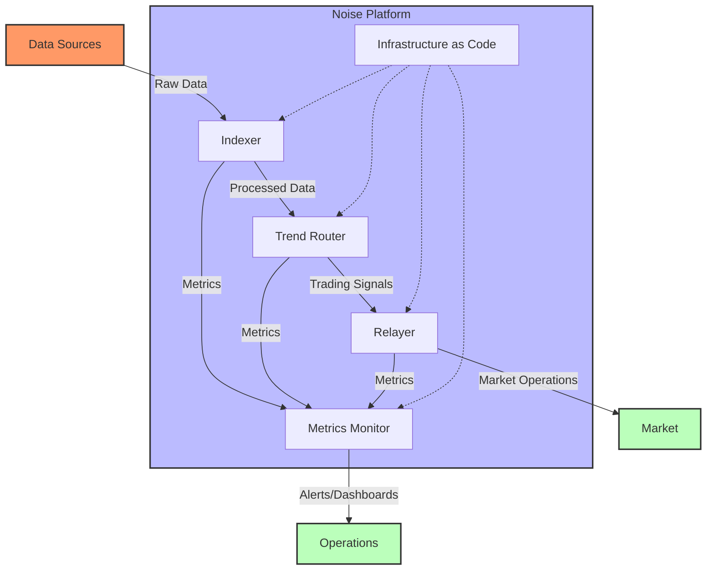
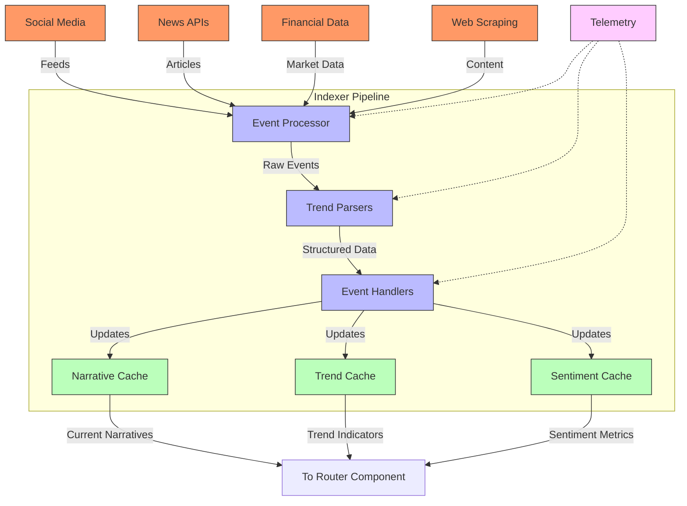
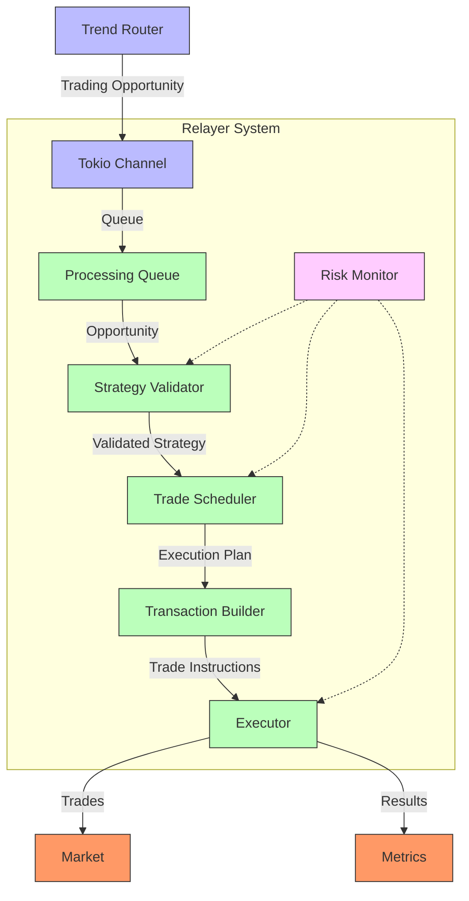
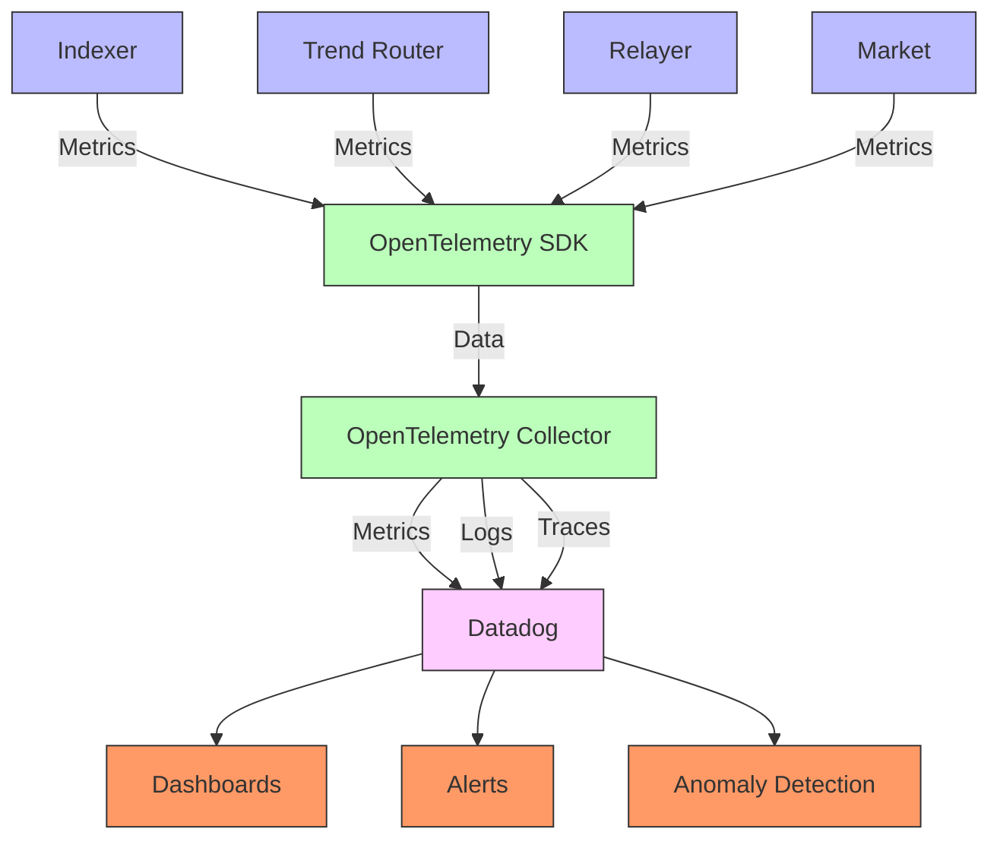
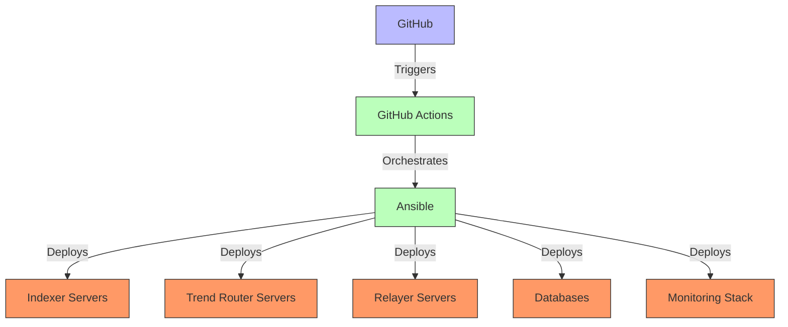

# Noise System Design: Trading Trends and Narratives

## Executive Summary

This document outlines a system design for Noise's programmatic liquidity platform that enables users to trade trends and narratives as assets. The design leverages architectural patterns from the qtrade system, adapting them to the unique requirements of discovering, quantifying, and trading global narratives as financial instruments.

At its core, the system combines real-time data indexing, sophisticated trend analysis, optimized routing, and reliable transaction execution to create a seamless platform for narrative-based trading.

## System Overview

The Noise platform transforms intangible market trends and narratives into tradable assets through a sophisticated system with five key components:



### Core Components

1. **Indexer**: Collects, processes, and structures data from diverse sources to identify narratives and trends
2. **Trend Router**: Analyzes narrative data to identify trading opportunities
3. **Relayer**: Executes trading operations based on identified opportunities
4. **Metrics Monitor**: Tracks system performance and market behaviors
5. **Infrastructure as Code**: Manages deployment and scaling of all system components

## Detailed Component Architecture

### 1. Indexer

The Indexer is responsible for ingesting, processing, and structuring data from diverse sources to identify and quantify narratives and trends.



#### Key Components

1. **Event Processor**: Receives data from various sources and routes it to appropriate parsers based on data type and source
2. **Trend Parsers**: Specialized parsers for different data sources that extract relevant information:
   - `SocialMediaParser`: Processes Twitter, Reddit, and other social media posts
   - `NewsParser`: Extracts information from news articles
   - `MarketDataParser`: Processes financial market data
   - `WebContentParser`: Extracts relevant data from web content

3. **Event Handlers**: Convert parsed data into structured narrative and trend models and update the shared caches

4. **Thread-Safe Caches**: Provide concurrent, low-latency access to current narrative and trend states:
   - `NarrativeCache`: Maintains current active narratives and their key characteristics
   - `TrendCache`: Stores trend indicators including momentum and direction
   - `SentimentCache`: Houses sentiment metrics related to narratives

5. **Telemetry**: OpenTelemetry integration captures performance metrics throughout the pipeline to monitor health and efficiency

#### Data Flow

1. Raw data is collected from multiple sources (social media, news, market data, web content)
2. The Event Processor routes data to specialized parsers based on source and format
3. Parsers extract relevant information and structure it for further processing
4. Event Handlers update the shared caches with the latest narrative and trend data
5. The Router component has continuous access to up-to-date narrative and trend information

### 2. Trend Router

The Trend Router analyzes narrative data to identify trading opportunities and optimal execution strategies.

```mermaid
flowchart TD
    %% Input Sources
    NC[Narrative Cache] --> |Narrative Data| TR[Trend Router]
    TC[Trend Cache] --> |Trend Indicators| TR
    SC[Sentiment Cache] --> |Sentiment Metrics| TR

    %% Router Components
    TR --> |Periodic Check| A[Analyzer]
    A --> |Model Input| NLP[NLP Processing]

    %% ML Pipeline components (flattened)
    NLP --> FM[Feature Matrix]
    FM --> MM[Market Model]
    MM --> |Solve| OPT[Optimizer]
    OPT --> |Result| EX[Extraction]
    EX --> TO[Trading Opportunity]

    %% Output Flow
    TO --> |Tokio Channel| RT[To Relayer]

    %% Styling
    rect rgb(240, 240, 255)
        TR
        A
    end

    rect rgb(250, 240, 255)
        NLP
        FM
        MM
        OPT
        EX
    end

    %% Metadata
    classDef inputs fill:#bbf,stroke:#333
    classDef output fill:#f96,stroke:#333

    class NC,TC,SC inputs
    class RT output
```

#### Key Components

1. **Analyzer**: Periodically examines the current state of narratives and trends from the caches
2. **ML Pipeline**: Processes narrative and trend data through sophisticated machine learning models:
   - `NLP Processing`: Applies natural language processing to extract features from text data
   - `Feature Matrix`: Constructs a matrix of features for each narrative/trend
   - `Market Model`: Maps features to market behavior and price impact
   - `Optimizer`: Determines optimal trading strategies for each opportunity
   - `Extraction`: Formats results for downstream processing

3. **Trading Opportunity**: A structured representation of an identified opportunity including:
   - Narrative identification
   - Expected price impact
   - Confidence metrics
   - Optimal execution strategy
   - Risk parameters

#### Technical Components

1. **NLP Engine**: Utilizes transformers and embedding models to process textual data
2. **Time Series Analysis**: Identifies patterns and correlations in trend development
3. **Sentiment Analysis**: Quantifies public sentiment around specific narratives
4. **Market Impact Model**: Predicts how narratives will affect prices and trading volumes
5. **Optimization Algorithm**: Determines optimal entry and exit points for trading narratives

#### Scheduling and Execution

- A timer triggers analysis runs at configurable intervals
- Each run retrieves the latest narrative and trend data from the caches
- The ML pipeline processes the data to identify trading opportunities
- Results are packaged as `TradingOpportunity` structures containing:
  - `narrative_id`: Identifier for the narrative
  - `confidence`: Confidence score for the opportunity
  - `expected_impact`: Expected market impact
  - `entry_strategy`: Optimal entry strategy
  - `exit_conditions`: Conditions for exiting the position
  - `risk_metrics`: Risk evaluation metrics

### 3. Relayer

The Relayer executes trading operations based on identified opportunities from the Trend Router.



#### Key Components

1. **Processing Queue**: Manages incoming trading opportunities in order of priority
2. **Strategy Validator**: Validates and refines trading strategies based on current market conditions
3. **Trade Scheduler**: Determines optimal timing and sequencing of trades
4. **Transaction Builder**: Constructs the actual trade transactions
5. **Executor**: Submits trades to the market and monitors execution
6. **Risk Monitor**: Provides real-time risk assessment and circuit breaker functionality

#### Execution Flow

1. Trading opportunities are received from the Router via a Tokio channel
2. The Processing Queue prioritizes opportunities based on confidence and expected return
3. The Strategy Validator confirms that the opportunity is still valid based on latest data
4. The Trade Scheduler creates an execution plan, potentially breaking large trades into smaller ones
5. The Transaction Builder creates the actual trade instructions
6. The Executor submits trades to the market and monitors execution status
7. Results are recorded for metrics and performance analysis

#### Risk Management

- **Circuit Breakers**: Automatic trading stops if market conditions change significantly
- **Exposure Limits**: Enforces maximum exposure to any single narrative
- **Correlation Analysis**: Prevents overexposure to correlated narratives
- **Slippage Monitoring**: Tracks and limits slippage on trade execution
- **Execution Simulation**: Pre-flight simulation of trades to validate expected outcomes

### 4. Metrics Monitor

The Metrics Monitor tracks system performance and market behaviors through comprehensive telemetry.



#### Key Metrics

1. **System Performance Metrics**:
   - Component latency and throughput
   - Resource utilization (CPU, memory, network)
   - Error rates and types
   - Processing queue lengths

2. **Narrative and Trend Metrics**:
   - Narrative detection rates
   - Sentiment accuracy
   - Trend prediction accuracy
   - Narrative lifecycle statistics

3. **Trading Performance Metrics**:
   - Strategy success rates
   - Return on investment by narrative type
   - Execution efficiency
   - Slippage statistics
   - Risk exposure levels

#### Monitoring and Alerting

- **Real-time Dashboards**: Visualize system health and performance
- **Multi-tier Alerting**: Escalated notification based on severity
- **Anomaly Detection**: Identify unusual patterns in system behavior or market conditions
- **Performance Analytics**: Track and optimize component performance over time
- **Business Intelligence**: Extract insights from trading patterns and narrative lifecycles

### 5. Infrastructure as Code

The Infrastructure as Code component manages deployment, scaling, and configuration of all system components.



#### Key Components

1. **GitHub Actions Orchestration**: Manages the CI/CD pipeline
2. **Ansible Automation**: Handles configuration management and deployment
3. **Infrastructure Templates**: Define infrastructure components in code
4. **Environment Management**: Supports development, staging, and production environments
5. **Secret Management**: Secures API keys and sensitive configuration
6. **Scaling Policies**: Defines how and when to scale components based on load

#### Deployment Strategy

- **Hybrid Deployment**: Combines cloud resources for scalability with bare-metal for performance
- **Canary Releases**: Gradual rollout of new features to minimize risk
- **Automatic Rollbacks**: Revert to previous versions if issues are detected
- **Configuration Management**: Centralized management of all component configurations
- **Disaster Recovery**: Automated backup and recovery procedures

## Data Structures

### NarrativeData

The core data structure for tracking narratives:

```rust
pub struct NarrativeData {
    /// Unique identifier for the narrative
    pub id: String,
    /// Human-readable name/description
    pub name: String,
    /// Current strength/prevalence (0.0-1.0)
    pub strength: f64,
    /// Momentum indicator (-1.0 to 1.0)
    pub momentum: f64,
    /// Sentiment score (-1.0 to 1.0)
    pub sentiment: f64,
    /// Related keywords and terms
    pub keywords: Vec<String>,
    /// Sources where this narrative appears
    pub sources: Vec<String>,
    /// First detection timestamp
    pub first_seen: u64,
    /// Most recent update timestamp
    pub last_updated: u64,
    /// Related narratives
    pub related_narratives: Vec<String>,
}
```

### TradingOpportunity

Data structure for representing trading opportunities:

```rust
pub struct TradingOpportunity {
    /// Narrative ID this opportunity is based on
    pub narrative_id: String,
    /// Confidence score (0.0-1.0)
    pub confidence: f64,
    /// Expected market impact
    pub expected_impact: f64,
    /// Optimal time to enter position
    pub entry_timing: EntryTiming,
    /// Position size recommendation
    pub position_size: f64,
    /// Exit condition parameters
    pub exit_conditions: ExitConditions,
    /// Risk metrics
    pub risk_metrics: RiskMetrics,
    /// Strategy status
    pub status: String,
}
```

## Performance Characteristics

The system is designed for high performance and reliability:

1. **Scalability**: Horizontal scaling of all components to handle increased load
2. **Latency**: Sub-second processing of new data for real-time trend detection
3. **Throughput**: Capable of processing thousands of data points per second
4. **Reliability**: Fault-tolerant design with no single point of failure
5. **Accuracy**: Continuous improvement of prediction models through feedback loops

## Future Enhancements

1. **Enhanced NLP Models**: Integration of more sophisticated language models for narrative detection
2. **Multi-modal Analysis**: Incorporate image and video analysis for more comprehensive trend detection
3. **Advanced Sentiment Analysis**: More nuanced sentiment detection including irony and humor
4. **Cross-platform Correlation**: Better correlation of narratives across different platforms
5. **Predictive Narrative Modeling**: Anticipate emerging narratives before they gain widespread traction
6. **Narrative Lifecycle Management**: Track complete lifecycle of narratives from emergence to decay

## Conclusion

This system design leverages the core architectural patterns from qtrade while adapting them to the unique requirements of detecting and trading narratives and trends. By combining real-time data indexing, sophisticated analysis, and reliable execution, the platform provides a comprehensive solution for transforming intangible narratives into tradable assets.

The modular, scalable architecture allows for continuous improvement and expansion of capabilities while maintaining high performance and reliability. Through comprehensive monitoring and metrics collection, the system can adapt to changing market conditions and improve prediction accuracy over time.
