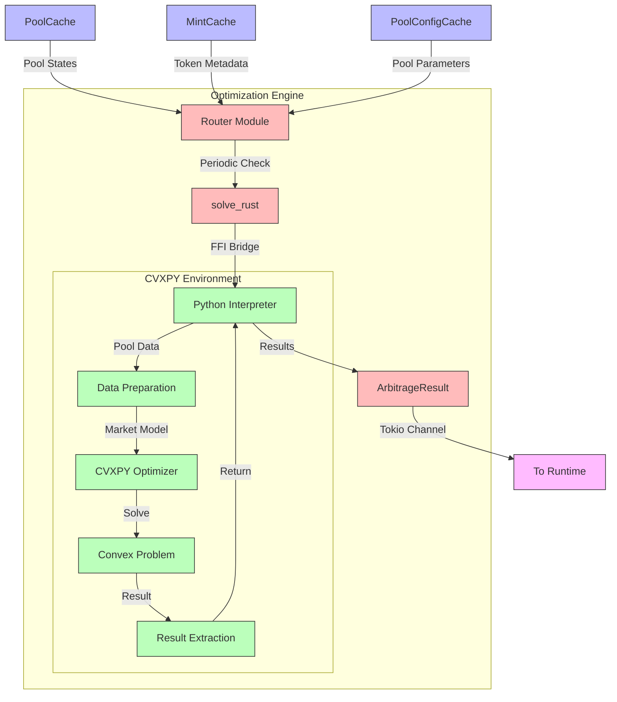

# Optimization Engine

QTrade's optimization layer bridges Rust performance with Python flexibility, using a hybrid CVXPY-based solver. Cached DEX pool reserves are streamed into the engine in near real-time, where the solver computes optimal arbitrage routes across multiple pools and tokens—maximizing profit potential while accounting for slippage, fees, and execution constraints.

## Architecture Overview

The optimization engine represents a critical component in QTrade's arbitrage system, acting as the computational brain that identifies profitable trading opportunities. The architecture employs a hybrid approach that leverages both Rust's performance and Python's extensive mathematical optimization libraries.



## Technical Components

### 1. Data Flow Integration

The optimization engine receives input data from three key thread-safe caches maintained by the streaming infrastructure:

- **PoolCache**: Contains up-to-date liquidity pool reserves for all supported DEXes
- **MintCache**: Provides token metadata including decimals and symbols
- **PoolConfigCache**: Stores configuration parameters for each pool, including fee structures

These caches employ atomic reference counting (`Arc<T>`) to ensure thread-safe, concurrent access with minimal overhead.

### 2. Rust-Python FFI Bridge

The system implements a Foreign Function Interface (FFI) bridge between Rust and Python using the `PyO3` crate:

- Rust's `solve()` function extracts pool data from the caches and converts it to Python-compatible structures
- The Python environment is initialized using `Python::with_gil()` to access the Global Interpreter Lock
- Pool states, including reserves, fees, and market value, are converted to Python objects
- The Python module `qtrade.arbitrage.core` is imported and its `solve_arbitrage` function is called
- Results are converted back to Rust data structures for downstream processing

### 3. CVXPY Convex Optimization

At the core of the engine is a sophisticated convex optimization model implemented using Python's CVXPY library:

```python
# Core optimization logic
deltas = [cp.Variable(len(l), nonneg=True) for l in local_indices]
lambdas = [cp.Variable(len(l), nonneg=True) for l in local_indices]
psi = cp.sum([A_i @ (L - D) for A_i, D, L in zip(A, deltas, lambdas)])

# Objective function to maximize profit
obj = cp.Maximize(market_value @ psi)
```

The optimization model incorporates:

- **Local-Global Token Index Mapping**: Allows reasoning across different pools with different token orderings
- **Trading Bounds**: Variables constrained to ensure realistic trade sizes
- **AMM Invariant Preservation**: Geometric mean constraints ensure trades respect DEX invariants
- **Fee Modeling**: Accurate fee calculations based on pool-specific parameters

### 4. Scheduling and Execution

The engine operates on a scheduled cycle, periodically examining the current state of all pools:

- A timer triggers optimization runs every 60 seconds (configurable via `CHECK_INTERVAL`)
- Each run retrieves the latest pool states from the caches
- The optimization problem is solved to determine arbitrage opportunities
- Results are packaged as `ArbitrageResult` structures containing:
  - `deltas`: Tender amounts for each pool
  - `lambdas`: Receive amounts for each pool
  - `a_matrices`: Mapping matrices between global and local indices
  - `status`: Optimization outcome status

### 5. Inter-Component Communication

Results from the optimization engine are passed to the runtime execution system via a thread-safe Tokio channel:

```rust
lazy_static! {
    pub static ref ARBITRAGE_SENDER: tokio::sync::Mutex<mpsc::Sender<ArbitrageResult>> = {
        // Channel setup for thread-safe communication
    };
}
```

This channel implementation ensures:
- Thread-safety via Mutex locks
- Back-pressure handling through bounded capacity (100 messages)
- Low-latency transfer between router and execution components

## Performance Characteristics

The optimization engine achieves high performance through several technical optimizations:

1. **Memory Efficiency**: Pool data is accessed via references rather than copying
2. **Concurrency**: The engine operates independently from the streaming infrastructure
3. **Error Resilience**: Failed optimization attempts are logged but don't disrupt the system
4. **Instrumentation**: OpenTelemetry integration provides real-time performance metrics

## Future Enhancements

The modular architecture allows for several planned enhancements:

1. **Quantum-Inspired Optimization**: Integration with quantum-inspired solvers like OpenQAOA
2. **Multi-Route Arbitrage**: Simultaneous calculation of multiple arbitrage paths
3. **Dynamic Timing Adjustment**: Adaptive optimization frequency based on market volatility
4. **GPU Acceleration**: Offloading compute-intensive operations to GPU

This hybrid Rust-Python architecture provides the optimal balance between performance and mathematical expressiveness, enabling QTrade to identify complex arbitrage opportunities across multiple DEXes with minimal latency.
