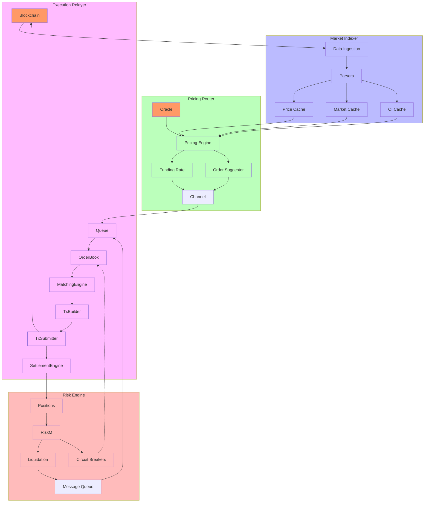
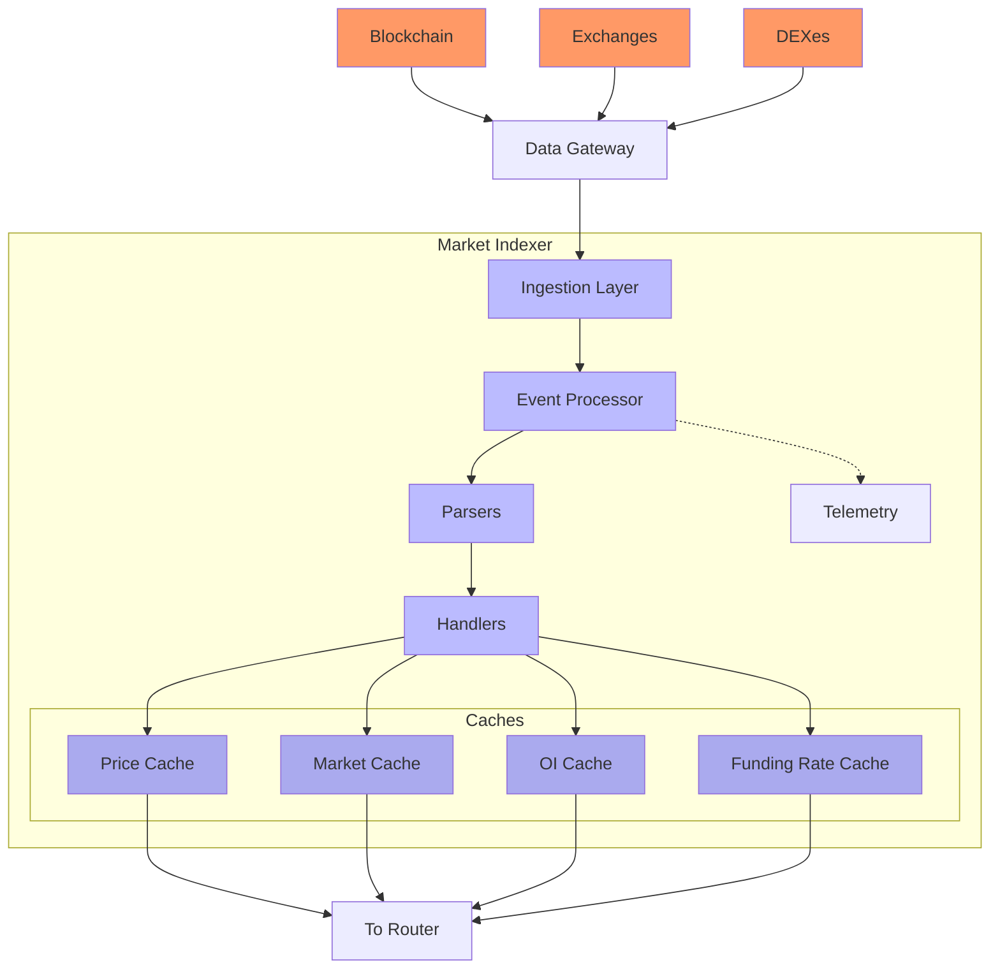
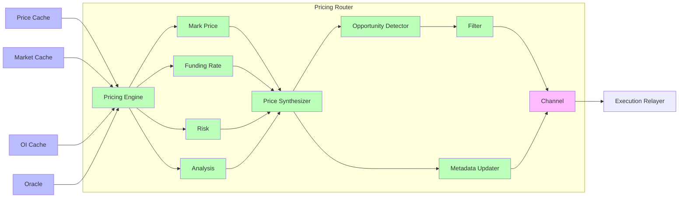
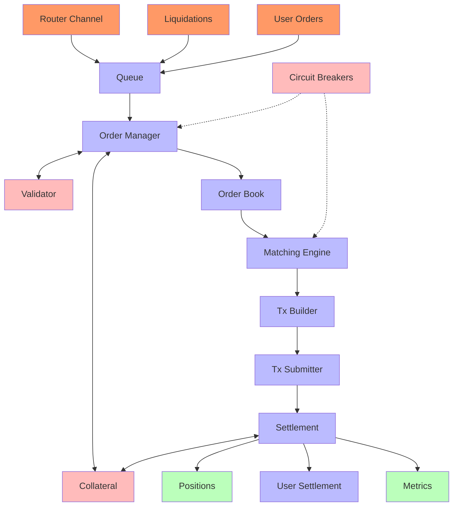
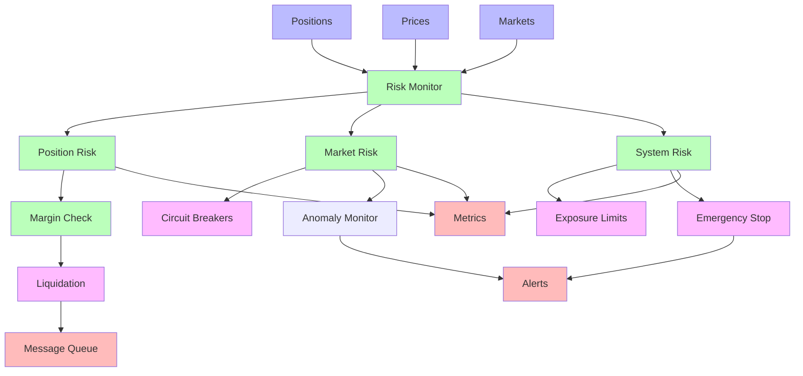

# Perpetual Futures Platform Architecture

This document outlines the architecture for a perpetual futures trading platform inspired by the QTrade arbitrage system design. The platform enables trading of perpetual futures contracts with efficient price discovery, robust risk management, and high-performance execution.

## System Overview

The system is designed with a modular architecture consisting of several key components:

1. **Market Indexer**: Captures and processes market data from various sources
2. **Pricing Router**: Calculates mark prices, funding rates, and identifies trading opportunities
3. **Execution Relayer**: Manages order execution and settlement
4. **Risk Engine**: Handles position management, liquidations, and risk controls
5. **Infrastructure Components**: Provides monitoring, scaling, and deployment capabilities

## Architecture Diagram



## Key Components

### Market Indexer

The Market Indexer is responsible for gathering and processing market data from multiple sources, providing a unified view of the market state:



The Market Indexer provides:
- Real-time price data collection from multiple sources
- Normalized data structures for consistent processing
- Thread-safe caches for concurrent access
- Historical data storage for backtesting and analysis
- Telemetry for monitoring data flow and quality

### Pricing Router

The Pricing Router is the analytical core of the system, responsible for calculating mark prices, funding rates, and identifying trading opportunities:



The Pricing Router provides:
- Mark price calculation using volume-weighted aggregation
- Funding rate determination based on index-mark price deviation
- Volatility estimation for risk management
- Technical analysis for trading signal generation
- Prioritization of trading opportunities based on expected value

### Execution Relayer

The Execution Relayer handles order management, matching, and settlement:



The Execution Relayer provides:
- Order validation and prioritization
- Order book management and matching engine
- Transaction construction and submission
- Settlement and position updating
- Integration with risk management systems

### Risk Engine

The Risk Engine monitors and manages system and user risk:



The Risk Engine provides:
- Real-time monitoring of position risks
- Automated liquidation of under-margined positions
- Circuit breakers for market volatility protection
- System-wide risk limits and controls
- Anomaly detection for market manipulation

## Data Structures

### Market Position

```rust
pub struct MarketPosition {
    /// Market identifier
    pub market_id: String,
    /// Direction (long/short)
    pub side: PositionSide,
    /// Size in base units
    pub size: f64,
    /// Entry price
    pub entry_price: f64,
    /// Leverage used
    pub leverage: f64,
    /// Liquidation price
    pub liquidation_price: f64,
    /// Unrealized PnL
    pub unrealized_pnl: f64,
    /// Margin allocated
    pub margin: f64,
    /// Position timestamp
    pub timestamp: u64,
}
```

### Mark Price Update

```rust
pub struct MarkPriceUpdate {
    /// Market identifier
    pub market_id: String,
    /// Current mark price
    pub mark_price: f64,
    /// Index price (from oracle)
    pub index_price: f64,
    /// Current funding rate (8hr)
    pub funding_rate: f64,
    /// Funding interval in seconds
    pub funding_interval: u64,
    /// Next funding timestamp
    pub next_funding: u64,
    /// Price change percentage (24h)
    pub price_change_24h: f64,
    /// Timestamp
    pub timestamp: u64,
}
```

### Order Request

```rust
pub struct OrderRequest {
    /// Market identifier
    pub market_id: String,
    /// Order type (market, limit, stop, etc)
    pub order_type: OrderType,
    /// Order side (buy/sell)
    pub side: OrderSide,
    /// Size in base units
    pub size: f64,
    /// Limit price (if applicable)
    pub price: Option<f64>,
    /// Stop price (if applicable)
    pub trigger_price: Option<f64>,
    /// Time in force
    pub time_in_force: TimeInForce,
    /// Reduce only flag
    pub reduce_only: bool,
    /// Post only flag
    pub post_only: bool,
    /// Client order ID
    pub client_order_id: String,
}
```

## System Components Detail

### Indexer Component

The indexer is responsible for gathering and processing data from multiple sources:

1. **Data Ingestion**:
   - Connects to exchange APIs, blockchain nodes, and price oracles
   - Normalizes data formats for consistent processing
   - Validates and filters incoming data for quality

2. **Data Processing**:
   - Parses exchange-specific data structures
   - Calculates derived metrics (e.g., implied volatility)
   - Detects market anomalies and outliers

3. **Caching Layer**:
   - Maintains price time series with efficient time-based indexing
   - Stores market metadata and configuration
   - Tracks open interest and funding rate history

### Router Component

The router component performs calculations and analysis:

1. **Mark Price Calculation**:
   - Weighted average of multiple exchange prices
   - Manipulation-resistant using outlier rejection
   - Time-weighted price dampening for stability

2. **Funding Rate Mechanism**:
   - Periodic rate based on mark-index price divergence
   - Premium/discount factor based on market conditions
   - Funding cap and floor for extreme conditions

3. **Opportunity Detection**:
   - Statistical arbitrage between mark and index prices
   - Mean reversion strategies based on funding rate
   - Volatility-based position sizing

### Relayer Component

The relayer handles order execution and settlement:

1. **Order Management**:
   - Priority queuing based on order type and timestamp
   - Validation against account balance and position limits
   - Support for advanced order types (stop, take-profit, trailing)

2. **Matching Engine**:
   - Price-time priority matching algorithm
   - Support for partial fills and order modifications
   - Post-only and immediate-or-cancel execution options

3. **Settlement Process**:
   - Position updating after confirmed executions
   - Funding rate application at interval boundaries
   - PnL calculation and account balance adjustment

### Risk Management

Risk management is embedded throughout the system:

1. **Position Risk**:
   - Real-time margin ratio monitoring
   - Graduated liquidation process to minimize market impact
   - Auto-deleveraging system for extreme conditions

2. **Market Risk**:
   - Dynamic price bands based on volatility
   - Circuit breakers for extreme price movements
   - Exposure limits per market

3. **System Risk**:
   - Insurance fund for socialized losses
   - Global risk limits across all markets
   - Emergency shutdown capabilities

## Metrics and Monitoring

The platform tracks performance metrics such as:

- Trading volume and open interest
- Liquidation events and amounts
- Funding payments
- Order book depth and liquidity
- System latency and throughput
- Error rates and system health

All metrics are collected using OpenTelemetry and visualized in Grafana dashboards, with alerting through Prometheus AlertManager.

## Infrastructure as Code

The platform is deployed using infrastructure as code principles:

1. **Terraform** for cloud resource provisioning
2. **Kubernetes** for container orchestration
3. **Ansible** for configuration management
4. **GitHub Actions** for CI/CD pipelines

## Security Considerations

The platform implements several security measures:

1. **Isolation** of components to limit attack surface
2. **Rate limiting** to prevent DOS attacks
3. **Circuit breakers** to limit cascade failures
4. **Multi-sig** requirements for critical operations
5. **Comprehensive logging** for audit and forensics

## Future Enhancements

1. **Cross-margin** support across multiple markets
2. **Portfolio margin** based on correlation models
3. **Advanced order types** such as conditional and bracket orders
4. **Social trading** features for signal following
5. **Enhanced risk models** incorporating machine learning

## Conclusion

This perpetual futures platform architecture leverages the core principles of the QTrade arbitrage system while adapting them to the specific requirements of perpetual futures trading. The modular design ensures scalability, while the emphasis on risk management provides security for both users and the platform itself.
