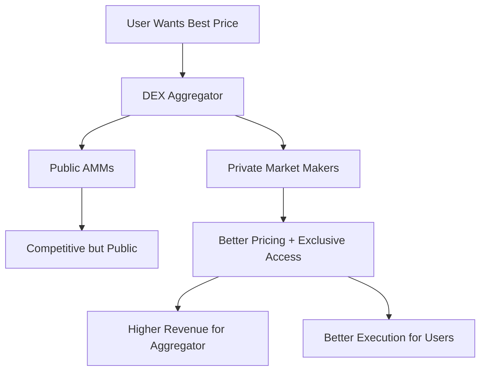
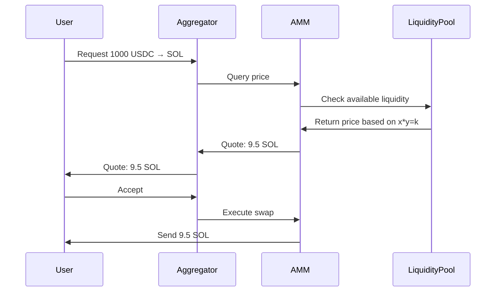
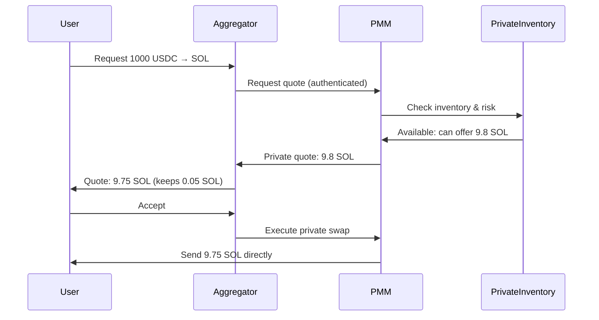
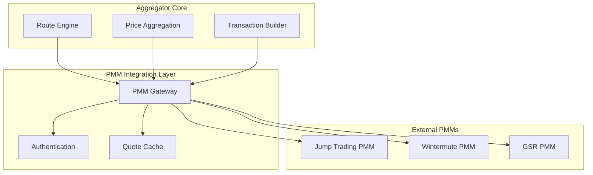
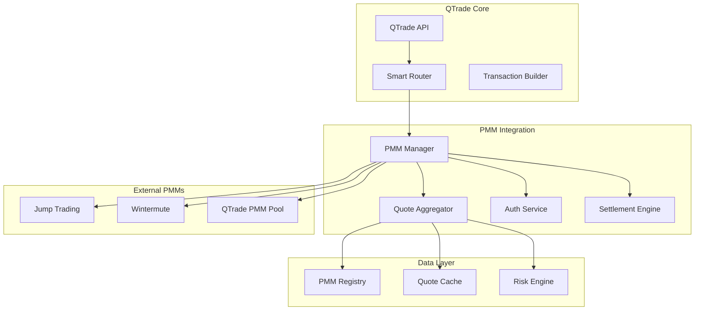
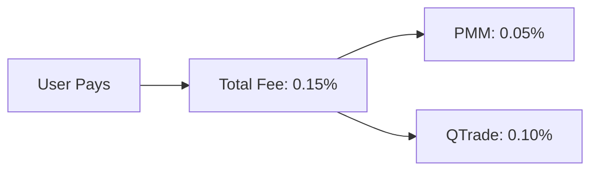
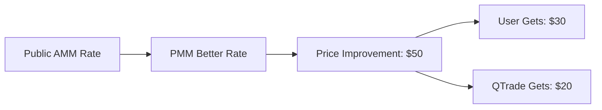
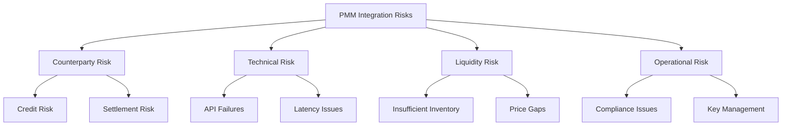
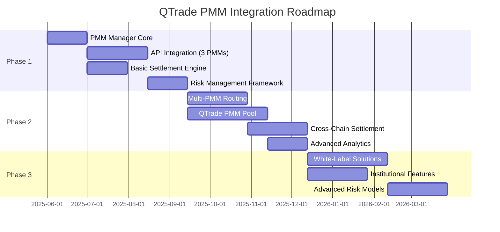

# Private Market Makers in DEX Aggregators: System Technical Design

## Table of Contents
1. [Introduction to Private Market Makers](#introduction-to-private-market-makers)
2. [How Private Market Makers Work](#how-private-market-makers-work)
3. [Technical Architecture](#technical-architecture)
4. [QTrade Implementation Strategy](#qtrade-implementation-strategy)
5. [Revenue Models and Economics](#revenue-models-and-economics)
6. [Implementation Examples](#implementation-examples)
7. [Risk Management](#risk-management)
8. [Competitive Analysis](#competitive-analysis)
9. [Roadmap](#roadmap)

## Introduction to Private Market Makers

Private Market Makers (PMMs) are sophisticated trading entities that provide liquidity directly to DEX aggregators through private pools or off-chain agreements, bypassing traditional AMM pools. Unlike public AMMs where anyone can trade, PMMs offer exclusive liquidity access to specific aggregators.

### Key Characteristics

- **Exclusive Access**: Only whitelisted aggregators can access PMM liquidity
- **Better Pricing**: Often provide better rates than public AMMs due to reduced competition
- **Custom Logic**: Can implement sophisticated pricing models and risk management
- **Direct Integration**: Connect directly with aggregators via APIs or smart contracts
- **Professional Operations**: Operated by institutional market makers with significant capital

### Why PMMs Matter for Aggregators



## How Private Market Makers Work

### Traditional AMM vs Private Market Maker

**Traditional AMM Model:**


**Private Market Maker Model:**


### Key Differences

| Aspect | Public AMM | Private Market Maker |
|--------|------------|---------------------|
| **Liquidity Access** | Open to everyone | Exclusive to partners |
| **Pricing** | Algorithm-based (x*y=k) | Dynamic, risk-adjusted |
| **Competition** | High (public access) | Low (private access) |
| **Inventory Management** | Passive (LPs deposit) | Active (professional management) |
| **Pricing Updates** | Continuous (arbitrage) | Real-time (market data) |
| **Risk Management** | Automated (slippage) | Sophisticated (custom logic) |

## Technical Architecture

### PMM Integration Points



### PMM Communication Protocols

#### 1. REST API Integration
```rust
#[derive(Serialize, Deserialize)]
pub struct PMMQuoteRequest {
    pub aggregator_id: String,
    pub signature: String,        // Authenticated request
    pub timestamp: u64,
    pub input_mint: String,
    pub output_mint: String,
    pub input_amount: u64,
    pub max_slippage_bps: u16,
}

#[derive(Serialize, Deserialize)]
pub struct PMMQuoteResponse {
    pub quote_id: String,
    pub output_amount: u64,
    pub valid_until: u64,        // Quote expiration
    pub execution_endpoint: String,
    pub required_accounts: Vec<Pubkey>,
}
```

#### 2. WebSocket Real-time Updates
```rust
#[derive(Serialize, Deserialize)]
pub enum PMMMessage {
    PriceUpdate {
        pair: String,
        bid: f64,
        ask: f64,
        inventory: u64,
        timestamp: u64,
    },
    InventoryUpdate {
        token: String,
        available_amount: u64,
        reserved_amount: u64,
    },
    RiskParameters {
        max_position_size: u64,
        min_spread_bps: u16,
        enabled_pairs: Vec<String>,
    }
}
```

#### 3. On-chain Settlement
```rust
// Smart contract for PMM settlement
#[derive(Accounts)]
pub struct ExecutePMMSwap<'info> {
    #[account(mut)]
    pub user: Signer<'info>,

    #[account(mut)]
    pub user_source_account: Account<'info, TokenAccount>,

    #[account(mut)]
    pub user_destination_account: Account<'info, TokenAccount>,

    #[account(mut)]
    pub pmm_source_account: Account<'info, TokenAccount>,

    #[account(mut)]
    pub pmm_destination_account: Account<'info, TokenAccount>,

    /// PMM authorization account
    pub pmm_authority: Signer<'info>,

    /// Aggregator fee collection
    #[account(mut)]
    pub aggregator_fee_account: Account<'info, TokenAccount>,

    pub token_program: Program<'info, Token>,
}

pub fn execute_pmm_swap(
    ctx: Context<ExecutePMMSwap>,
    quote_id: String,
    input_amount: u64,
    minimum_output_amount: u64,
    aggregator_fee_bps: u16,
) -> Result<()> {
    // Validate quote hasn't expired
    let quote = validate_quote(&quote_id)?;
    require!(quote.valid_until > Clock::get()?.unix_timestamp, ErrorCode::QuoteExpired);

    // Calculate actual amounts
    let output_amount = quote.output_amount;
    let aggregator_fee = output_amount * aggregator_fee_bps as u64 / 10000;
    let user_amount = output_amount - aggregator_fee;

    // Execute atomic swap
    transfer_from_user_to_pmm(&ctx, input_amount)?;
    transfer_from_pmm_to_user(&ctx, user_amount)?;
    transfer_from_pmm_to_aggregator(&ctx, aggregator_fee)?;

    Ok(())
}
```

## QTrade Implementation Strategy

### Architecture Overview



### Core Components

#### 1. PMM Manager
```rust
pub struct PMMManager {
    registered_pmms: HashMap<String, PMMConfig>,
    quote_cache: Arc<QuoteCache>,
    auth_service: Arc<AuthService>,
    risk_engine: Arc<RiskEngine>,
}

impl PMMManager {
    pub async fn get_best_quote(
        &self,
        request: QuoteRequest,
    ) -> Result<BestQuoteResponse> {
        let mut quotes = Vec::new();

        // Get quotes from all eligible PMMs in parallel
        let futures: Vec<_> = self.registered_pmms
            .values()
            .filter(|pmm| pmm.supports_pair(&request.input_mint, &request.output_mint))
            .map(|pmm| self.get_pmm_quote(pmm, &request))
            .collect();

        let pmm_quotes = futures::future::join_all(futures).await;

        for quote_result in pmm_quotes {
            if let Ok(quote) = quote_result {
                quotes.push(quote);
            }
        }

        // Also get public AMM quotes for comparison
        let public_quotes = self.get_public_amm_quotes(&request).await?;
        quotes.extend(public_quotes);

        // Select best quote considering price and reliability
        let best_quote = self.select_best_quote(quotes)?;

        Ok(best_quote)
    }

    async fn get_pmm_quote(
        &self,
        pmm: &PMMConfig,
        request: &QuoteRequest,
    ) -> Result<Quote> {
        // Check cache first
        if let Some(cached_quote) = self.quote_cache.get(&pmm.id, request) {
            return Ok(cached_quote);
        }

        // Create authenticated request
        let auth_request = self.auth_service.create_authenticated_request(pmm, request)?;

        // Make API call to PMM
        let response = pmm.client.get_quote(auth_request).await?;

        // Validate and cache response
        let quote = self.validate_and_cache_quote(pmm, response)?;

        Ok(quote)
    }
}
```

#### 2. Quote Aggregation Engine
```rust
pub struct QuoteAggregationEngine {
    pmm_manager: Arc<PMMManager>,
    public_amm_client: Arc<PublicAMMClient>,
    risk_engine: Arc<RiskEngine>,
}

impl QuoteAggregationEngine {
    pub async fn get_comprehensive_quotes(
        &self,
        request: QuoteRequest,
    ) -> Result<Vec<EnrichedQuote>> {
        // Get quotes from all sources concurrently
        let (pmm_quotes, amm_quotes) = tokio::join!(
            self.get_pmm_quotes(&request),
            self.get_amm_quotes(&request)
        );

        let mut all_quotes = Vec::new();
        all_quotes.extend(pmm_quotes?);
        all_quotes.extend(amm_quotes?);

        // Enrich quotes with additional metadata
        let enriched_quotes = self.enrich_quotes(all_quotes).await?;

        // Apply risk scoring
        let scored_quotes = self.risk_engine.score_quotes(enriched_quotes)?;

        // Sort by best execution value (price + reliability + fees)
        scored_quotes.sort_by(|a, b| {
            b.execution_score().partial_cmp(&a.execution_score()).unwrap()
        });

        Ok(scored_quotes)
    }

    fn enrich_quotes(&self, quotes: Vec<Quote>) -> Vec<EnrichedQuote> {
        quotes.into_iter().map(|quote| {
            EnrichedQuote {
                base_quote: quote,
                liquidity_source: self.identify_source(&quote),
                historical_reliability: self.get_reliability_score(&quote),
                execution_probability: self.estimate_execution_probability(&quote),
                total_cost_basis: self.calculate_total_cost(&quote),
            }
        }).collect()
    }
}
```

#### 3. Settlement Engine
```rust
pub struct SettlementEngine {
    pmm_contracts: HashMap<String, Pubkey>,
    fee_accounts: HashMap<String, Pubkey>,
}

impl SettlementEngine {
    pub async fn execute_pmm_trade(
        &self,
        quote: &PMMQuote,
        user_wallet: &Pubkey,
    ) -> Result<Transaction> {
        match quote.settlement_type {
            SettlementType::OnChain => {
                self.build_onchain_settlement(quote, user_wallet).await
            },
            SettlementType::CrossChain => {
                self.build_crosschain_settlement(quote, user_wallet).await
            },
            SettlementType::OffChain => {
                self.build_offchain_settlement(quote, user_wallet).await
            },
        }
    }

    async fn build_onchain_settlement(
        &self,
        quote: &PMMQuote,
        user_wallet: &Pubkey,
    ) -> Result<Transaction> {
        let pmm_contract = self.pmm_contracts.get(&quote.pmm_id)
            .ok_or(ErrorCode::PMMNotFound)?;

        let instruction = execute_pmm_swap(
            ExecutePMMSwapAccounts {
                user: *user_wallet,
                user_source_account: quote.user_source_account,
                user_destination_account: quote.user_destination_account,
                pmm_source_account: quote.pmm_source_account,
                pmm_destination_account: quote.pmm_destination_account,
                pmm_authority: quote.pmm_authority,
                aggregator_fee_account: self.fee_accounts.get(&quote.output_mint)
                    .copied()
                    .unwrap_or_default(),
                token_program: spl_token::ID,
            },
            ExecutePMMSwapArgs {
                quote_id: quote.quote_id.clone(),
                input_amount: quote.input_amount,
                minimum_output_amount: quote.minimum_output_amount,
                aggregator_fee_bps: quote.aggregator_fee_bps,
            }
        );

        Ok(Transaction::new_with_payer(&[instruction], Some(user_wallet)))
    }
}
```

### PMM Registry and Configuration

```rust
#[derive(Clone, Debug)]
pub struct PMMConfig {
    pub id: String,
    pub name: String,
    pub api_endpoint: String,
    pub websocket_endpoint: Option<String>,
    pub supported_pairs: Vec<TradingPair>,
    pub authentication: AuthMethod,
    pub settlement_type: SettlementType,
    pub fee_structure: FeeStructure,
    pub risk_parameters: RiskParameters,
    pub contract_address: Option<Pubkey>,
}

#[derive(Clone, Debug)]
pub enum AuthMethod {
    ApiKey { key: String },
    SignedRequest { private_key: String },
    OAuth { client_id: String, client_secret: String },
    Whitelisted, // IP-based whitelist
}

#[derive(Clone, Debug)]
pub enum SettlementType {
    OnChain,      // Direct smart contract interaction
    CrossChain,   // Cross-chain bridge settlement
    OffChain,     // Off-chain settlement with on-chain finalization
}

#[derive(Clone, Debug)]
pub struct FeeStructure {
    pub maker_fee_bps: u16,        // Fee PMM pays to aggregator
    pub taker_fee_bps: u16,        // Fee user pays
    pub minimum_fee_amount: u64,    // Minimum fee in base units
    pub fee_currency: String,       // Which token fees are paid in
}
```

## Revenue Models and Economics

### PMM Revenue Sharing Models

#### 1. Fixed Fee Model


**Implementation:**
- PMM quotes include fixed fee percentage
- Aggregator adds their fee on top
- Simple and predictable revenue

#### 2. Revenue Sharing Model
```mermaid
flowchart LR
    Trade[Trade Volume: $100k] --> Revenue[PMM Revenue: $150]
    Revenue --> PMMKeep[PMM Keeps: $90 (60%)]
    Revenue --> AggregatorShare[QTrade Gets: $60 (40%)]
```

**Implementation:**
- PMM collects total fees
- Revenue split based on pre-negotiated percentage
- Aligned incentives for volume growth

#### 3. Rebate Model


### QTrade PMM Economics

**Revenue Calculation Example:**
```rust
pub struct PMMRevenueCalculator {
    base_fee_bps: u16,
    pmm_share_percentage: u8,
    volume_tiers: Vec<VolumeTier>,
}

impl PMMRevenueCalculator {
    pub fn calculate_revenue(
        &self,
        trade_volume: u64,
        pmm_id: &str,
        user_tier: UserTier,
    ) -> RevenueBreakdown {
        let base_fee = trade_volume * self.base_fee_bps as u64 / 10000;

        // Apply volume discounts
        let volume_discount = self.get_volume_discount(trade_volume);
        let user_discount = self.get_user_tier_discount(user_tier);

        let effective_fee = base_fee
            .saturating_sub(volume_discount)
            .saturating_sub(user_discount);

        // Calculate PMM and aggregator shares
        let pmm_share = effective_fee * self.pmm_share_percentage as u64 / 100;
        let aggregator_share = effective_fee - pmm_share;

        RevenueBreakdown {
            total_fee: effective_fee,
            pmm_revenue: pmm_share,
            aggregator_revenue: aggregator_share,
            user_savings: base_fee - effective_fee,
        }
    }
}
```

## Implementation Examples

### 1. Jump Trading Integration

```rust
pub struct JumpTradingPMM {
    api_client: JumpApiClient,
    auth_config: JumpAuthConfig,
    websocket: Option<JumpWebSocket>,
}

impl PMMProvider for JumpTradingPMM {
    async fn get_quote(&self, request: QuoteRequest) -> Result<Quote> {
        let jump_request = JumpQuoteRequest {
            base_token: request.input_mint,
            quote_token: request.output_mint,
            side: if request.exact_in { "buy" } else { "sell" },
            quantity: request.amount.to_string(),
            aggregator: "qtrade".to_string(),
        };

        let response = self.api_client
            .post("/v1/quote")
            .json(&jump_request)
            .send()
            .await?;

        let jump_quote: JumpQuoteResponse = response.json().await?;

        Ok(Quote {
            id: jump_quote.quote_id,
            pmm_id: "jump_trading".to_string(),
            input_amount: request.amount,
            output_amount: jump_quote.price.parse()?,
            valid_until: Utc::now().timestamp() + jump_quote.ttl_seconds,
            execution_endpoint: jump_quote.execution_url,
            settlement_type: SettlementType::OnChain,
        })
    }

    async fn execute_quote(&self, quote: &Quote) -> Result<ExecutionResult> {
        let execution_request = JumpExecutionRequest {
            quote_id: quote.id.clone(),
            user_signature: "...", // User's transaction signature
        };

        let response = self.api_client
            .post(&quote.execution_endpoint)
            .json(&execution_request)
            .send()
            .await?;

        let result: JumpExecutionResponse = response.json().await?;

        Ok(ExecutionResult {
            transaction_id: result.transaction_id,
            status: ExecutionStatus::Pending,
            settlement_time: result.estimated_settlement,
        })
    }
}
```

### 2. Custom QTrade PMM Pool

```rust
// QTrade can also operate their own PMM
pub struct QTradePMMPool {
    inventory_manager: Arc<InventoryManager>,
    risk_engine: Arc<RiskEngine>,
    pricing_engine: Arc<PricingEngine>,
    settlement_contract: Pubkey,
}

impl QTradePMMPool {
    pub async fn create_quote(
        &self,
        request: QuoteRequest,
    ) -> Result<Quote> {
        // Check if we have sufficient inventory
        let inventory_check = self.inventory_manager
            .check_availability(&request.output_mint, request.estimated_output())
            .await?;

        if !inventory_check.sufficient {
            return Err(ErrorCode::InsufficientInventory);
        }

        // Calculate risk-adjusted price
        let market_price = self.pricing_engine
            .get_market_price(&request.input_mint, &request.output_mint)
            .await?;

        let risk_adjustment = self.risk_engine
            .calculate_risk_premium(&request, &inventory_check)
            .await?;

        let our_price = market_price * (1.0 + risk_adjustment);

        // Create quote
        Ok(Quote {
            id: Uuid::new_v4().to_string(),
            pmm_id: "qtrade_pool".to_string(),
            input_amount: request.amount,
            output_amount: (request.amount as f64 * our_price) as u64,
            valid_until: Utc::now().timestamp() + 30, // 30 second TTL
            execution_endpoint: "/api/v1/execute".to_string(),
            settlement_type: SettlementType::OnChain,
        })
    }
}
```

### 3. Multi-PMM Route Optimization

```rust
pub struct MultiPMMRouter {
    pmm_manager: Arc<PMMManager>,
    route_optimizer: Arc<RouteOptimizer>,
}

impl MultiPMMRouter {
    pub async fn find_optimal_route(
        &self,
        request: RouteRequest,
    ) -> Result<OptimalRoute> {
        // For large trades, might split across multiple PMMs
        if request.amount > LARGE_TRADE_THRESHOLD {
            return self.find_split_route(request).await;
        }

        // Get quotes from all sources
        let all_quotes = self.pmm_manager
            .get_comprehensive_quotes(request)
            .await?;

        // Select best execution considering:
        // - Price impact
        // - Execution probability
        // - Settlement time
        // - Counter-party risk
        let best_quote = self.route_optimizer
            .select_optimal_execution(all_quotes)?;

        Ok(OptimalRoute {
            quotes: vec![best_quote],
            total_input: request.amount,
            total_output: best_quote.output_amount,
            execution_plan: ExecutionPlan::Single(best_quote.pmm_id),
        })
    }

    async fn find_split_route(
        &self,
        request: RouteRequest,
    ) -> Result<OptimalRoute> {
        // Split large order across multiple PMMs to reduce impact
        let split_sizes = self.calculate_optimal_splits(request.amount);
        let mut split_quotes = Vec::new();

        for split_size in split_sizes {
            let split_request = RouteRequest {
                amount: split_size,
                ..request
            };

            let quote = self.pmm_manager
                .get_best_quote(split_request)
                .await?;

            split_quotes.push(quote);
        }

        Ok(OptimalRoute {
            total_input: request.amount,
            total_output: split_quotes.iter().map(|q| q.output_amount).sum(),
            quotes: split_quotes,
            execution_plan: ExecutionPlan::Split,
        })
    }
}
```

## Risk Management

### PMM Risk Categories



### Risk Mitigation Implementation

```rust
pub struct PMMRiskEngine {
    counterparty_limits: HashMap<String, RiskLimits>,
    exposure_monitor: Arc<ExposureMonitor>,
    circuit_breakers: Arc<CircuitBreakers>,
}

impl PMMRiskEngine {
    pub fn evaluate_pmm_risk(&self, pmm_id: &str, quote: &Quote) -> RiskScore {
        let mut risk_factors = Vec::new();

        // Counterparty risk assessment
        let counterparty_score = self.assess_counterparty_risk(pmm_id);
        risk_factors.push(("counterparty", counterparty_score));

        // Liquidity risk assessment
        let liquidity_score = self.assess_liquidity_risk(quote);
        risk_factors.push(("liquidity", liquidity_score));

        // Technical risk assessment
        let technical_score = self.assess_technical_risk(pmm_id);
        risk_factors.push(("technical", technical_score));

        // Calculate composite risk score
        let weighted_score = risk_factors.iter()
            .map(|(factor, score)| {
                let weight = self.get_risk_weight(factor);
                score * weight
            })
            .sum::<f64>();

        RiskScore {
            overall_score: weighted_score,
            individual_factors: risk_factors,
            recommendation: self.get_risk_recommendation(weighted_score),
        }
    }

    pub fn should_use_pmm(&self, pmm_id: &str, quote: &Quote) -> bool {
        let risk_score = self.evaluate_pmm_risk(pmm_id, quote);
        let exposure = self.exposure_monitor.get_current_exposure(pmm_id);
        let limits = self.counterparty_limits.get(pmm_id).unwrap();

        // Check circuit breakers
        if self.circuit_breakers.is_triggered(pmm_id) {
            return false;
        }

        // Check exposure limits
        if exposure.total_exposure + quote.input_amount > limits.max_exposure {
            return false;
        }

        // Check risk score threshold
        risk_score.overall_score < limits.max_risk_score
    }
}
```

## Competitive Analysis

### Current Market Leaders

#### Jupiter's Approach
- **Model**: Primarily uses public AMMs with some private liquidity partnerships
- **PMM Integration**: Limited, mainly through referral programs
- **Revenue**: 0.025-0.05% through referral fees
- **Advantage**: Largest market share, extensive DEX integrations

#### 1inch's Approach
- **Model**: Hybrid public/private liquidity with "PMM" program
- **PMM Integration**: More advanced, direct partnerships with market makers
- **Revenue**: 0.1-0.3% through various fee models
- **Advantage**: Cross-chain capabilities, sophisticated routing

#### Paraswap's Approach
- **Model**: Heavy focus on private market maker partnerships
- **PMM Integration**: Advanced, multiple settlement methods
- **Revenue**: Revenue sharing with PMMs
- **Advantage**: Better pricing on large trades

### QTrade's Competitive Position

**Advantages:**
- Real-time data feeds enable better PMM pricing
- Multi-RPC infrastructure provides higher reliability
- Can offer both aggregation and PMM services
- Advanced risk management capabilities

**Implementation Strategy:**
1. **Phase 1**: Integrate with existing PMMs (Jump, Wintermute, GSR)
2. **Phase 2**: Launch QTrade's own PMM pool
3. **Phase 3**: Offer white-label PMM solutions to other protocols

## Roadmap

### Phase 1: Basic PMM Integration (Months 1-3)

**Core Infrastructure:**
- PMM Manager and Quote Aggregation
- Basic authentication and API integration
- Simple on-chain settlement for 2-3 major PMMs

**Target PMMs for Initial Integration:**
- Jump Trading (largest, most reliable)
- Wintermute (good European coverage)
- GSR (strong in Asian markets)

**Expected Outcomes:**
- 10-15% better pricing on trades > $10k
- Additional revenue stream of 0.05-0.1% per trade

### Phase 2: Advanced Features (Months 4-6)

**Enhanced Capabilities:**
- Multi-PMM route splitting for large orders
- Real-time inventory tracking and risk management
- Cross-chain settlement support
- Dynamic fee optimization

**QTrade PMM Pool Launch:**
- Initial inventory of $1M across major pairs
- Risk management and pricing engines
- Integration with existing QTrade infrastructure

### Phase 3: Market Leadership (Months 7-12)

**Advanced Features:**
- White-label PMM solutions for other protocols
- Institutional client onboarding
- Custom settlement mechanisms
- Advanced analytics and reporting

**Scale Targets:**
- $100M+ daily volume through PMM channels
- 15+ integrated PMM partners
- $50M+ in QTrade PMM pool inventory

### Technical Milestones



## Conclusion

Private Market Makers represent a significant opportunity for DEX aggregators to:

1. **Improve User Experience**: Better pricing and execution, especially for larger trades
2. **Increase Revenue**: Higher margins through PMM partnerships and fee sharing
3. **Reduce Slippage**: Access to deeper liquidity pools not available publicly
4. **Competitive Advantage**: Differentiation from aggregators that only use public AMMs

QTrade's technical architecture positions it well to capitalize on PMM opportunities through:

- **Real-time Data Advantage**: Better pricing through superior market data
- **Robust Infrastructure**: Multi-RPC reliability ensures PMM trades execute successfully
- **Risk Management**: Sophisticated risk controls protect against PMM counterparty risks
- **Dual Model**: Can both integrate external PMMs and operate internal PMM pools

The economic opportunity is substantial - PMM integration could increase QTrade's effective fee rate from 0.25% to 0.4-0.6% while still providing users with better execution than competitors.

Success in PMM integration requires careful balance of:
- **Technical Excellence**: Reliable, fast execution infrastructure
- **Risk Management**: Protecting against counterparty and operational risks
- **Relationship Management**: Building trust with institutional PMM partners
- **User Value**: Ensuring users always receive better execution than alternatives

The PMM model represents the evolution of DEX aggregation from simple routing optimization to sophisticated liquidity orchestration, and QTrade is well-positioned to lead this transition.
