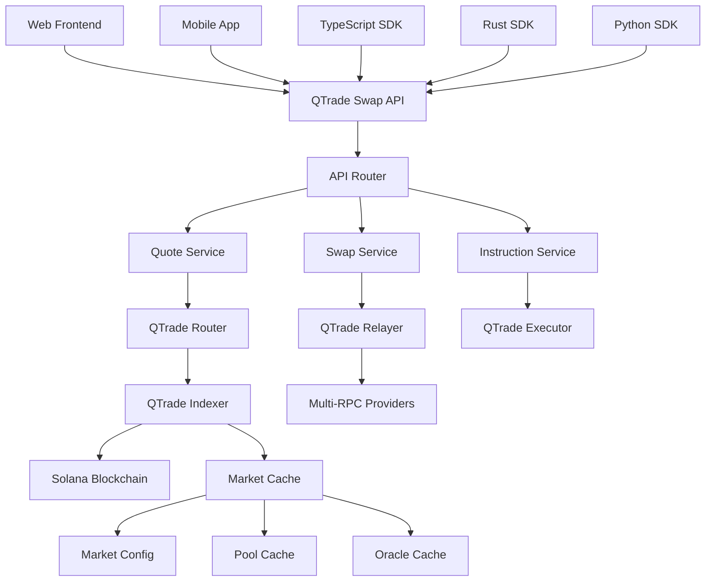
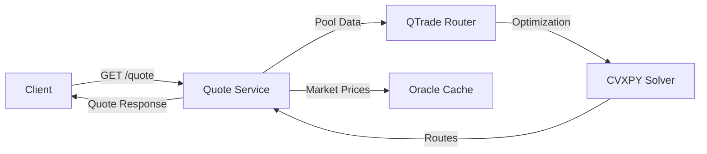
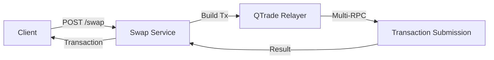
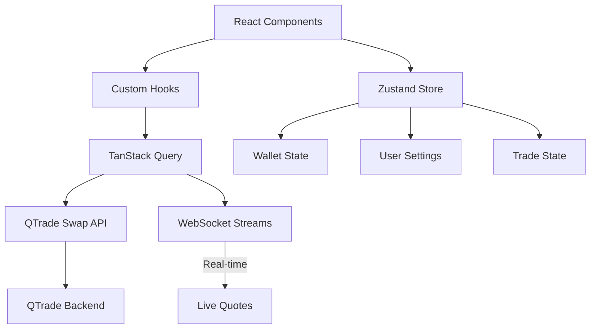
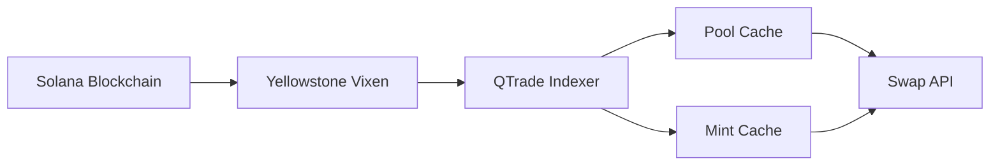
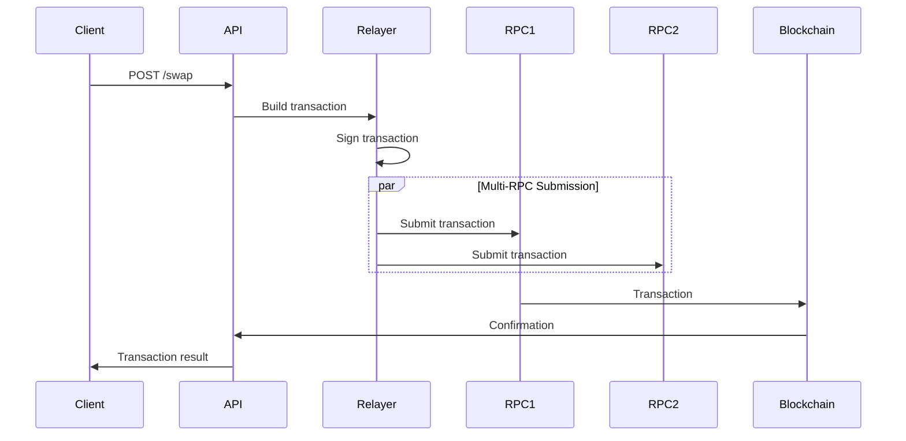
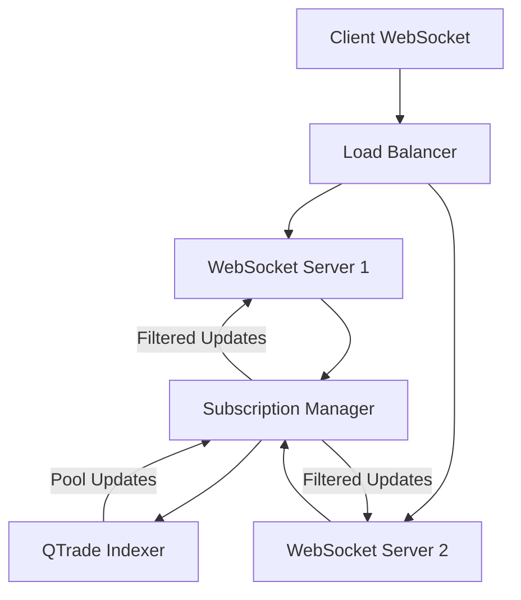
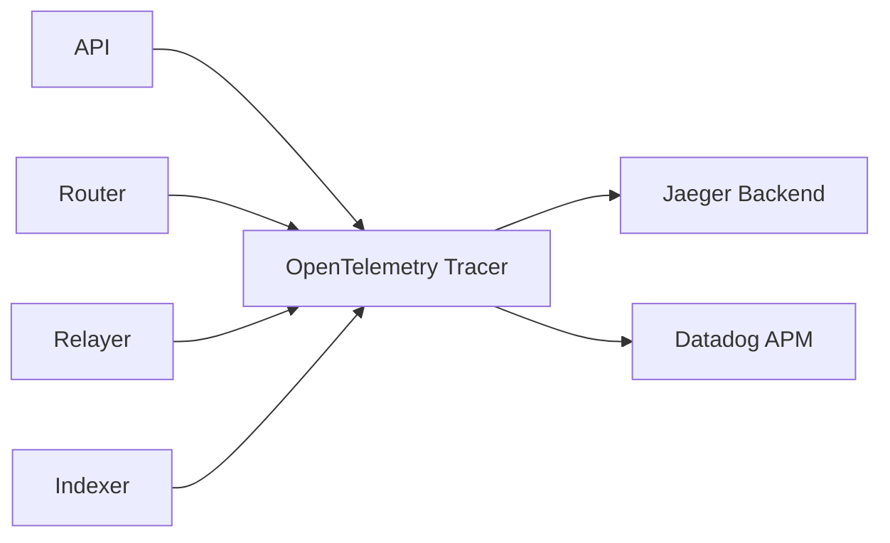
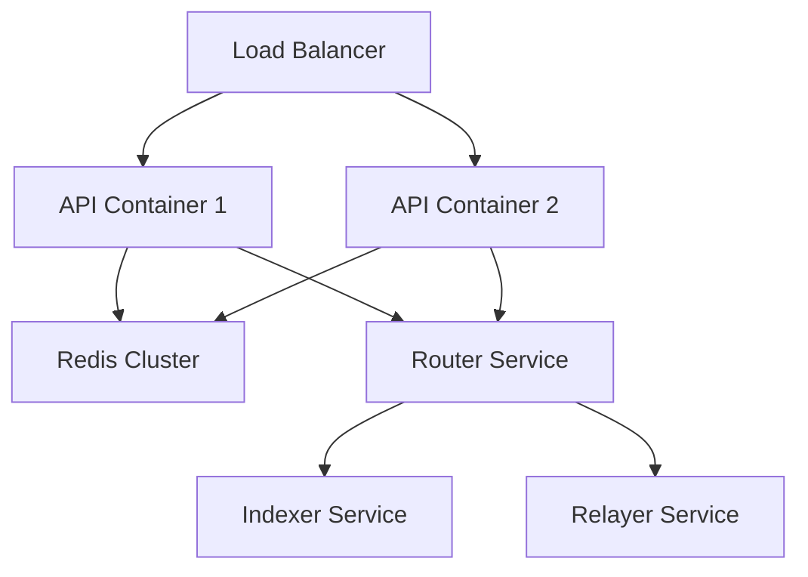

# QTrade Swap API System Design: Building a Jupiter-Inspired DEX Aggregator Frontend

## Overview

The QTrade Swap API system design represents a comprehensive architecture for building a front-end DEX aggregator that rivals Jupiter's capabilities while leveraging QTrade's existing infrastructure. This design follows Jupiter's proven approach but incorporates QTrade's unique strengths in real-time data streaming, optimization, and transaction execution.

The system provides a standardized REST API for token swaps, route optimization, and transaction building while maintaining compatibility with existing QTrade components and enabling multi-language SDK integration.

## High-Level Architecture



## Core System Components

### 1. QTrade Swap API Gateway

The API Gateway serves as the primary interface for all client interactions, providing REST endpoints that mirror Jupiter's API structure while leveraging QTrade's optimized routing engine.

**Key Responsibilities:**
- Request validation and authentication
- Rate limiting and DDoS protection
- Response caching for frequently requested quotes
- Load balancing across backend services
- API versioning and backwards compatibility

**Technology Stack:**
- **Framework**: Axum (Rust-based web framework)
- **Authentication**: JWT tokens for API access
- **Caching**: Redis for response caching
- **Load Balancing**: Internal round-robin for service distribution

### 2. Quote Service

The Quote Service handles price discovery and route optimization requests, interfacing directly with QTrade's router component.



**API Endpoints:**
- `GET /quote` - Request swap quotes with routing optimization
- `GET /quote-stream` - WebSocket endpoint for real-time quote updates

**Quote Response Structure:**
```json
{
  "inputMint": "EPjFWdd5AufqSSqeM2qN1xzybapC8G4wEGGkZwyTDt1v",
  "outputMint": "Es9vMFrzaCERmJfrF4H2FYD4KCoNkY11McCe8BenwNYB",
  "inAmount": "1000000",
  "outAmount": "998500",
  "routePlan": [
    {
      "swapInfo": {
        "ammKey": "2QdhepnKRTLjjSqPL1PtKNwqrUkoLee5Gqs8bvZhRdMv",
        "label": "Orca",
        "inputMint": "EPjFWdd5AufqSSqeM2qN1xzybapC8G4wEGGkZwyTDt1v",
        "outputMint": "Es9vMFrzaCERmJfrF4H2FYD4KCoNkY11McCe8BenwNYB",
        "inAmount": "1000000",
        "outAmount": "998500",
        "feeAmount": "1500",
        "feeMint": "EPjFWdd5AufqSSqeM2qN1xzybapC8G4wEGGkZwyTDt1v"
      }
    }
  ],
  "contextSlot": 123456789,
  "timeTaken": 0.045
}
```

### 3. Swap Service

The Swap Service builds complete transactions for execution, utilizing QTrade's relayer for transaction construction and submission.



**API Endpoints:**
- `POST /swap` - Build complete swap transaction
- `POST /swap-instructions` - Get raw swap instructions for custom transaction building

### 4. Market Cache Integration

Following Jupiter's market cache approach, QTrade implements a custom market discovery and caching system.

**Market Cache Structure:**
```json
{
  "markets": [
    {
      "pubkey": "2QdhepnKRTLjjSqPL1PtKNwqrUkoLee5Gqs8bvZhRdMv",
      "owner": "whirLbMiicVdio4qvUfM5KAg6Ct8VwpYzGff3uctyCc",
      "data": ["base64EncodedAccountData", "base64"],
      "params": {
        "tokenMintA": "EPjFWdd5AufqSSqeM2qN1xzybapC8G4wEGGkZwyTDt1v",
        "tokenMintB": "Es9vMFrzaCERmJfrF4H2FYD4KCoNkY11McCe8BenwNYB",
        "tickArrayAddresses": ["array1", "array2", "array3"],
        "feeRate": 3000
      },
      "meta": {
        "lastUpdated": "2025-06-03T12:00:00Z",
        "liquidityUsd": 1500000,
        "volume24h": 250000,
        "dex": "orca"
      }
    }
  ],
  "timestamp": "2025-06-03T12:00:00Z",
  "version": "1.0"
}
```

## Frontend Architecture

### Web Frontend Technology Stack

Following Orca's proven approach with modern enhancements:

**Core Technologies:**
- **Framework**: Next.js 14 with App Router
- **Language**: TypeScript with strict type checking
- **State Management**: Zustand for client state, TanStack Query for server state
- **Styling**: Tailwind CSS with custom design system
- **Charts**: TradingView Charting Library for professional trading interface
- **Wallet Integration**: Solana Wallet Adapter with support for all major wallets

**Frontend Architecture Pattern:**


### Key Frontend Features

1. **Professional Trading Interface**
   - TradingView charts with DEX liquidity overlays
   - Real-time price feeds and depth charts
   - Advanced order types and slippage controls
   - Multi-hop routing visualization

2. **Swap Interface**
   - Token selection with search and favorites
   - Real-time quote updates with WebSocket connections
   - Slippage and route customization
   - Transaction simulation and preview

3. **Portfolio Management**
   - Multi-wallet support with portfolio aggregation
   - Transaction history and PnL tracking
   - Token performance analytics
   - Position management tools

## Multi-Language SDK Architecture

### gRPC API Design

The QTrade Swap API exposes gRPC endpoints for high-performance SDK integration:

**Service Definition:**
```protobuf
syntax = "proto3";
package qtrade.swap.v1;

service SwapService {
  rpc GetQuote(QuoteRequest) returns (QuoteResponse);
  rpc BuildSwap(SwapRequest) returns (SwapResponse);
  rpc GetSwapInstructions(InstructionRequest) returns (InstructionResponse);
  rpc StreamQuotes(QuoteStreamRequest) returns (stream QuoteResponse);
}

message QuoteRequest {
  string input_mint = 1;
  string output_mint = 2;
  uint64 amount = 3;
  SwapMode swap_mode = 4;
  optional uint32 slippage_bps = 5;
  repeated string dexes = 6;
  repeated string exclude_dexes = 7;
}

message QuoteResponse {
  string input_mint = 1;
  string output_mint = 2;
  uint64 in_amount = 3;
  uint64 out_amount = 4;
  repeated RouteStep route_plan = 5;
  uint64 context_slot = 6;
  double time_taken = 7;
}

enum SwapMode {
  EXACT_IN = 0;
  EXACT_OUT = 1;
}
```

### SDK Implementations

#### TypeScript SDK
```typescript
import { QTradeSwapClient } from '@qtrade/swap-sdk';

const client = new QTradeSwapClient({
  endpoint: 'https://api.qtrade.com',
  apiKey: 'your-api-key'
});

// Get quote
const quote = await client.getQuote({
  inputMint: 'EPjFWdd5AufqSSqeM2qN1xzybapC8G4wEGGkZwyTDt1v',
  outputMint: 'Es9vMFrzaCERmJfrF4H2FYD4KCoNkY11McCe8BenwNYB',
  amount: 1_000_000n,
  swapMode: SwapMode.EXACT_IN,
  slippageBps: 50
});

// Build and execute swap
const swap = await client.buildSwap({
  quote,
  userPublicKey: wallet.publicKey,
  wrapUnwrapSOL: true
});
```

#### Rust SDK
```rust
use qtrade_swap_sdk::{SwapClient, QuoteRequest, SwapMode};

#[tokio::main]
async fn main() -> Result<(), Box<dyn std::error::Error>> {
    let client = SwapClient::new("https://api.qtrade.com", "your-api-key");

    let quote = client.get_quote(QuoteRequest {
        input_mint: "EPjFWdd5AufqSSqeM2qN1xzybapC8G4wEGGkZwyTDt1v".to_string(),
        output_mint: "Es9vMFrzaCERmJfrF4H2FYD4KCoNkY11McCe8BenwNYB".to_string(),
        amount: 1_000_000,
        swap_mode: SwapMode::ExactIn,
        slippage_bps: Some(50),
        ..Default::default()
    }).await?;

    println!("Quote: {} -> {}", quote.in_amount, quote.out_amount);
    Ok(())
}
```

#### Python SDK
```python
from qtrade_swap import SwapClient, QuoteRequest, SwapMode

client = SwapClient(endpoint="https://api.qtrade.com", api_key="your-api-key")

quote = await client.get_quote(QuoteRequest(
    input_mint="EPjFWdd5AufqSSqeM2qN1xzybapC8G4wEGGkZwyTDt1v",
    output_mint="Es9vMFrzaCERmJfrF4H2FYD4KCoNkY11McCe8BenwNYB",
    amount=1_000_000,
    swap_mode=SwapMode.EXACT_IN,
    slippage_bps=50
))

print(f"Quote: {quote.in_amount} -> {quote.out_amount}")
```

## Integration with Existing QTrade Components

### 1. QTrade Indexer Integration

The Swap API leverages QTrade's real-time indexer for market data:



**Benefits:**
- Sub-second market data updates
- Direct integration with Orca, Raydium, and other DEX protocols
- Efficient pool state management with atomic updates

### 2. QTrade Router Integration

The routing engine provides optimal path discovery:

**Router Interface:**
```rust
pub trait RouteOptimizer {
    async fn find_best_route(
        &self,
        input_mint: &Pubkey,
        output_mint: &Pubkey,
        amount: u64,
        slippage_bps: u16,
    ) -> Result<OptimalRoute>;

    async fn get_multiple_quotes(
        &self,
        requests: Vec<QuoteRequest>,
    ) -> Result<Vec<QuoteResponse>>;
}
```

### 3. QTrade Relayer Integration

Transaction building and submission through the multi-RPC relayer:

**Transaction Flow:**


## Performance Optimizations

### 1. Caching Strategy

**Multi-Layer Caching:**
- **L1 Cache**: In-memory quote cache (Redis) - 100ms TTL
- **L2 Cache**: Pool state cache - 1s TTL
- **L3 Cache**: Market configuration cache - 5min TTL

### 2. Real-Time Updates

**WebSocket Architecture:**


### 3. Route Optimization

**Intelligent Route Caching:**
- Cache optimal routes for popular token pairs
- Precompute routes for high-volume pairs
- Invalidate cache on significant liquidity changes

## Security and Reliability

### 1. API Security

**Authentication & Authorization:**
- JWT-based API keys with rate limiting
- Request signing for sensitive operations
- IP whitelisting for institutional clients

### 2. Transaction Security

**Safety Measures:**
- Transaction simulation before submission
- Slippage protection with user-defined limits
- Multi-signature support for institutional wallets
- Comprehensive audit logs for all operations

### 3. Error Handling

**Graceful Degradation:**
- Fallback to alternative DEXes on routing failures
- Circuit breakers for external service dependencies
- Detailed error responses with actionable guidance

## Monitoring and Observability

### 1. Metrics Collection

**Key Performance Indicators:**
- Quote response time (target: <100ms p95)
- Swap success rate (target: >99%)
- Route optimization efficiency
- API availability and error rates

### 2. Distributed Tracing

**OpenTelemetry Integration:**


### 3. Health Checks

**Service Health Monitoring:**
- Real-time service health endpoints
- Dependency health checks (RPC providers, caches)
- Automated alerting on service degradation

## Deployment and Infrastructure

### 1. Containerized Deployment

**Docker Architecture:**


### 2. Auto-scaling

**Kubernetes Configuration:**
- Horizontal Pod Autoscaler based on CPU and custom metrics
- Vertical Pod Autoscaler for memory optimization
- Node autoscaling for demand spikes

### 3. Geographic Distribution

**Multi-Region Deployment:**
- Primary regions: US-East, EU-West, Asia-Pacific
- Edge caching with CloudFlare for global performance
- Regional failover capabilities

## Development Roadmap

### Phase 1: Core API Development (Months 1-2)
- Basic quote and swap endpoints
- QTrade component integration
- TypeScript SDK development

### Phase 2: Frontend Development (Months 2-3)
- Next.js web application
- TradingView chart integration
- Wallet adapter implementation

### Phase 3: Advanced Features (Months 3-4)
- Real-time WebSocket feeds
- Advanced routing algorithms
- Rust and Python SDK development

### Phase 4: Enterprise Features (Months 4-6)
- API analytics dashboard
- White-label solutions
- Institutional features (multi-sig, custom slippage)

## Comparison with Jupiter

### Advantages of QTrade Approach

1. **Real-time Data Advantage**: Sub-second market updates vs Jupiter's periodic updates
2. **Advanced Optimization**: CVXPY-based routing with mathematical optimization
3. **Multi-RPC Resilience**: Built-in redundancy across 6+ RPC providers
4. **Customizable Architecture**: Self-hosted deployment options
5. **Professional Trading Focus**: TradingView integration and advanced charting

### Compatibility Considerations

1. **API Compatibility**: Maintain Jupiter API compatibility for easy migration
2. **Market Cache Format**: Support Jupiter market cache format for seamless integration
3. **SDK Interfaces**: Similar method signatures for developer familiarity

## Conclusion

The QTrade Swap API system design presents a comprehensive architecture that combines the proven success of Jupiter's approach with QTrade's unique technological advantages. By leveraging real-time data streaming, advanced mathematical optimization, and robust infrastructure, QTrade can deliver superior performance while maintaining compatibility and ease of use.

The modular design enables rapid development and deployment while ensuring scalability and reliability for both retail and institutional users. The multi-language SDK support and comprehensive API coverage position QTrade as a competitive alternative in the DEX aggregation space.

This architecture provides a solid foundation for building a world-class DEX aggregator that can compete effectively with established players while offering unique value propositions in performance, reliability, and advanced trading features.
