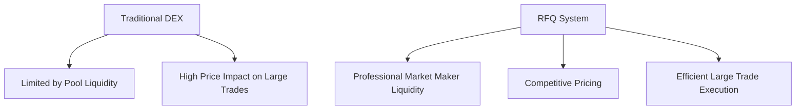
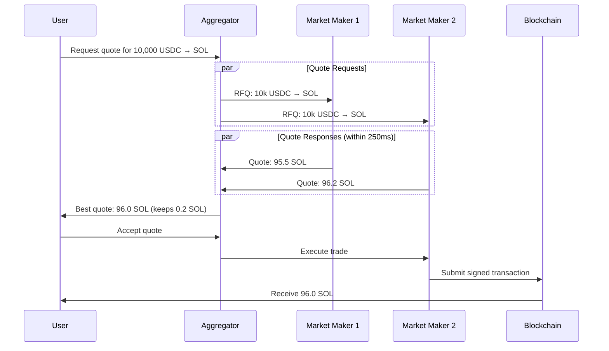
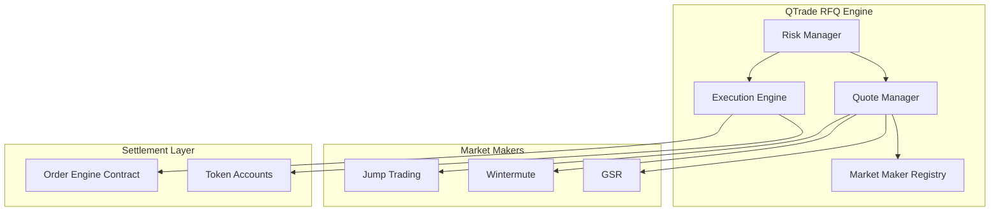
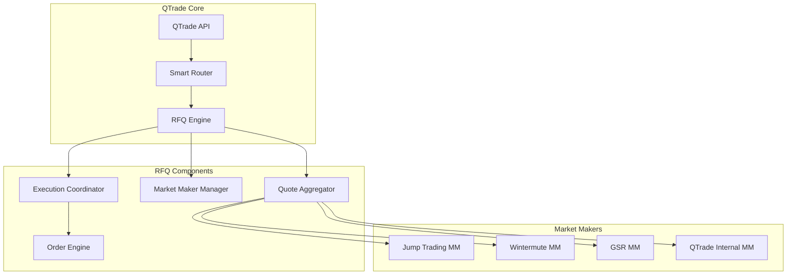
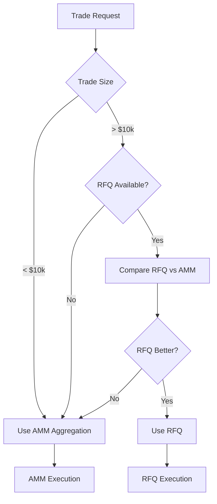
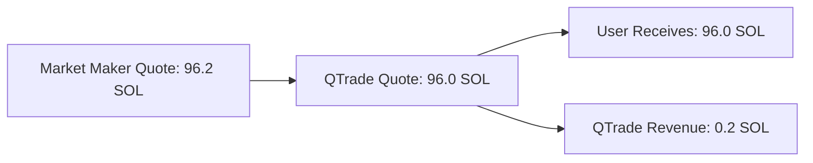
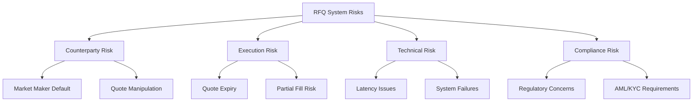
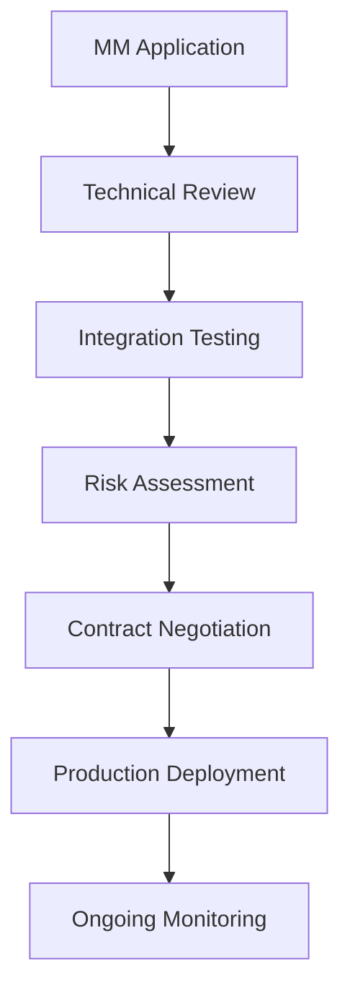
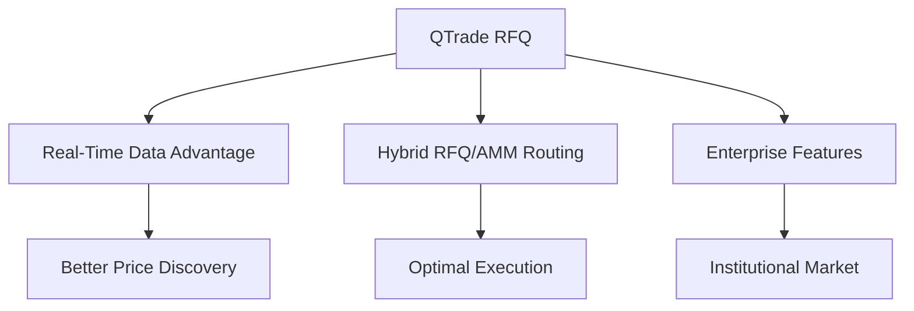
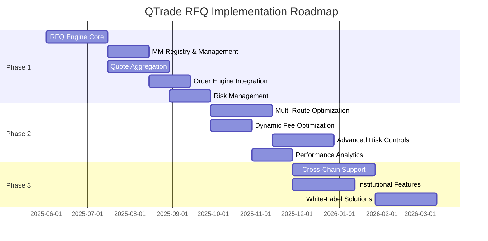

# Request for Quote (RFQ) System Design for DEX Aggregators

## Table of Contents
1. [Introduction to RFQ Systems](#introduction-to-rfq-systems)
2. [How RFQ Systems Work](#how-rfq-systems-work)
3. [Technical Architecture](#technical-architecture)
4. [QTrade RFQ Implementation Strategy](#qtrade-rfq-implementation-strategy)
5. [RFQ vs Traditional DEX Aggregation](#rfq-vs-traditional-dex-aggregation)
6. [Revenue Models and Economics](#revenue-models-and-economics)
7. [Implementation Examples](#implementation-examples)
8. [Risk Management and Compliance](#risk-management-and-compliance)
9. [Integration with Market Makers](#integration-with-market-makers)
10. [Competitive Analysis](#competitive-analysis)
11. [Roadmap](#roadmap)

## Introduction to RFQ Systems

Request for Quote (RFQ) is a trading mechanism where users request quotes from market makers who compete to provide the best price. Unlike traditional AMM-based DEX aggregation, RFQ systems create a marketplace where professional market makers bid on user trades in real-time.

### Key Characteristics of RFQ Systems

- **Intent-Based Trading**: Users express their trading intent, market makers respond with quotes
- **Professional Market Makers**: Institutional-grade liquidity providers with significant capital
- **Competitive Pricing**: Multiple market makers compete for each trade
- **Off-Chain Quote Generation**: Quotes generated off-chain for speed and sophistication
- **On-Chain Settlement**: Final execution happens on-chain for security and atomicity
- **Time-Limited Quotes**: Quotes have short expiration times (typically 15-60 seconds)

### Why RFQ Systems Matter



**Benefits for Users:**
- Better pricing, especially on larger trades
- Reduced slippage and MEV exposure
- Access to institutional-grade liquidity
- Faster execution times

**Benefits for Aggregators:**
- Higher revenue margins
- Differentiated product offering
- Reduced reliance on public AMM liquidity
- Better execution rates

## How RFQ Systems Work

### Basic RFQ Flow



### Key Components of RFQ Systems

#### 1. Quote Request Distribution
- Aggregator broadcasts quote requests to registered market makers
- Requests include trade parameters (tokens, amount, direction)
- Authenticated requests with rate limiting
- Timeout enforcement (typically 250ms)

#### 2. Quote Response Aggregation
- Market makers respond with competitive quotes
- Quotes include price, expiration time, and execution commitment
- Aggregator compares and ranks all received quotes
- Best quote selected based on price and reliability

#### 3. Trade Execution
- User accepts best quote within expiration window
- Market maker commits to execute at quoted price
- Settlement happens on-chain atomically
- Failed executions trigger penalties for market makers

### RFQ vs AMM Comparison

| Aspect | Traditional AMM | RFQ System |
|--------|----------------|------------|
| **Liquidity Source** | Automated pools | Professional market makers |
| **Price Discovery** | Algorithm (x*y=k) | Competitive bidding |
| **Quote Speed** | Instant | 250ms response time |
| **Large Trade Handling** | High slippage | Competitive pricing |
| **MEV Exposure** | High | Reduced |
| **Market Maker Competition** | Indirect (arbitrage) | Direct (quote competition) |
| **Execution Guarantee** | Pool liquidity dependent | Market maker commitment |

## Technical Architecture

### Core RFQ System Components



### RFQ API Schema

Following Jupiter's RFQ specification, market makers must implement three endpoints:

#### 1. Quote Endpoint
```rust
#[derive(Serialize, Deserialize)]
pub struct RFQQuoteRequest {
    pub input_mint: String,
    pub output_mint: String,
    pub amount: String,           // Amount in smallest token units
    pub swap_mode: SwapMode,      // ExactIn or ExactOut
    pub dex_fee: u64,            // Dynamic fee in basis points
    pub slippage_bps: u16,       // Maximum acceptable slippage
}

#[derive(Serialize, Deserialize)]
pub struct RFQQuoteResponse {
    pub quote_id: String,
    pub input_amount: String,
    pub output_amount: String,
    pub price_impact_pct: Option<f64>,
    pub expires_at: u64,         // Unix timestamp
    pub market_maker_id: String,
}
```

#### 2. Swap Endpoint
```rust
#[derive(Serialize, Deserialize)]
pub struct RFQSwapRequest {
    pub quote_id: String,
    pub user_public_key: String,
    pub user_source_token_account: String,
    pub user_destination_token_account: String,
}

#[derive(Serialize, Deserialize)]
pub struct RFQSwapResponse {
    pub transaction: String,      // Base64 encoded transaction
    pub success: bool,
    pub error_message: Option<String>,
}
```

#### 3. Tokens Endpoint
```rust
#[derive(Serialize, Deserialize)]
pub struct SupportedTokensResponse {
    pub tokens: Vec<String>,      // List of supported token mint addresses
    pub last_updated: u64,
}
```

### Market Maker Integration Protocol

```rust
pub trait RFQMarketMaker {
    async fn get_quote(&self, request: RFQQuoteRequest) -> Result<RFQQuoteResponse>;
    async fn execute_swap(&self, request: RFQSwapRequest) -> Result<RFQSwapResponse>;
    async fn get_supported_tokens(&self) -> Result<SupportedTokensResponse>;
    async fn health_check(&self) -> Result<HealthStatus>;
}

pub struct MarketMakerClient {
    base_url: String,
    api_key: Option<String>,
    timeout: Duration,
    http_client: reqwest::Client,
}

impl RFQMarketMaker for MarketMakerClient {
    async fn get_quote(&self, request: RFQQuoteRequest) -> Result<RFQQuoteResponse> {
        let url = format!("{}/jupiter/rfq/quote", self.base_url);

        let mut req = self.http_client
            .post(&url)
            .json(&request)
            .timeout(Duration::from_millis(250)); // Jupiter's 250ms requirement

        if let Some(api_key) = &self.api_key {
            req = req.header("X-API-KEY", api_key);
        }

        let response = req.send().await?;

        match response.status() {
            reqwest::StatusCode::OK => {
                let quote: RFQQuoteResponse = response.json().await?;
                Ok(quote)
            },
            reqwest::StatusCode::NOT_FOUND => {
                Err(RFQError::NoQuoteAvailable)
            },
            reqwest::StatusCode::BAD_REQUEST => {
                Err(RFQError::InvalidRequest)
            },
            _ => {
                Err(RFQError::MarketMakerError(response.status()))
            }
        }
    }
}
```

## QTrade RFQ Implementation Strategy

### Architecture Overview



### Core RFQ Engine Implementation

```rust
pub struct QTradeRFQEngine {
    market_maker_manager: Arc<MarketMakerManager>,
    quote_aggregator: Arc<QuoteAggregator>,
    execution_coordinator: Arc<ExecutionCoordinator>,
    risk_manager: Arc<RiskManager>,
    config: RFQConfig,
}

impl QTradeRFQEngine {
    pub async fn get_rfq_quote(
        &self,
        request: RFQQuoteRequest,
    ) -> Result<RFQQuoteResponse> {
        // Validate request
        self.risk_manager.validate_request(&request)?;

        // Get quotes from all eligible market makers
        let quotes = self.quote_aggregator
            .get_quotes_from_market_makers(&request)
            .await?;

        // Select best quote
        let best_quote = self.select_best_quote(quotes)?;

        // Apply QTrade margin
        let qtrade_quote = self.apply_qtrade_margin(best_quote)?;

        Ok(qtrade_quote)
    }

    pub async fn execute_rfq_trade(
        &self,
        quote_id: String,
        user_accounts: UserAccounts,
    ) -> Result<ExecutionResult> {
        // Retrieve quote
        let quote = self.quote_aggregator.get_quote(&quote_id).await?;

        // Validate quote hasn't expired
        if quote.expires_at < Utc::now().timestamp() {
            return Err(RFQError::QuoteExpired);
        }

        // Execute trade with market maker
        let execution_result = self.execution_coordinator
            .execute_trade(quote, user_accounts)
            .await?;

        Ok(execution_result)
    }

    fn select_best_quote(&self, quotes: Vec<RFQQuote>) -> Result<RFQQuote> {
        let mut scored_quotes: Vec<_> = quotes
            .into_iter()
            .map(|quote| {
                let score = self.calculate_quote_score(&quote);
                (quote, score)
            })
            .collect();

        // Sort by score (higher is better)
        scored_quotes.sort_by(|a, b| b.1.partial_cmp(&a.1).unwrap());

        scored_quotes
            .into_iter()
            .next()
            .map(|(quote, _)| quote)
            .ok_or(RFQError::NoQuotesReceived)
    }

    fn calculate_quote_score(&self, quote: &RFQQuote) -> f64 {
        let price_score = quote.output_amount as f64;
        let reliability_score = self.get_mm_reliability_score(&quote.market_maker_id);
        let speed_score = self.get_mm_speed_score(&quote.market_maker_id);

        // Weighted scoring: 70% price, 20% reliability, 10% speed
        price_score * 0.7 + reliability_score * 0.2 + speed_score * 0.1
    }
}
```

### Quote Aggregation Implementation

```rust
pub struct QuoteAggregator {
    market_makers: HashMap<String, Box<dyn RFQMarketMaker>>,
    quote_cache: Arc<QuoteCache>,
    metrics: Arc<RFQMetrics>,
}

impl QuoteAggregator {
    pub async fn get_quotes_from_market_makers(
        &self,
        request: &RFQQuoteRequest,
    ) -> Result<Vec<RFQQuote>> {
        let start_time = Instant::now();

        // Filter market makers that support this token pair
        let eligible_mms: Vec<_> = self.market_makers
            .iter()
            .filter(|(id, mm)| {
                self.supports_token_pair(mm, &request.input_mint, &request.output_mint)
            })
            .collect();

        // Request quotes from all eligible market makers in parallel
        let quote_futures: Vec<_> = eligible_mms
            .iter()
            .map(|(id, mm)| {
                let request = request.clone();
                let id = id.clone();
                async move {
                    let start = Instant::now();
                    let result = mm.get_quote(request).await;
                    let duration = start.elapsed();

                    // Record metrics
                    self.metrics.record_quote_latency(&id, duration);

                    match result {
                        Ok(quote) => {
                            self.metrics.increment_successful_quotes(&id);
                            Some(RFQQuote::from_response(quote, id))
                        },
                        Err(e) => {
                            self.metrics.increment_failed_quotes(&id);
                            warn!("Quote request failed for MM {}: {:?}", id, e);
                            None
                        }
                    }
                }
            })
            .collect();

        // Wait for all quotes with timeout
        let quotes_results = timeout(
            Duration::from_millis(300), // 50ms buffer beyond MM timeout
            futures::future::join_all(quote_futures)
        ).await?;

        let quotes: Vec<RFQQuote> = quotes_results
            .into_iter()
            .filter_map(|quote_opt| quote_opt)
            .collect();

        // Cache quotes
        for quote in &quotes {
            self.quote_cache.store(quote.clone()).await?;
        }

        let total_duration = start_time.elapsed();
        self.metrics.record_quote_aggregation_latency(total_duration);

        Ok(quotes)
    }

    fn supports_token_pair(
        &self,
        mm: &Box<dyn RFQMarketMaker>,
        input_mint: &str,
        output_mint: &str
    ) -> bool {
        // Check cached supported tokens
        if let Some(supported_tokens) = self.get_cached_supported_tokens(&mm.id()) {
            return supported_tokens.contains(input_mint) &&
                   supported_tokens.contains(output_mint);
        }

        // Default to true if we don't have cached info
        true
    }
}
```

### Order Engine Integration

Following Jupiter's order engine pattern, QTrade needs to integrate with an on-chain order engine for settlement:

```rust
// Order engine instruction for RFQ settlement
pub fn create_rfq_order(
    ctx: Context<CreateRFQOrder>,
    order_params: RFQOrderParams,
) -> Result<()> {
    let order = &mut ctx.accounts.order;

    // Initialize order with parameters
    order.taker = ctx.accounts.taker.key();
    order.maker = ctx.accounts.maker.key();
    order.input_mint = order_params.input_mint;
    order.output_mint = order_params.output_mint;
    order.input_amount = order_params.input_amount;
    order.output_amount = order_params.output_amount;
    order.expires_at = Clock::get()?.unix_timestamp + order_params.ttl;
    order.quote_id = order_params.quote_id;

    // Validate order parameters
    require!(order.input_amount > 0, ErrorCode::InvalidInputAmount);
    require!(order.output_amount > 0, ErrorCode::InvalidOutputAmount);
    require!(order.expires_at > Clock::get()?.unix_timestamp, ErrorCode::OrderExpired);

    Ok(())
}

pub fn fill_rfq_order(
    ctx: Context<FillRFQOrder>,
) -> Result<()> {
    let order = &ctx.accounts.order;

    // Validate order hasn't expired
    require!(
        order.expires_at > Clock::get()?.unix_timestamp,
        ErrorCode::OrderExpired
    );

    // Validate order hasn't been filled
    require!(!order.filled, ErrorCode::OrderAlreadyFilled);

    // Transfer tokens from maker to taker
    transfer_tokens(
        &ctx.accounts.maker_token_account,
        &ctx.accounts.taker_token_account,
        &ctx.accounts.maker,
        order.output_amount,
        &ctx.accounts.token_program,
    )?;

    // Transfer tokens from taker to maker
    transfer_tokens(
        &ctx.accounts.taker_token_account,
        &ctx.accounts.maker_token_account,
        &ctx.accounts.taker,
        order.input_amount,
        &ctx.accounts.token_program,
    )?;

    // Mark order as filled
    let order = &mut ctx.accounts.order;
    order.filled = true;
    order.filled_at = Clock::get()?.unix_timestamp;

    Ok(())
}
```

## RFQ vs Traditional DEX Aggregation

### Performance Comparison

| Metric | Traditional AMM Aggregation | RFQ System |
|--------|----------------------------|------------|
| **Quote Speed** | < 100ms | 250-300ms |
| **Price Improvement (Large Trades)** | Limited by pool depth | Competitive market maker pricing |
| **MEV Protection** | Limited | High (off-chain quotes) |
| **Execution Guarantee** | Pool liquidity dependent | Market maker commitment |
| **Capital Efficiency** | Passive LP capital | Active professional capital |
| **Slippage on Large Trades** | High (exponential) | Low (competitive pricing) |

### When to Use RFQ vs AMM



**QTrade's Hybrid Approach:**
- Small trades (< $10k): Route through traditional AMM aggregation
- Medium trades ($10k - $100k): Compare RFQ vs AMM, use better option
- Large trades (> $100k): Prefer RFQ, fallback to AMM if no quotes
- Institutional trades: RFQ only with custom terms

## Revenue Models and Economics

### RFQ Revenue Streams

#### 1. Spread Capture Model


**Implementation:**
- Market maker quotes 96.2 SOL
- QTrade quotes user 96.0 SOL
- QTrade captures 0.2 SOL spread
- User still gets better price than AMM (95.5 SOL)

#### 2. Fee Sharing Model
```rust
pub struct RFQFeeStructure {
    pub base_fee_bps: u16,           // Base fee in basis points
    pub mm_share_percentage: u8,      // Percentage shared with MM
    pub qtrade_share_percentage: u8,  // Percentage kept by QTrade
}

impl RFQFeeStructure {
    pub fn calculate_fees(&self, trade_volume: u64) -> FeeBreakdown {
        let total_fee = trade_volume * self.base_fee_bps as u64 / 10000;
        let mm_fee = total_fee * self.mm_share_percentage as u64 / 100;
        let qtrade_fee = total_fee - mm_fee;

        FeeBreakdown {
            total_fee,
            market_maker_fee: mm_fee,
            aggregator_fee: qtrade_fee,
        }
    }
}
```

#### 3. Premium Service Model
- **Standard RFQ**: Best effort quotes, standard spreads
- **Priority RFQ**: Guaranteed quotes within 100ms, reduced spreads
- **Institutional RFQ**: Custom pricing, dedicated market makers
- **API Access**: Direct RFQ API access for high-frequency traders

### Revenue Projections

**RFQ Revenue Analysis:**
```rust
pub struct RFQRevenueProjection {
    daily_rfq_volume: u64,
    average_spread_bps: u16,
    execution_rate: f64,
    operational_costs_bps: u16,
}

impl RFQRevenueProjection {
    pub fn calculate_monthly_revenue(&self) -> u64 {
        let daily_executed_volume = (self.daily_rfq_volume as f64 * self.execution_rate) as u64;
        let daily_gross_revenue = daily_executed_volume * self.average_spread_bps as u64 / 10000;
        let daily_operational_costs = daily_executed_volume * self.operational_costs_bps as u64 / 10000;
        let daily_net_revenue = daily_gross_revenue.saturating_sub(daily_operational_costs);

        daily_net_revenue * 30 // Monthly
    }
}

// Example calculation
let rfq_projection = RFQRevenueProjection {
    daily_rfq_volume: 50_000_000, // $50M daily RFQ volume
    average_spread_bps: 15,        // 0.15% average spread
    execution_rate: 0.85,          // 85% execution rate
    operational_costs_bps: 5,      // 0.05% operational costs
};

// Expected monthly revenue: ~$1.275M
```

## Implementation Examples

### 1. Jupiter Z Integration Pattern

Following Jupiter's RFQ model, QTrade can implement similar webhook-based integration:

```rust
pub struct JupiterStyleRFQHandler {
    webhook_clients: HashMap<String, WebhookClient>,
    order_engine: Arc<OrderEngineClient>,
    quote_timeout: Duration,
}

impl JupiterStyleRFQHandler {
    pub async fn handle_rfq_request(
        &self,
        request: RFQQuoteRequest,
    ) -> Result<RFQQuoteResponse> {
        let start_time = Instant::now();

        // Add Jupiter-style headers
        let headers = self.create_rfq_headers(&start_time);

        // Broadcast to all registered webhooks
        let quote_futures: Vec<_> = self.webhook_clients
            .iter()
            .map(|(id, client)| {
                let request = request.clone();
                let headers = headers.clone();
                async move {
                    client.get_quote(request, headers).await
                        .map(|quote| (id.clone(), quote))
                }
            })
            .collect();

        // Wait for responses with timeout
        let quotes = timeout(self.quote_timeout, futures::future::join_all(quote_futures))
            .await?;

        // Process and rank quotes
        let valid_quotes: Vec<_> = quotes
            .into_iter()
            .filter_map(|result| result.ok())
            .collect();

        self.select_best_quote(valid_quotes)
    }

    fn create_rfq_headers(&self, start_time: &Instant) -> HashMap<String, String> {
        let mut headers = HashMap::new();
        headers.insert(
            "x-request-start".to_string(),
            start_time.elapsed().as_millis().to_string()
        );
        headers.insert(
            "x-request-timeout".to_string(),
            self.quote_timeout.as_millis().to_string()
        );
        headers
    }
}
```

### 2. Hashflow-Style RFQ Implementation

Hashflow uses a different approach with signed quotes and price guarantees:

```rust
pub struct HashflowStyleRFQHandler {
    market_makers: HashMap<String, HashflowMM>,
    price_verifier: Arc<PriceVerifier>,
}

#[derive(Serialize, Deserialize)]
pub struct HashflowRFQQuote {
    pub quote_id: String,
    pub trader: String,
    pub base_token: String,
    pub quote_token: String,
    pub base_token_amount: String,
    pub quote_token_amount: String,
    pub signature: String,        // Market maker's signature
    pub expires_at: u64,
}

impl HashflowStyleRFQHandler {
    pub async fn get_signed_quote(
        &self,
        request: RFQQuoteRequest,
    ) -> Result<HashflowRFQQuote> {
        // Get quotes from market makers
        let quotes = self.request_quotes_from_market_makers(&request).await?;

        // Verify signatures
        let verified_quotes: Vec<_> = quotes
            .into_iter()
            .filter(|quote| self.verify_quote_signature(quote))
            .collect();

        // Select best verified quote
        let best_quote = self.select_best_quote(verified_quotes)?;

        Ok(best_quote)
    }

    fn verify_quote_signature(&self, quote: &HashflowRFQQuote) -> bool {
        let message = self.create_quote_message(quote);
        let mm_pubkey = self.get_mm_pubkey(&quote.market_maker_id);

        self.price_verifier.verify_signature(
            &quote.signature,
            &message,
            &mm_pubkey
        )
    }
}
```

### 3. Multi-Engine Routing

QTrade can implement a sophisticated routing engine that combines RFQ with traditional AMM routing:

```rust
pub struct MultiEngineRouter {
    rfq_engine: Arc<QTradeRFQEngine>,
    amm_router: Arc<AMMRouter>,
    routing_config: RoutingConfig,
}

impl MultiEngineRouter {
    pub async fn get_best_route(
        &self,
        request: RouteRequest,
    ) -> Result<OptimalRoute> {
        // Determine which engines to query based on trade characteristics
        let engines_to_query = self.select_engines_for_request(&request);

        let mut route_futures = Vec::new();

        // Query RFQ if applicable
        if engines_to_query.contains(&RoutingEngine::RFQ) {
            let rfq_future = self.rfq_engine.get_rfq_quote(request.clone().into());
            route_futures.push(async move {
                rfq_future.await.map(|quote| RouteOption::RFQ(quote))
            }.boxed());
        }

        // Query AMM routing
        if engines_to_query.contains(&RoutingEngine::AMM) {
            let amm_future = self.amm_router.get_best_route(request.clone());
            route_futures.push(async move {
                amm_future.await.map(|route| RouteOption::AMM(route))
            }.boxed());
        }

        // Wait for all routes
        let routes = futures::future::join_all(route_futures).await;

        // Select optimal route considering price, execution probability, and fees
        let optimal_route = self.select_optimal_route(routes)?;

        Ok(optimal_route)
    }

    fn select_engines_for_request(&self, request: &RouteRequest) -> Vec<RoutingEngine> {
        let mut engines = Vec::new();

        // Always include AMM for comparison
        engines.push(RoutingEngine::AMM);

        // Include RFQ based on trade size and token pair
        if request.amount > self.routing_config.min_rfq_amount {
            if self.rfq_engine.supports_token_pair(&request.input_mint, &request.output_mint) {
                engines.push(RoutingEngine::RFQ);
            }
        }

        engines
    }
}
```

## Risk Management and Compliance

### RFQ-Specific Risks



### Risk Mitigation Framework

```rust
pub struct RFQRiskManager {
    counterparty_limits: HashMap<String, CounterpartyLimits>,
    execution_monitor: Arc<ExecutionMonitor>,
    compliance_checker: Arc<ComplianceChecker>,
}

impl RFQRiskManager {
    pub fn validate_request(&self, request: &RFQQuoteRequest) -> Result<()> {
        // Check trade size limits
        if request.amount > self.max_single_trade_amount {
            return Err(RFQError::TradeTooLarge);
        }

        // Check rate limits
        if !self.check_rate_limits(&request.user_id) {
            return Err(RFQError::RateLimitExceeded);
        }

        // Compliance checks
        self.compliance_checker.validate_trade(request)?;

        Ok(())
    }

    pub fn validate_quote(&self, quote: &RFQQuote) -> Result<()> {
        // Check counterparty limits
        let limits = self.counterparty_limits
            .get(&quote.market_maker_id)
            .ok_or(RFQError::UnknownMarketMaker)?;

        // Check current exposure
        let current_exposure = self.get_current_exposure(&quote.market_maker_id);
        if current_exposure + quote.input_amount > limits.max_exposure {
            return Err(RFQError::ExposureLimitExceeded);
        }

        // Check quote reasonableness
        if !self.is_quote_reasonable(quote) {
            return Err(RFQError::UnreasonableQuote);
        }

        Ok(())
    }

    pub async fn monitor_execution(
        &self,
        quote_id: &str,
        execution_start: Instant,
    ) -> Result<ExecutionStatus> {
        let timeout = Duration::from_secs(25); // Jupiter's 25-second execution window

        loop {
            if execution_start.elapsed() > timeout {
                return Ok(ExecutionStatus::Timeout);
            }

            match self.execution_monitor.check_status(quote_id).await? {
                ExecutionStatus::Pending => {
                    tokio::time::sleep(Duration::from_millis(500)).await;
                    continue;
                },
                status => return Ok(status),
            }
        }
    }
}

#[derive(Clone, Debug)]
pub struct CounterpartyLimits {
    pub max_exposure: u64,
    pub max_single_trade: u64,
    pub reliability_threshold: f64,
    pub max_daily_volume: u64,
}
```

### Fulfillment Requirements

Following Jupiter's model, QTrade should enforce strict fulfillment requirements:

```rust
pub struct FulfillmentTracker {
    fulfillment_rates: HashMap<String, FulfillmentStats>,
    performance_thresholds: PerformanceThresholds,
}

#[derive(Clone, Debug)]
pub struct FulfillmentStats {
    pub quotes_provided: u64,
    pub quotes_executed: u64,
    pub average_response_time: Duration,
    pub reliability_score: f64,
}

#[derive(Clone, Debug)]
pub struct PerformanceThresholds {
    pub min_fulfillment_rate: f64,     // 95% (Jupiter's requirement)
    pub max_response_time: Duration,    // 250ms (Jupiter's requirement)
    pub min_reliability_score: f64,    // Custom QTrade requirement
}

impl FulfillmentTracker {
    pub fn should_suspend_market_maker(&self, mm_id: &str) -> bool {
        let stats = match self.fulfillment_rates.get(mm_id) {
            Some(stats) => stats,
            None => return false,
        };

        let fulfillment_rate = stats.quotes_executed as f64 / stats.quotes_provided as f64;

        // Suspend if below thresholds
        fulfillment_rate < self.performance_thresholds.min_fulfillment_rate ||
        stats.average_response_time > self.performance_thresholds.max_response_time ||
        stats.reliability_score < self.performance_thresholds.min_reliability_score
    }

    pub fn record_quote_provided(&mut self, mm_id: &str) {
        let stats = self.fulfillment_rates.entry(mm_id.to_string())
            .or_insert_with(FulfillmentStats::default);
        stats.quotes_provided += 1;
    }

    pub fn record_quote_executed(&mut self, mm_id: &str, response_time: Duration) {
        let stats = self.fulfillment_rates.entry(mm_id.to_string())
            .or_insert_with(FulfillmentStats::default);
        stats.quotes_executed += 1;

        // Update average response time
        let total_time = stats.average_response_time.as_millis() * stats.quotes_executed as u128;
        let new_total = total_time + response_time.as_millis();
        stats.average_response_time = Duration::from_millis(
            (new_total / stats.quotes_executed as u128) as u64
        );
    }
}
```

## Integration with Market Makers

### Market Maker Onboarding Process



### Market Maker Requirements

**Technical Requirements:**
- Implement Jupiter RFQ API specification
- Response time < 250ms for quote requests
- 95%+ fulfillment rate on provided quotes
- Support for major token pairs (SOL, USDC, USDT, etc.)
- Proper error handling and status codes

**Financial Requirements:**
- Minimum $10M in demonstrable liquidity
- Risk management and position limits
- Insurance or collateral requirements
- Competitive pricing capability

**Operational Requirements:**
- 24/7 system availability
- Incident response procedures
- Regular system health checks
- Compliance with regulatory requirements

### Market Maker Integration Example

```rust
pub struct MarketMakerIntegration {
    mm_id: String,
    config: MMConfig,
    client: Box<dyn RFQMarketMaker>,
    health_checker: Arc<HealthChecker>,
    performance_tracker: Arc<PerformanceTracker>,
}

impl MarketMakerIntegration {
    pub async fn integrate_new_market_maker(
        mm_config: MMConfig,
    ) -> Result<MarketMakerIntegration> {
        // Create client
        let client = Self::create_mm_client(&mm_config)?;

        // Test basic connectivity
        client.health_check().await?;

        // Test quote functionality
        let test_quote_request = Self::create_test_quote_request();
        let quote_response = client.get_quote(test_quote_request).await?;

        // Validate response format
        Self::validate_quote_response(&quote_response)?;

        // Get supported tokens
        let supported_tokens = client.get_supported_tokens().await?;
        Self::validate_supported_tokens(&supported_tokens)?;

        Ok(MarketMakerIntegration {
            mm_id: mm_config.id.clone(),
            config: mm_config,
            client,
            health_checker: Arc::new(HealthChecker::new()),
            performance_tracker: Arc::new(PerformanceTracker::new()),
        })
    }

    pub async fn continuous_monitoring(&self) -> Result<()> {
        loop {
            // Health check every 30 seconds
            tokio::time::sleep(Duration::from_secs(30)).await;

            match self.client.health_check().await {
                Ok(_) => {
                    self.performance_tracker.record_health_check_success(&self.mm_id);
                },
                Err(e) => {
                    self.performance_tracker.record_health_check_failure(&self.mm_id);
                    warn!("Health check failed for MM {}: {:?}", self.mm_id, e);

                    // Suspend MM if too many failures
                    if self.performance_tracker.should_suspend(&self.mm_id) {
                        self.suspend_market_maker().await?;
                    }
                }
            }
        }
    }
}
```

## Competitive Analysis

### Current RFQ Market Landscape

#### Jupiter Z (Jupiter's RFQ System)
- **Model**: Webhook-based integration with market makers
- **Quote Timeout**: 250ms response requirement
- **Fulfillment**: 95% fulfillment rate requirement
- **Fee Structure**: Dynamic fees based on tokens and size
- **Settlement**: Order engine on Solana
- **Advantages**: First-mover advantage, large user base, proven infrastructure

#### Hashflow
- **Model**: Signed quotes with price guarantees
- **Quote Mechanism**: Off-chain signed quotes, on-chain settlement
- **Cross-Chain**: Multi-chain support (Ethereum, Polygon, etc.)
- **MEV Protection**: Complete MEV protection through signed quotes
- **Advantages**: Mature cross-chain infrastructure, strong MM relationships

#### CoW Swap (Gnosis Protocol)
- **Model**: Batch auctions with coincidence of wants
- **Settlement**: Batch execution with MEV capture redistribution
- **Quote Mechanism**: Intent-based with solver competition
- **Advantages**: MEV protection, batch efficiency, fair price discovery

### QTrade's RFQ Competitive Position

**Competitive Advantages:**
1. **Real-Time Market Data**: Superior price discovery through sub-second data feeds
2. **Multi-RPC Infrastructure**: Higher execution reliability and speed
3. **Hybrid Routing**: Seamless integration between RFQ and AMM routing
4. **Risk Management**: Advanced counterparty risk controls
5. **Customizable Solutions**: Enterprise and institutional-grade features

**Market Positioning Strategy:**


**Differentiation Strategy:**
- **Phase 1**: Competitive parity with Jupiter Z's webhook model
- **Phase 2**: Superior execution through real-time data and multi-RPC
- **Phase 3**: Advanced features like cross-chain RFQ and institutional services

## Roadmap

### Phase 1: Core RFQ Infrastructure (Months 1-4)

**Technical Milestones:**
- RFQ Engine core implementation
- Market Maker registry and management
- Quote aggregation and selection logic
- Basic order engine integration
- Risk management framework

**Integration Targets:**
- 3-5 major market makers (Jump, Wintermute, GSR)
- Support for top 20 token pairs
- Jupiter-compatible API specification

**Performance Targets:**
- < 300ms total quote time
- 90%+ uptime and reliability
- Competitive pricing vs. Jupiter Z

### Phase 2: Advanced Features (Months 5-8)

**Enhanced Capabilities:**
- Multi-route optimization (RFQ + AMM)
- Dynamic fee optimization
- Advanced risk controls and monitoring
- Real-time performance analytics
- Market maker performance scoring

**Scale Targets:**
- 10+ integrated market makers
- $10M+ daily RFQ volume
- Support for 50+ token pairs

### Phase 3: Market Leadership (Months 9-12)

**Advanced Features:**
- Cross-chain RFQ support
- Institutional client features
- White-label RFQ solutions
- Custom settlement mechanisms
- Advanced MEV protection

**Business Targets:**
- $100M+ daily RFQ volume
- 20+ market maker partnerships
- Enterprise client onboarding

### Technical Implementation Timeline



## Conclusion

Request for Quote (RFQ) systems represent a significant evolution in DEX aggregation, moving beyond simple AMM routing to sophisticated liquidity orchestration with professional market makers. The key benefits include:

**For Users:**
- Better pricing, especially on larger trades
- Reduced slippage and MEV exposure
- Access to institutional-grade liquidity
- Improved execution certainty

**For QTrade:**
- Higher revenue margins (0.1-0.3% vs 0.05% for referrals)
- Competitive differentiation
- Access to professional liquidity
- Scalable business model

**Technical Success Factors:**
1. **Low Latency**: Sub-300ms total quote time
2. **High Reliability**: 99%+ system uptime
3. **Risk Management**: Sophisticated counterparty controls
4. **Market Maker Relationships**: Strong partnerships with institutional MMs

**Economic Opportunity:**
RFQ integration could significantly increase QTrade's revenue potential:
- Traditional referral model: 0.025-0.05% per trade
- RFQ model: 0.1-0.3% per trade
- Potential 4-6x increase in per-trade revenue

The RFQ model is particularly powerful when combined with QTrade's existing strengths:
- **Real-time data feeds** enable better quote evaluation
- **Multi-RPC infrastructure** ensures high execution rates
- **Advanced routing** can seamlessly blend RFQ and AMM liquidity

Success in RFQ requires balancing technical excellence, market maker relationships, and user experience to create a competitive and sustainable liquidity solution.
