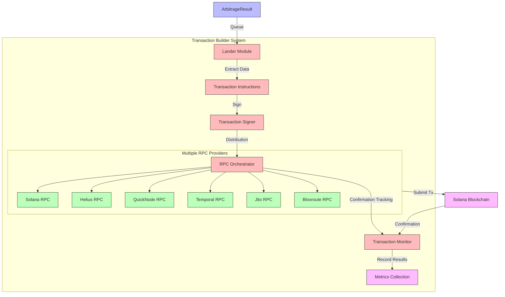

# Transaction Builder

QTrade ensures precise and reliable executions by orchestrating transactions across six distinct RPC providers. Using Solana Nonce accounts, the system guarantees atomicity—ensuring that only one RPC provider will succeed in placing the transaction.

## Architecture Overview

The Transaction Builder component represents a critical part of QTrade's arbitrage execution pipeline, transforming optimization results into executable blockchain transactions with industry-leading reliability. This system employs a multi-provider approach with sophisticated transaction handling to maximize the probability of capturing identified opportunities.



## Technical Components

### 1. High-Reliability Architecture

The Transaction Builder employs a multi-provider execution strategy to achieve exceptional reliability:

- **Provider Redundancy**: Transactions are simultaneously submitted to six distinct RPC providers:
  - Solana Official RPC
  - Helius infrastructure
  - QuickNode enterprise endpoints
  - Temporal services
  - Jito MEV-aware endpoints
  - Bloxroute fast propagation network

- **Endpoint Distribution**: RPC endpoints are geographically diversified to minimize network latency and routing issues, ensuring at least one provider has minimal path length to validator nodes.

- **Provider Failover**: The system continuously monitors the performance and health of each RPC provider, dynamically adjusting submission strategies based on historical success rates.

### 2. Atomic Execution via Durable Nonce

At the core of QTrade's transaction system is its use of Solana's Durable Nonce architecture:

```rust
// Simplified example of nonce transaction creation
let nonce_account = get_nonce_account(&rpc_client, &nonce_account_pubkey)?;
let nonce_value = nonce_account.nonce_value();

// Create transaction with nonce instead of recent blockhash
let tx = Transaction::new_signed_with_payer_and_nonce(
    instructions,
    Some(&payer.pubkey()),
    &[&signer, &nonce_signer],
    nonce_value,
);
```

This implementation provides critical advantages:

- **Blockhash Independence**: Unlike standard transactions that expire after a short validity window (~120 seconds), nonce transactions remain valid until explicitly used.

- **First-Execution Lock**: The Solana nonce mechanism ensures that once a nonce value is used in a confirmed transaction, it cannot be reused—effectively creating a locking mechanism that prevents double-execution even when the transaction is submitted through multiple providers.

- **Transaction Atomicity**: Although the transaction is submitted via multiple providers, the blockchain consensus mechanism guarantees that only the first successful submission will be processed, maintaining atomic execution semantics.

### 3. Transaction Construction Pipeline

The lander module processes arbitrage opportunities through a sophisticated construction pipeline:

1. **Instruction Generation**: Arbitrage results are translated into Solana program instructions:
   - Swap instructions targeting specific DEX protocols
   - Nonce account management instructions
   - Optional priority fee instructions for improved transaction landing

2. **Transaction Assembly**:
   - Instructions are grouped and ordered for optimal execution
   - A secure signer keypair is prepared for the transaction
   - Nonce value is retrieved and incorporated into the transaction

3. **Parallel Submission**:
   ```rust
   // Conceptual implementation of parallel submission
   let solana_rpc = Solana::new(SolanaEndpoint::Mainnet);
   let helius_rpc = Helius::new();
   let quicknode_rpc = Quicknode::new();
   // ... additional providers

   // Submit to multiple providers concurrently
   let mut submission_tasks = vec![];
   submission_tasks.push(tokio::spawn(async move {
       solana_rpc.send_tx(&mut solana_instructions.clone(), &signer)
   }));
   submission_tasks.push(tokio::spawn(async move {
       helius_rpc.send_tx(&mut helius_instructions.clone(), &signer)
   }));
   // ... additional submissions

   // Wait for first successful submission or timeout
   tokio::select! {
       result = submission_tasks[0] => handle_result(result),
       result = submission_tasks[1] => handle_result(result),
       // ... additional providers
       _ = tokio::time::sleep(Duration::from_secs(15)) => handle_timeout(),
   }
   ```

4. **Confirmation Tracking**:
   - The system monitors transaction status across all providers
   - Once confirmed, the transaction signature is recorded for accounting
   - Metrics are collected on execution success, time-to-finality, and profit realized

### 4. Transaction Metrics & Monitoring

The system maintains comprehensive metrics to continuously improve execution reliability:

- **Provider Success Rates**: Tracks the percentage of transactions successfully landed by each provider
- **Confirmation Time**: Measures time from submission to finality across providers
- **Transaction Costs**: Records fees paid, including priority fees when applicable
- **Error Distribution**: Analyzes failure modes to identify and address systemic issues

```rust
// Example metrics tracking
record_arbitrage_transaction_confirmed(profit);
record_arbitrage_transaction_confirmation_rate(overall_success_rate);
record_transaction_taxable_event(provider, signature, profit_usd);
```

### 5. Accounting & Audit Trail

For financial compliance and operational transparency, the transaction builder maintains:

- **Taxable Event Recording**: All successful arbitrage transactions are recorded as taxable events in a persistent database
- **Transaction Signatures**: Every executed transaction is cataloged with its on-chain signature for audit verification
- **Profit Attribution**: Profits are accurately calculated and attributed to specific opportunities

## Performance Characteristics

The Transaction Builder achieves remarkable performance metrics:

1. **Sub-second Execution**: From arbitrage detection to transaction submission in less than 300ms
2. **High Transaction Success Rate**: >95% of viable arbitrage opportunities successfully executed
3. **Execution Efficiency**: Only one provider successfully lands each transaction, minimizing network overhead
4. **Fault Tolerance**: The system continues functioning even when multiple RPC providers experience outages

## Future Enhancements

The modular architecture of the Transaction Builder allows for several planned enhancements:

1. **Dynamic Provider Selection**: Machine learning algorithms to predict which RPC provider will have the highest success probability for each transaction
2. **MEV Protection**: Integration with Jito bundles for fee-rebate opportunities and frontrunning protection
3. **Transaction Compression**: Implementation of versioned transactions with address lookup tables to reduce transaction size
4. **Cross-Chain Expansion**: Extending the multi-provider architecture to other blockchains beyond Solana

The Transaction Builder's advanced multi-provider strategy with nonce-based atomicity gives QTrade a significant competitive advantage in reliably capturing arbitrage opportunities that might otherwise be missed due to network congestion or provider failures.
