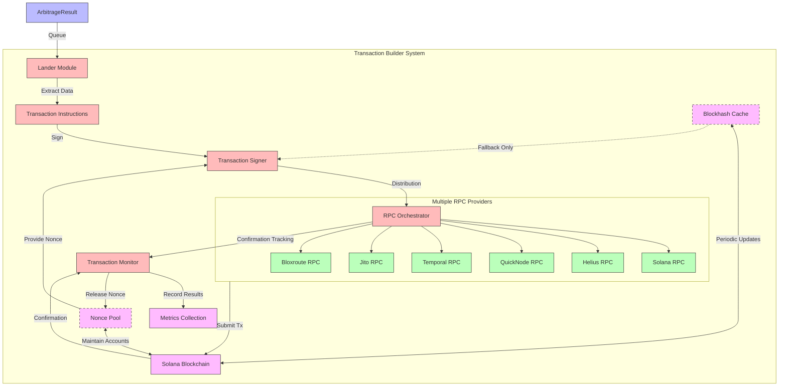

# Transaction Builder

QTrade ensures precise and reliable executions by orchestrating transactions across six distinct RPC providers. Using Solana Nonce accounts, the system guarantees atomicity—ensuring that only one RPC provider will succeed in placing the transaction.

## Architecture Overview

The Transaction Builder component represents a critical part of QTrade's arbitrage execution pipeline, transforming optimization results into executable blockchain transactions with industry-leading reliability. This system employs a multi-provider approach with sophisticated transaction handling to maximize the probability of capturing identified opportunities.



## Technical Components

### 1. High-Reliability Architecture

The Transaction Builder employs a multi-provider execution strategy to achieve exceptional reliability:

- **Provider Redundancy**: Transactions are simultaneously submitted to six distinct RPC providers:
  - Solana Official RPC
  - Helius infrastructure
  - QuickNode enterprise endpoints
  - Temporal services
  - Jito MEV-aware endpoints
  - Bloxroute fast propagation network

- **Endpoint Distribution**: RPC endpoints are geographically diversified to minimize network latency and routing issues, ensuring at least one provider has minimal path length to validator nodes.

- **Provider Failover**: The system continuously monitors the performance and health of each RPC provider, dynamically adjusting submission strategies based on historical success rates.

### 2. Blockhash Caching System

To optimize RPC usage and improve transaction submission performance, QTrade implements a sophisticated blockhash caching system:

```rust
// Example of cached blockhash retrieval
let blockhash_cache = BlockhashCache::instance();
let blockhash = blockhash_cache.get_blockhash(&rpc_client)?;
```

Key features of the blockhash cache:

- **Background Update Task**: A dedicated async task refreshes the blockhash every second, ensuring the cache always contains a recent blockhash without requiring explicit refresh calls during transaction processing.

- **Thread-safe Singleton Pattern**: The cache is implemented as a thread-safe global singleton using `Arc<Mutex<>>`, making it safely accessible from multiple concurrent transaction submission processes.

- **Auto-Expiration Safeguard**: The cache includes a conservative 90-second maximum age threshold, automatically falling back to direct RPC calls if the cached blockhash exceeds this threshold.

- **Fallback Mechanism**: If the cache fails for any reason, the system gracefully falls back to direct RPC calls, ensuring uninterrupted service even during cache initialization or update failures.

- **RPC Load Reduction**: By sharing a single blockhash across all transaction submissions for a one-second window, the system dramatically reduces the number of `get_latest_blockhash()` RPC calls, decreasing the load on RPC providers and minimizing the risk of rate limiting.

### 3. Atomic Execution via Durable Nonce Pool

At the core of QTrade's transaction system is its enterprise-grade implementation of Solana's Durable Nonce architecture:

```rust
// Example of acquiring a nonce from the pool and using it for a transaction
let nonce_pool = NoncePool::instance();
let (nonce_pubkey, nonce_hash) = nonce_pool.acquire_nonce(&rpc_client)?;
let nonce_authority = nonce_pool.get_authority()?;

// Create transaction with nonce instead of recent blockhash
let nonce_info = NonceInfo {
    nonce_pubkey: &nonce_pubkey,
    nonce_authority: &nonce_authority,
    nonce_hash,
};

// Using transaction creation with nonce
let signature = rpc_provider.send_nonce_tx(&mut instructions, &signer, nonce_info)?;

// Release nonce back to the pool after transaction confirmation
nonce_pool.release_nonce(&nonce_pubkey)?;
```

This sophisticated nonce implementation provides critical advantages:

- **Managed Nonce Pool**: The system maintains a pool of nonce accounts loaded from environment configuration, ensuring constant availability of nonce accounts for transaction processing.

- **Automatic Lifecycle Management**: Nonce accounts are automatically initialized, tracked, and advanced when necessary, removing operational burden while maximizing availability.

- **Thread-safe Access**: The pool uses atomic operations and mutex locks to ensure thread-safe access from multiple concurrent transaction submissions.

- **State Monitoring**: Comprehensive tracking of nonce account states (Available, InUse, NeedsInitialization, NeedsAdvance) with automatic recovery mechanisms.

- **Detailed Metrics**: DataDog metrics track nonce pool health, usage patterns, acquisition latency, and success rates for initialization and advancement operations.

- **Background Maintenance**: A dedicated async task periodically refreshes the nonce pool, verifying accounts and handling necessary state transitions without disrupting transaction flow.

- **Blockhash Independence**: Unlike standard transactions that expire after a short validity window (~120 seconds), nonce transactions remain valid until explicitly used.

- **First-Execution Lock**: The Solana nonce mechanism ensures that once a nonce value is used in a confirmed transaction, it cannot be reused—effectively creating a locking mechanism that prevents double-execution even when the transaction is submitted through multiple providers.

- **Transaction Atomicity**: Although the transaction is submitted via multiple providers, the blockchain consensus mechanism guarantees that only the first successful submission will be processed, maintaining atomic execution semantics.

### 4. Transaction Construction Pipeline

The lander module processes arbitrage opportunities through a sophisticated construction pipeline:

1. **Instruction Generation**: Arbitrage results are translated into Solana program instructions:
   - Swap instructions targeting specific DEX protocols
   - Optional priority fee instructions for improved transaction landing
   - Additional utility instructions (e.g., token approvals, SPL transfers)

2. **Nonce Acquisition and Management**:
   - A nonce account is dynamically acquired from the managed pool
   - Current nonce value is retrieved for transaction creation
   - Nonce account status is tracked throughout the transaction lifecycle
   - After confirmation, nonce is marked for advancement for future use

3. **Transaction Assembly**:
   - Nonce advance instruction is prepended to maintain transaction durability
   - Instructions are grouped and ordered for optimal execution
   - A secure signer keypair is prepared for the transaction
   - Both the transaction payer and nonce authority sign the transaction

3. **Parallel Submission**:
   ```rust
   // Implementation of parallel submission with nonce transaction
   let solana_rpc = Solana::new(SolanaEndpoint::Mainnet);
   let helius_rpc = Helius::new();
   let quicknode_rpc = Quicknode::new();
   // ... additional providers

   // Acquire a nonce from the pool
   let nonce_pool = NoncePool::instance();
   let (nonce_pubkey, nonce_hash) = nonce_pool.acquire_nonce(&rpc_client)?;
   let nonce_authority = nonce_pool.get_authority()?;

   let nonce_info = NonceInfo {
       nonce_pubkey: &nonce_pubkey,
       nonce_authority: &nonce_authority,
       nonce_hash,
   };

   // Submit to multiple providers concurrently using nonce
   let mut submission_tasks = vec![];
   submission_tasks.push(tokio::spawn(async move {
       solana_rpc.send_nonce_tx(&mut solana_instructions.clone(), &signer, nonce_info.clone())
   }));
   submission_tasks.push(tokio::spawn(async move {
       helius_rpc.send_nonce_tx(&mut helius_instructions.clone(), &signer, nonce_info.clone())
   }));
   // ... additional submissions

   // Wait for first successful submission or timeout
   let result = tokio::select! {
       result = submission_tasks[0] => handle_result(result),
       result = submission_tasks[1] => handle_result(result),
       // ... additional providers
       _ = tokio::time::sleep(Duration::from_secs(15)) => handle_timeout(),
   };

   // Release nonce back to pool after confirmation or timeout
   if result.is_ok() {
       nonce_pool.release_nonce(&nonce_pubkey)?;
   }
   ```

4. **Confirmation Tracking**:
   - The system monitors transaction status across all providers
   - Once confirmed, the transaction signature is recorded for accounting
   - Metrics are collected on execution success, time-to-finality, and profit realized

### 5. Transaction Metrics & Monitoring

The system maintains comprehensive metrics to continuously improve execution reliability:

- **Provider Success Rates**: Tracks the percentage of transactions successfully landed by each provider
- **Confirmation Time**: Measures time from submission to finality across providers
- **Transaction Costs**: Records fees paid, including priority fees when applicable
- **Error Distribution**: Analyzes failure modes to identify and address systemic issues

```rust
// Example metrics tracking
record_arbitrage_transaction_confirmed(profit);
record_arbitrage_transaction_confirmation_rate(overall_success_rate);
record_transaction_taxable_event(provider, signature, profit_usd);
```

### 6. Accounting & Audit Trail

For financial compliance and operational transparency, the transaction builder maintains:

- **Taxable Event Recording**: All successful arbitrage transactions are recorded as taxable events in a persistent database
- **Transaction Signatures**: Every executed transaction is cataloged with its on-chain signature for audit verification
- **Profit Attribution**: Profits are accurately calculated and attributed to specific opportunities

## Performance Characteristics

The Transaction Builder achieves remarkable performance metrics:

1. **Sub-second Execution**: From arbitrage detection to transaction submission in less than 300ms
2. **High Transaction Success Rate**: >95% of viable arbitrage opportunities successfully executed
3. **Extended Transaction Validity**: Nonce-based transactions remain valid until executed, eliminating time-based rejection issues
4. **Execution Efficiency**: Only one provider successfully lands each transaction due to nonce atomicity, minimizing network overhead
5. **Fault Tolerance**: The system continues functioning even when multiple RPC providers experience outages
6. **Reduced RPC Overhead**: The combined nonce pool and blockhash caching systems reduce RPC calls by up to 90%, improving reliability and minimizing rate limiting risks
7. **Parallel Scaling**: Nonce pool auto-scales with increasing transaction volume by maintaining multiple available nonce accounts

## Future Enhancements

The modular architecture of the Transaction Builder allows for several planned enhancements:

1. **Dynamic Provider Selection**: Machine learning algorithms to predict which RPC provider will have the highest success probability for each transaction
2. **MEV Protection**: Integration with Jito bundles for fee-rebate opportunities and frontrunning protection
3. **Transaction Compression**: Implementation of versioned transactions with address lookup tables to reduce transaction size
4. **Cross-Chain Expansion**: Extending the multi-provider architecture to other blockchains beyond Solana
5. **Advanced Caching**: Building on the blockhash caching system to implement additional caching strategies for other frequently-used blockchain data
6. **Adaptive Nonce Pool Sizing**: Dynamically adjust the nonce pool size based on historical usage patterns and current transaction volume
7. **Multi-Wallet Nonce Accounts**: Support for multiple authority wallets to manage nonce accounts, increasing system resilience
8. **Predictive Nonce Advancement**: Use machine learning to predict optimal times to advance nonces, minimizing transaction costs

The Transaction Builder's advanced multi-provider strategy combined with an enterprise-grade nonce pool implementation gives QTrade a significant competitive advantage in reliably capturing arbitrage opportunities that might otherwise be missed due to network congestion, provider failures, or transaction validity window limitations.
