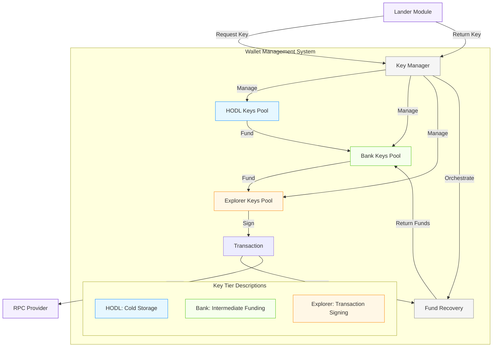

# Wallet Management System

QTrade implements a sophisticated three-tiered key management system for the Solana blockchain that enhances security through key isolation while ensuring operational efficiency. The system uses three distinct tiers of Solana keypairs (HODL, Bank, and Explorer keys), each with specific responsibilities and security characteristics, enabling secure fund storage and efficient transaction execution.

## Architecture Overview

The Wallet Management System represents a critical security component in QTrade's architecture, ensuring that funds are properly segregated while maintaining reliable access for transaction execution. This system employs a hierarchical approach to key management that isolates high-value funds from transaction-signing operations.



## Technical Components

### 1. Tiered Key Structure

The system maintains three distinct tiers of Solana keypairs:

- **HODL Keys**
  - **Purpose**: Secure cold storage for majority of funds
  - **Security Level**: Highest; ideally stored offline or in hardware wallets
  - **Usage Pattern**: Rarely accessed; only used to replenish Bank keys
  - **Implementation**: `KeyTier::Hodl` in the `KeyManager`

- **Bank Keys**
  - **Purpose**: Intermediate funding keys that distribute funds to Explorer keys
  - **Security Level**: Medium; more frequently accessed but limited exposure
  - **Usage Pattern**: Accessed periodically to fund Explorer keys
  - **Implementation**: `KeyTier::Bank` in the `KeyManager`

- **Explorer Keys**
  - **Purpose**: Transaction signing keys for network operations
  - **Security Level**: Lowest; highly transient with limited funds
  - **Usage Pattern**: Single-use keys that are retired after transaction completion
  - **Implementation**: `KeyTier::Explorer` in the `KeyManager`

### 2. Key Lifecycle Management

```rust
// Explorer key lifecycle example
// 1. Get an Explorer keypair for transaction signing
let (explorer_pubkey, explorer_keypair) = qtrade_wallets::get_explorer_keypair()
    .ok_or_else(|| anyhow!("No explorer keypairs available"))?;

// 2. Use the keypair to sign a transaction
let transaction = Transaction::new_signed_with_payer(
    &instructions,
    Some(&explorer_pubkey),
    &[&explorer_keypair],
    recent_blockhash
);

// 3. Submit the transaction to the network
let signature = rpc_client.send_and_confirm_transaction(&transaction).await?;

// 4. After transaction completion, retire the keypair (regardless of success)
qtrade_wallets::return_explorer_keypair(&explorer_pubkey, true)?; // true = retire the key

// 5. In the background, the periodic balancer will:
//    - Recover remaining funds from retired Explorer keys
//    - Return funds to the funding Bank key
//    - Create new Explorer keys as needed
```

The system implements a complete lifecycle for Explorer keys:

- **Provisioning**: New Explorer keys are automatically created by the balancer and funded from Bank keys
- **Allocation**: Explorer keys are assigned for transaction signing through a thread-safe pool
- **Usage**: Each Explorer key is used exactly once for signing a transaction
- **Retirement**: After transaction completion, Explorer keys are marked as "Used" via `return_explorer_keypair(pubkey, true)`
- **Recovery**: The balancer periodically recovers funds from retired Explorer keys back to their funding Bank keys
- **Replenishment**: New Explorer keys are created automatically when the pool runs low

### 3. Auto-Balancing Mechanism

The wallet system includes an automatic balancing mechanism that runs periodically through the `balancer()` function:

```rust
// Auto-balancing implementation
pub async fn balancer() -> Result<()> {
    let key_manager = get_key_manager()?;

    // Balance the key pools with proper thresholds
    key_manager.balance(
        MIN_EXPLORER_KEYS,         // Minimum Explorer keys to maintain (e.g., 5)
        EXPLORER_KEYS_TO_CREATE,   // Number to create when low (e.g., 3)
        LAMPORTS_PER_EXPLORER,     // Target balance for Explorer (e.g., 0.01 SOL)
        LAMPORTS_PER_BANK          // Target balance for Bank (e.g., 0.1 SOL)
    ).await?;

    Ok(())
}
```

Under the hood, the `KeyManager::balance()` method performs three key operations in sequence:

1. **Cleanup & Recovery**:
   - Identifies Explorer keys marked as "Used"
   - Recovers remaining SOL from these keys back to their funding Bank keys
   - Removes the retired keys from the Explorer pool

2. **Bank Key Funding**:
   - Checks balances of Bank keys against their target thresholds
   - Funds any underfunded Bank keys from HODL keys
   - Ensures Bank keys have sufficient funds to create new Explorer keys

3. **Explorer Key Creation**:
   - Checks if the available Explorer key count is below the minimum threshold
   - Creates new Explorer keys and funds them from Bank keys
   - Adds the new keys to the Explorer pool for future transactions

This automated process ensures the system always maintains:
- Sufficient Explorer keys available for transaction signing
- Properly funded Bank keys to create Explorer keys when needed
- Efficient recovery of funds from retired Explorer keys

### 4. Security Isolation

The tiered structure provides multiple security benefits:

- **Exposure Limitation**: Only Explorer keys (with minimal funds) are used in transaction signing
- **Single-Use Pattern**: Explorer keys are used exactly once, limiting the timeframe for potential compromise
- **Fund Segregation**: The majority of funds remain in cold storage, isolated from frequent operations
- **Automatic Recovery**: The system automatically recovers funds from Explorer keys after use

## Metrics and Monitoring

The wallet management system includes comprehensive metrics tracking to monitor key operations and system health. The metrics system provides both internal counters and OpenTelemetry integration for external monitoring.

### Key Metrics Tracked

The metrics system tracks the following key operations:

1. **Explorer Key Operations**
   - **Keys Acquired**: Number of explorer keys allocated for transaction signing
   - **Keys Retired**: Number of explorer keys retired after use
   - **Keys Created**: Number of new explorer keys created by the balancer
   - **Keys Recovered**: Number of explorer keys with funds recovered
   - **Total SOL Recovered**: Cumulative SOL recovered from retired explorer keys

2. **Bank Key Operations**
   - **Keys Funded**: Number of bank keys funded from HODL keys

3. **Key Pool Status**
   - **Pool Sizes**: Total and available counts for each key tier (HODL, Bank, Explorer)
   - **Key Balances**: Distribution of SOL balances across keys in each tier

### Metrics Implementation

The metrics system consists of two main components:

1. **Internal Atomic Counters**:
   ```rust
   // Internal metrics structure
   pub struct WalletMetrics {
       pub explorer_keys_acquired: Arc<AtomicU64>,
       pub explorer_keys_retired: Arc<AtomicU64>,
       pub explorer_keys_created: Arc<AtomicU64>,
       pub explorer_keys_funds_recovered: Arc<AtomicU64>,
       pub bank_keys_funded: Arc<AtomicU64>,
       pub total_sol_recovered: Arc<AtomicU64>,
   }
   ```

2. **OpenTelemetry Integration**:
   ```rust
   // OpenTelemetry counters for key operations
   static ref EXPLORER_KEYS_ACQUIRED_COUNTER: Counter<u64> = {
       QTRADE_WALLETS_METER
           .u64_counter("qtrade.wallets.explorer_keys_acquired")
           .with_description("Number of explorer keys acquired for transaction signing")
           .init()
   };
   ```

### Integration with Key Operations

Metrics are automatically recorded during key operations:

```rust
// Example: When acquiring an explorer key
pub fn get_explorer_keypair() -> Option<(Pubkey, Arc<Keypair>)> {
    // Get keypair logic...

    // Record metric
    wallet_metrics::record_explorer_key_acquired();

    Some((pubkey, keypair))
}

// Example: When retiring an explorer key
pub fn return_explorer_keypair(pubkey: &Pubkey, retire: bool) -> Result<()> {
    // Return keypair logic...

    // Record metric if retiring
    if retire {
        wallet_metrics::record_explorer_key_retired();
    }

    Ok(())
}
```

### Balance Monitoring

The system also includes mechanisms to track key balances:

```rust
// Record balances for a subset of keys from each pool
async fn record_key_balances(&self) -> Result<()> {
    // Sample keys from each pool
    for (tier, keys) in [
        ("hodl", self.hodl_pool.sample_keys(max_keys_to_sample)?),
        ("bank", self.bank_pool.sample_keys(max_keys_to_sample)?),
        ("explorer", self.explorer_pool.sample_keys(max_keys_to_sample)?)
    ] {
        for (pubkey, _) in keys {
            if let Ok(balance) = self.rpc_client.get_balance(&pubkey).await {
                let balance_sol = balance as f64 / 1_000_000_000.0;
                crate::wallet_metrics::record_key_balance(tier, balance_sol);
            }
        }
    }

    Ok(())
}
```

### Benefits of Metrics Tracking

- **Operational Visibility**: Real-time monitoring of key pool status and operations
- **Security Auditing**: Track key lifecycle events to detect anomalies
- **Resource Optimization**: Monitor fund recovery efficiency and key utilization
- **Performance Monitoring**: Track balance operation timing for system optimization
- **Integration with Monitoring Systems**: Export metrics to DataDog or other monitoring solutions via OpenTelemetry

## Integration with Transaction Pipeline

The Wallet Management System seamlessly integrates with QTrade's transaction pipeline:

1. When the Lander module needs to execute a transaction, it requests an Explorer keypair
2. The Key Manager provides an available Explorer keypair from the pool
3. The Lander uses this keypair to sign and submit the transaction
4. After transaction completion, the keypair is returned to the Key Manager marked for retirement
5. The Key Manager recovers funds from the retired keypair and returns them to the Bank pool
6. The system automatically maintains the Explorer key pool to ensure availability

## Benefits

- **Enhanced Security**: By using a tiered approach, exposure of high-value keys is minimized
- **Operational Efficiency**: Automatic key management eliminates manual fund transfers
- **Single-Use Transaction Keys**: Explorer keys are used exactly once, limiting attack vectors
- **Automatic Recovery**: The system automatically reclaims funds from used keys
- **Scalable Design**: The pool-based approach allows scaling to handle increased transaction volume
- **Comprehensive Monitoring**: Integrated metrics tracking provides operational visibility and security auditing

The Wallet Management System's architectural design represents a critical security feature in QTrade's infrastructure, providing a robust foundation for secure transaction execution while maintaining operational efficiency.
